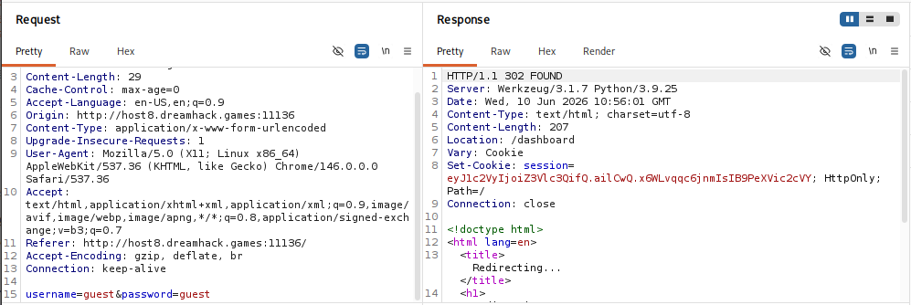
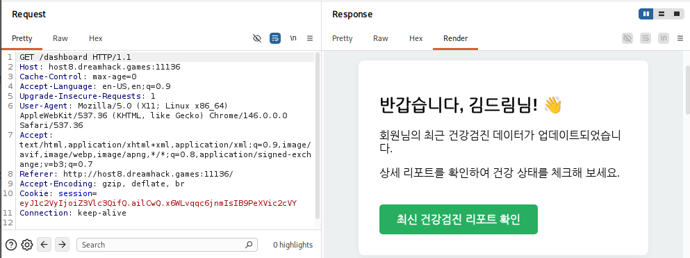
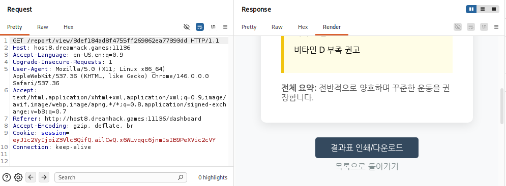
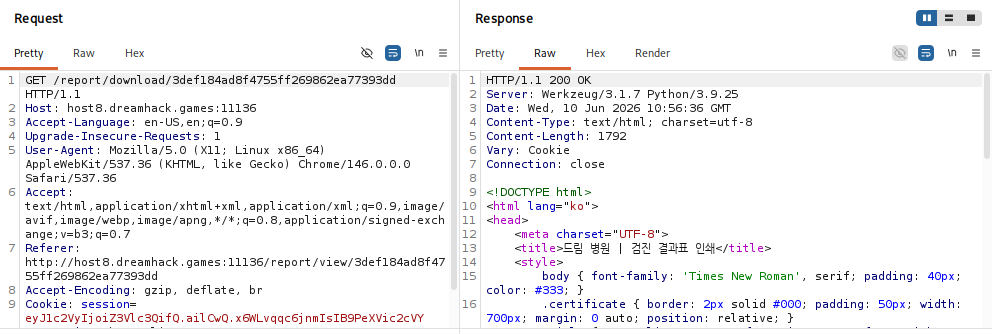
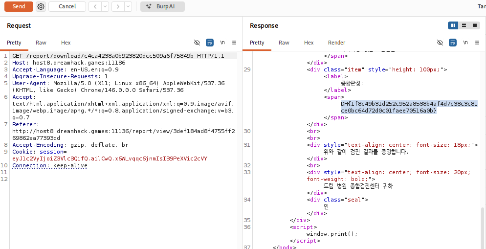

# [DreamHack] Dream Hospital (드림 병원 🌱) - Web Hacking

## 1. 문제 개요

* **문제 링크:** [Dreamhack - 드림 병원 🌱](https://dreamhack.io/wargame/challenges/2814)

* **분야:** Web

* **목표:** IDOR(안전하지 않은 직접 객체 참조) 취약점을 이용하여 `admin` 계정의 객체(리포트)에 접근하고 플래그 획득.

## 2. 취약점 분석
제공된 `app.py` 소스 코드를 분석한 결과, 리포트를 조회하는 라우트와 다운로드하는 라우트 간의 권한 검증 로직에 차이가 있음을 확인.

```python
@app.route('/report/view/<user_hash>')
def view_report(user_hash):
    # ... (중략) ...
    for uid, data in health_records.items():
        if get_hash(uid) == user_hash:
            # 조회 페이지: 소유자와 현재 로그인 세션 비교 검증 존재
            if data['owner'] != session['user']:
                return "<h1>Access Denied</h1>", 403
            return render_template('report.html', data=data, user_hash=user_hash)
    # ... (중략) ...

@app.route('/report/download/<user_hash>')
def download_report(user_hash):
    if 'user' not in session:
        return redirect(url_for('index'))

    for uid, data in health_records.items():
        if get_hash(uid) == user_hash:
            # [!] 취약점 발생: 다운로드 페이지는 본인 데이터인지 확인하는 인가 로직 누락
            return render_template('print.html', data=data)
    # ... (중략) ...
```

* **분석 결론:** `/report/view` 라우트에는 타인의 데이터 접근을 막는 검증(`data['owner'] != session['user']`)이 존재하지만, `/report/download` 라우트에는 해당 로직이 누락됨. 이를 통해 타인의 해시값만 알아내면 권한 없이 데이터를 열람할 수 있는 **IDOR(Insecure Direct Object Reference)** 취약점 존재 확인.

## 3. 공격 수행
Burp Suite를 활용하여 세션 획득부터 취약점이 존재하는 엔드포인트에 페이로드를 전송하기까지의 과정을 순차적으로 진행.

1. `guest` 계정(`username=guest`, `password=guest`)을 사용하여 로그인 요청 전송 및 세션 쿠키 획득.



2. 획득한 세션을 바탕으로 `/dashboard` 로 이동하여 정상적으로 계정에 접속된 상태 확인 후, 하단의 '최신 건강검진 리포트 확인'버튼 클릭



3. 대시보드에서 본인의 상세 리포트 페이지(`/report/view/<guest_hash>`)로 이동 후, 하단의 '결과표 인쇄/다운로드' 버튼 클릭.



4. 버튼 클릭 시 이동하는 `/report/download/<guest_hash>` 경로로 요청 전송. 서버 응답을 통해 검진 결과표 인쇄 페이지가 정상 출력됨을 확인.



5. 해당 경로(`/report/download/`)에 권한 검증이 누락된 취약점을 악용. 타겟인 `admin`(uid: 1)의 해시값인 `get_hash(1)`의 결과(`c4ca4238a0b923820dcc509a6f75849b`)를 파라미터에 삽입하여 요청 전송. 타인의 객체 참조에 성공하여 결과 화면에 플래그 노출.



## 4. 획득 결과
Burp Suite의 Response 탭 확인 결과, IDOR 취약점을 통해 `admin` 소유의 데이터를 조회하여 숨겨진 플래그 획득.

* **FLAG:** `DH{1f8c49b31d252c952a8538b4af4d7c38c3c81ce0bc64d72d0c01faee70516a0b}`

## 5. 대응 방안
웹 애플리케이션에서 사용자의 입력값(해시, ID 등)을 통해 직접 객체를 참조할 때는 반드시 해당 객체에 대한 사용자의 접근 권한을 확인하는 과정을 거쳐야 함.

* **인가 검증 추가:** `/report/download` 라우트 내부에도 `/report/view` 라우트와 동일하게 `if data['owner'] != session['user']:` 와 같은 검증 코드를 삽입하여, 요청한 세션의 주인과 데이터의 소유자가 일치할 때만 렌더링되도록 로직 수정.

* **난수화된 식별자 사용:** 순차적인 숫자나 단순 문자열의 MD5 해시 등 유추가 가능한 값 대신, UUID와 같은 강력하고 예측 불가능한 식별자를 사용하여 브루트포스나 유추를 통한 접근 방지.