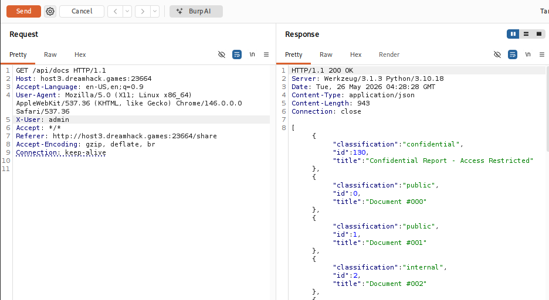
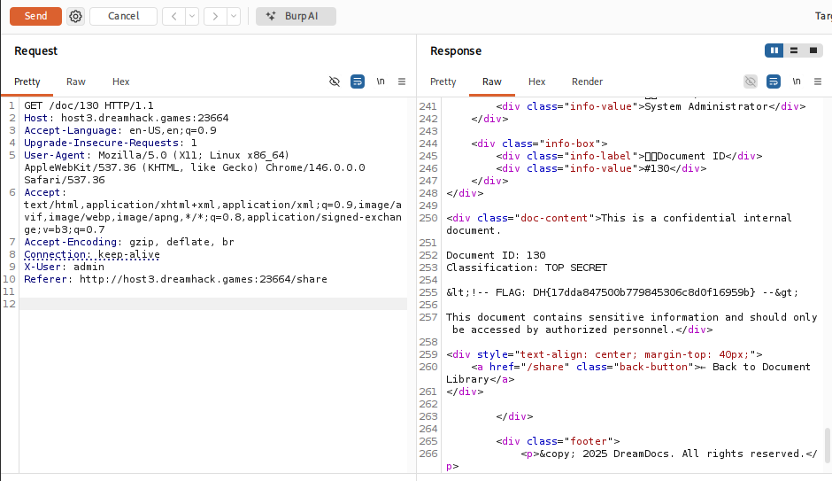

# [DreamHack] DreamDocs - Web Hacking

## 1. 문제 개요

* **문제 링크:** [DreamHack - DreamDocs](https://dreamhack.io/wargame/challenges/2325)

* **분야:** Web

* **목표:** HTTP 헤더(`X-User`, `Referer`) 조작을 통한 권한 검증 우회 및 플래그 문서 열람.

## 2. 취약점 분석
제공된 `app.py` 소스 코드 분석 결과, 특정 API 통신 및 문서 열람 시 사용자의 권한과 접근 경로를 클라이언트가 임의로 조작 가능한 HTTP 헤더 값을 통해 검증하는 취약점 확인.

```python
@app.route('/doc/<int:doc_id>')
def view_document(doc_id):
    # [!] 취약점 1: 조작 가능한 Referer 헤더로 출처 검증
    referer = request.headers.get('Referer', '')
    
    # [!] 취약점 2: 클라이언트가 전송하는 커스텀 헤더(X-User)로 권한 식별
    user_level = request.headers.get('X-User', 'guest')

    # ... (중략) ...

    if '/share' not in referer:
        return render_template('error.html', message="Access denied..."), 403

    if document['classification'] == 'confidential':
        if user_level != 'admin':
            return render_template('error.html', message="Insufficient privileges..."), 403

    # ... (중략) ...

    return render_template('document.html', doc=document, doc_id=doc_id)
```

* **분석 결론:** `X-User` 헤더 값을 `admin`으로 변조하여 관리자 권한 획득 가능. 또한 `Referer` 헤더 값에 `/share` 문자열을 삽입하여 이전 페이지 접근 검증 로직 우회 가능.

## 3. 공격 수행
Burp Suite의 Proxy를 통해 기능 맵핑을 수행한 후, 식별된 엔드포인트를 Repeater로 전송하여 익스플로잇.

### 3.1. API 패킷 변조 및 Flag ID 획득

1. 브라우저 탐색 중 백엔드 API인 `/api/docs`로 요청되는 패킷을 Burp Suite History에서 식별하여 Repeater로 전송.

2. 요청 헤더에 관리자 권한을 부여하는 `X-User: admin` 추가 후 전송.

3. 응답 결과에서 가장 먼저 삽입된 `classification: confidential` 문서의 `id` 값이 `130`임을 확인.



### 3.2. 플래그 문서 열람 권한 우회

1. 앞서 획득한 문서 ID를 사용하여 `/doc/130` 엔드포인트로 GET 요청 패킷 구성.

2. 권한 검증 로직 통과를 위해 `X-User: admin` 헤더 삽입.

3. 비정상 접근 차단 로직(Referer 검증) 우회를 위해 `Referer: http://host3.dreamhack.games:23664/share` 헤더 삽입 후 전송.



## 4. 획득 결과
Burp Suite의 Response 탭 HTML 렌더링 코드 확인 결과, 관리자 권한 및 출처 검증이 우회되어 기밀문서 내용과 플래그 출력.

* **FLAG:** `DH{17dda847500b779845306c8d0f16959b}`

## 5. 대응 방안
클라이언트에서 쉽게 위변조가 가능한 HTTP 헤더 값을 권한 인가 및 접근 통제 목적으로 사용하는 것은 위험하므로 안전한 세션 관리 아키텍처로 개선 필요.

* **서버 사이드 권한 통제:** `X-User`와 같은 커스텀 헤더 대신, 로그인 시 발급되는 서버 측 세션이나 서명된 JWT 토큰을 통해 사용자의 실제 권한을 안전하게 검증.

* **직접 객체 참조(IDOR) 방어:** 난수화된 문서 ID를 사용하더라도 권한이 없는 사용자가 해당 객체에 접근할 수 없도록 객체별 열람 권한 매핑 테이블 적용.