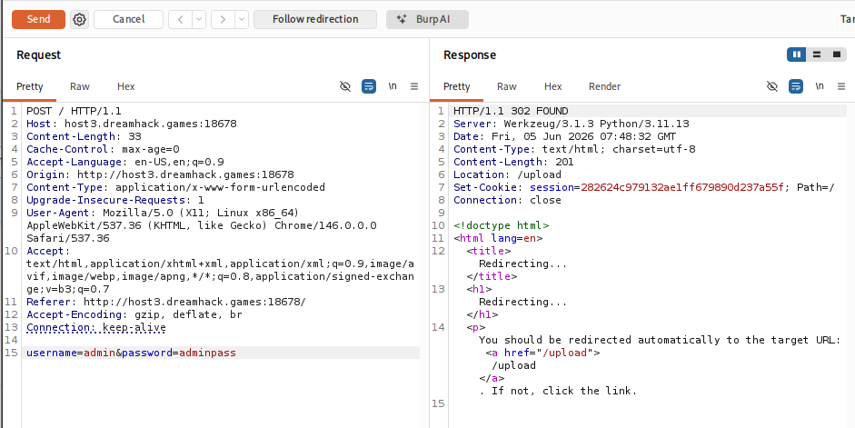
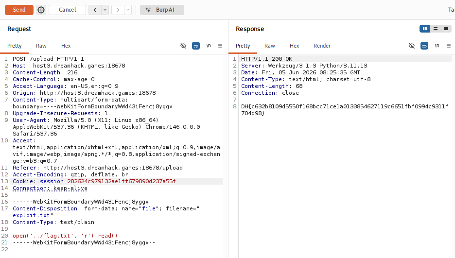

# [Dreamhack] 이발(eval) - Web Hacking

## 1. 문제 개요

* **문제 링크:** [Dreamhack - 이발](https://dreamhack.io/wargame/challenges/2251)

* **분야:** Web

* **목표:** 파일 업로드 필터링 우회 및 `eval()` 함수 취약점을 이용한 원격 코드 실행(RCE)으로 플래그 획득.

## 2. 취약점 분석
제공된 `app.py` 소스 코드를 분석한 결과, `/upload` 엔드포인트에서 업로드된 텍스트 파일을 다시 읽어들여 파이썬의 `eval()` 함수로 직접 실행하는 것을 확인.

```python
@app.route('/upload', methods=['GET', 'POST'])
def upload():
    # ... (중략) ...
    if request.method == 'POST':
        file = request.files['file']
        filename = file.filename
        if any(x in filename for x in ['.php', '.phtml', '.htaccess']):
            return "Permission Denied"
        filepath = os.path.join(UF, filename)
        file.save(filepath)
        with open(filepath, 'r') as f:
            code = f.read()
            try:
                # [!] 취약점 발생: 업로드된 파일 내용을 파이썬 코드로 직접 실행
                result = eval(code) 
            except Exception as e:
                result = f"Error: {e}"
            return f"{result}"
```

* **분석 결론:** 파일 확장자 필터링이 `.php`, `.phtml`, `.htaccess`에만 국한되어 있어 `.txt` 확장자 업로드가 가능하며, 저장된 파일의 내용을 `eval()` 함수로 실행하므로 악의적인 파이썬 구문을 삽입하여 서버 명령을 실행할 수 있는 **Remote Code Execution(RCE)** 취약점 존재.

## 3. 공격 수행
Burp Suite를 활용하여 웹 브라우저 렌더링 과정을 거치지 않고 직접 조작된 패킷을 전송하여 익스플로잇.

### 3.1. 관리자 계정 인증 패킷 전송
1. 소스코드에 하드코딩된 관리자 계정(`admin` / `adminpass`) 정보를 삽입하여 POST 요청 패킷 구성.

2. 서버로 전송 후, 정상적으로 세션이 발급되며 `/upload` 경로로 리다이렉트(302 FOUND)되는 것을 확인.



### 3.2. 악성 페이로드 업로드 및 RCE 트리거
1. 파일 업로드 폼에서 발생하는 POST 패킷을 캡처하여 Repeater로 전송.

2. `filename` 파라미터를 필터링에 걸리지 않는 `exploit.txt`로 조작.

3. 파일 Content 영역에 상위 경로의 플래그 파일을 읽어오는 파이썬 코드 `open('../flag.txt', 'r').read()`를 페이로드로 삽입 후 전송.

4. 서버 내부에서 `eval()` 함수가 페이로드를 실행하여 플래그 값을 반환.



## 4. 획득 결과
Burp Suite의 Response 탭 확인 결과, 조작된 페이로드가 파이썬 코드로 실행되어 본 서버의 플래그가 텍스트로 출력됨.

* **FLAG:** `DH{c632b8109d5550f168bcc71cela0133854627119c6651fbf0994c9311f704d98}`

## 5. 대응 방안
사용자 입력값을 검증 없이 동적 코드로 실행하는 것은 매우 위험하므로, 안전한 설계 방식으로 수정해야 함.

* **`eval()` 함수 사용 제거:** `eval()`, `exec()` 등 외부 입력을 시스템 명령이나 코드로 해석하는 함수의 사용을 원천적으로 금지.

* **안전한 파일 업로드 구현:** 파일 확장자 검증 시 블랙리스트 방식이 아닌 화이트리스트 방식을 채택하고, 업로드된 파일은 실행 권한이 없는 별도의 스토리지 서버에 보관.