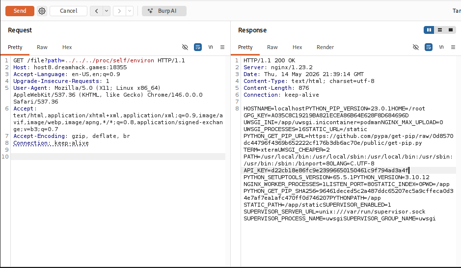
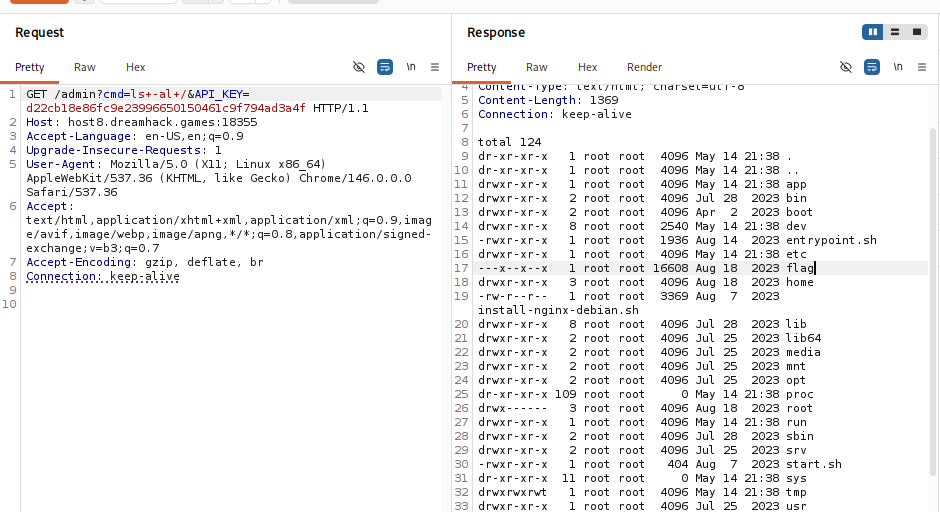
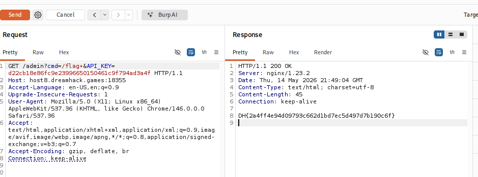

# [Dreamhack] File Vulnerability Advanced for Linux - Web Hacking

## 1. 문제 개요

* **문제 링크:** [Dreamhack - File Vulnerability Advanced for linux](https://dreamhack.io/wargame/challenges/417)

* **분야:** Web

* **목표:** LFI(Local File Inclusion) 취약점을 이용하여 환경변수에 저장된 API_KEY를 탈취하고, RCE(Remote Code Execution) 취약점을 통해 시스템 명령어를 실행하여 플래그 획득.

## 2. 취약점 분석
제공된 `main.py` 소스 코드를 분석한 결과, 주요 엔드포인트에서 다음과 같은 보안 취약점 확인.

**2.1. Local File Inclusion (LFI)**

`/file` 엔드포인트에서 사용자가 입력한 `path` 파라미터 값에 대한 경로 조작(`../`) 필터링이 없어 서버 내부의 임의 파일 읽기 가능.

```python
@app.route('/file', methods=['GET'])
def file():
    path = request.args.get('path', None)
    if path:
        data = open('./files/' + path).read()
        return data
```

**2.2. Remote Code Execution (RCE)**

`/admin` 엔드포인트에서 인증 통과 시, `cmd` 파라미터 값을 필터링 없이 `subprocess.getoutput()`에 직접 전달하므로 임의의 시스템 명령어 실행.

```python
@app.route('/admin', methods=['GET'])
@key_required
def admin():
    cmd = request.args.get('cmd', None)
    if cmd:
        result = subprocess.getoutput(cmd)
        return result
```

**2.3. 인증 로직 분석**

`/admin` 접근 시 사용되는 커스텀 데코레이터로, 사용자가 전달한 `API_KEY` 파라미터와 서버 환경변수의 값을 대조하여 접근 제어 수행.

```python
def key_required(view):
    @wraps(view)
    def wrapped_view(**kwargs):
        apikey = request.args.get('API_KEY', None)
        if API_KEY and apikey:
            if apikey == API_KEY:
                return view(**kwargs)
        return 'Access Denied !'
    return wrapped_view
```

**2.4. 환경변수 기반 인증 우회**

인증에 사용되는 `API_KEY`는 서버의 환경변수(`os.environ`)에서 로드. 앞서 발견한 LFI 취약점을 통해 `/proc/self/environ` 파일을 읽어 실제 키값 탈취 가능 확인.

```python
API_KEY = os.environ.get('API_KEY', None)
```

## 3. 공격 수행
Burp Suite의 Repeater를 활용하여 웹 브라우저를 거치지 않고 직접 조작된 페이로드를 서버로 전송하여 익스플로잇.

### 3.1. API_KEY 탈취 (LFI)
`/file` 엔드포인트에 (`../`) 페이로드를 삽입하여 요청 전송. 서버 응답값(환경변수 리스트)에서 하드코딩되지 않은 실제 API 키 확인.



### 3.2. 디렉토리 탐색 및 플래그 파일 확인 (RCE)
탈취한 API 키(`d22cb18e86fc9e23996650150461c9f794ad3a4f`)를 인증 파라미터로 사용하고, 시스템 루트(`/`) 디렉토리 목록을 조회하는 명령어(`ls -al /`) 전송. 응답 결과에서 실행 권한(`---x--x--x`)만 부여된 `flag` 바이너리 파일 발견.



### 3.3. 플래그 바이너리 실행 (RCE)
해당 파일이 텍스트가 아닌 컴파일된 바이너리이므로, `cat` 명령어가 아닌 프로그램 자체를 실행시키는 페이로드(`/flag`) 전송.



## 4. 획득 결과
Burp Suite의 Response 탭 확인 결과, 플래그 바이너리가 정상적으로 실행되어 결과 출력.

* **FLAG:** `DH{2a4ff4e94d09793c662d1bd7ec5d497d7b190c6f}`

## 5. 대응 방안
시스템 명령어를 직접 호출하는 설계를 지양하고, 입력값에 대한 철저한 검증 도입.

* **LFI 방어:** `path` 파라미터에 `../` 또는 `..`와 같은 디렉토리 이동 문자열 필터링. 허용된 디렉토리 내의 파일만 읽을 수 있도록 화이트리스트 방식 접근 제어 구현.

* **RCE 방어:** 사용자 입력값을 시스템 명령어(`subprocess`)로 직접 전달하는 구조 지양. 불가피한 경우 실행 가능한 명령어에 대해 화이트리스트 기반 검증 로직 적용.