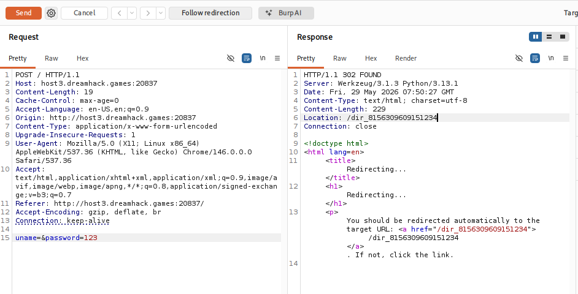
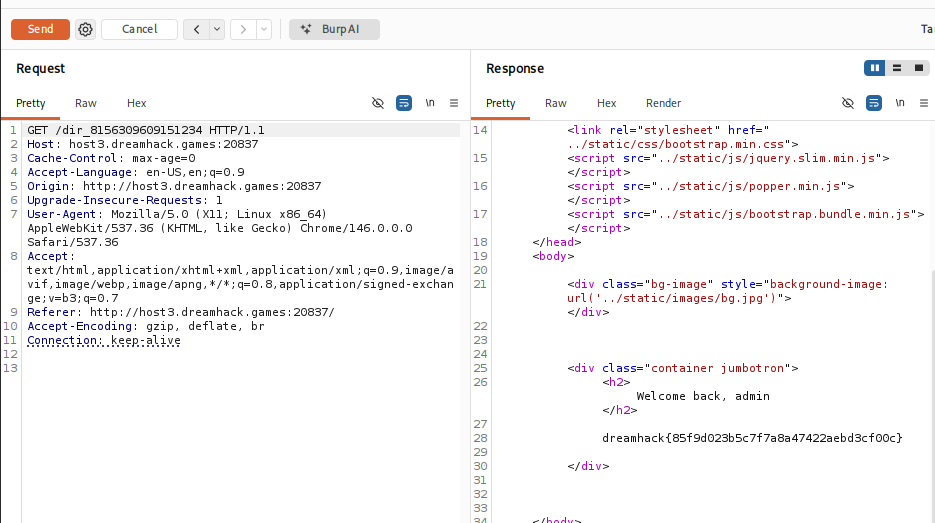

# [Dreamhack] Logical - Web Hacking

## 1. 문제 개요

* **문제 링크:** [Dreamhack - Logical](https://dreamhack.io/wargame/challenges/1744)

* **분야:** Web

* **목표:** 파이썬 논리 연산자 및 삼항 연산자 처리 로직의 취약점을 이용하여 인증을 우회하고 플래그 획득.

## 2. 취약점 분석

제공된 `app.py` 소스 코드를 분석한 결과, `login_check()` 함수 내 입력값 검증 및 데이터베이스 조회 결과 처리 부분에서 논리적 결함 확인.

```python
def login_check():
    uname = request.form.get('uname', '')
    password = request.form.get('password', '')
    
    # [!] 취약점 발생 1: and 연산자 사용으로 인한 불완전한 빈칸 검증
    if not uname and not password:
        return False
        
    # ... (중략) ...
    query = ("SELECT uname, password FROM users WHERE password = '{}'").format(md5(password.encode()).hexdigest())
    usrname = cursor.execute(query).fetchall()
    
    # [!] 취약점 발생 2: DB 결과가 비어있을 때 빈 문자열('') 반환
    name = usrname[0][0] if usrname and usrname[0] and usrname[0][0] else ''
    
    # 최종 우회: '' == '' 조건이 성립되어 True 반환
    return name == uname
```

* **분석 결론:** 입력값 검증 시 `and`를 사용하여 `uname`을 빈 문자열(`''`)로, `password`를 임의의 값으로 전송하면 필터링 조건 우회. DB에 일치하는 비밀번호가 없어 `usrname`이 빈 리스트(`[]`)로 반환되며, 이후 삼항 연산자의 `else` 절이 실행되어 `name` 변수에 빈 문자열(`''`) 할당. 최종적으로 `'' == ''` 비교 연산이 참(`True`)이 되어 관리자 로그인 성공.

## 3. 공격 수행

Burp Suite를 사용하여 프론트엔드의 입력 강제 검증(`required`)을 우회하고, 직접 조작된 페이로드를 서버로 전송하여 익스플로잇.

### 3.1. 페이로드 전송 및 리다이렉션 확인

1. 브라우저 단에서 빈칸 전송이 막히므로, Repeater에서 HTTP 메서드를 `POST`로 지정하고 메인 경로(`/`)로 요청.

2. Body 파라미터에 아이디 누락 폼(`uname=&password=123`)을 작성하여 전송.

3. 서버 내부 로직 취약점으로 인해 인증이 통과되며, 동적으로 생성된 숨겨진 디렉터리 경로(`/dir_8156309609151234`)로 `302 FOUND` 리다이렉션 응답 반환.



### 3.2. 리다이렉션 추적 및 플래그 획득

1. Burp Suite의 'Follow redirection' 기능을 사용하여 Location 헤더에 명시된 숨겨진 경로로 `GET` 요청 전송.

2. 응답 패킷의 HTML Body 내에서 관리자 환영 메시지와 함께 출력된 플래그 확인.



## 4. 획득 결과

Burp Suite의 Response 탭 확인 결과, 로직 우회 인증이 성공하여 목표 플래그 노출.

* **FLAG:** `dreamhack{85f9d023b5c7f7a8a47422aebd3cf00c}`

## 5. 대응 방안

논리 연산자의 엄격한 적용 및 예외 상황에 대한 명확한 실패 처리 로직 구현 필요.

* **검증 로직 보완:** 아이디나 비밀번호 중 하나라도 누락되면 즉시 거부하도록 `and`를 `or`로 변경. (`if not uname or not password:`)

* **데이터베이스 조회 예외 처리:** DB 조회 결과(`usrname`)가 빈 리스트일 경우, 강제로 로그인 실패(`return False`) 처리하도록 분기문 추가.