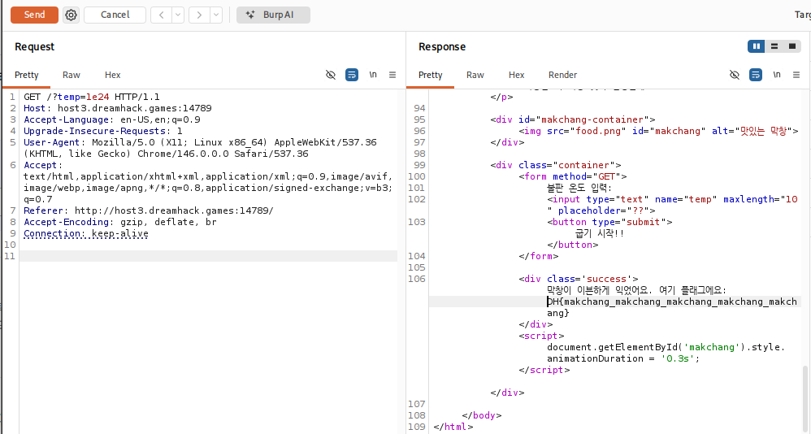

# [Dreamhack] 막창 좋아하세요? 🌱 - Web Hacking

## 1. 문제 개요

* **문제 링크:** [Dreamhack - 막창 좋아하세요? 🌱](https://dreamhack.io/wargame/challenges/2867)

* **분야:** Web

* **목표:** PHP 형변환 시 지수 표기법(Scientific Notation)을 인식하는 특징을 이용한 검증 로직 우회 및 플래그 획득.

## 2. 취약점 분석
제공된 `index.php` 소스 코드 분석 결과, 파라미터의 길이와 크기를 동시에 검증하는 로직에서 취약점 확인.

```php
if (isset($_GET['temp'])) {
    $temp = $_GET['temp'];
    if (strlen($temp) <= 4) {
        
        // [!] 취약점 발생: PHP의 지수 표기법 문자열을 정상적인 float 형으로 자동 변환하는 특성
        if ((float)$temp > 1000000000000000) {
            echo "<div class='success'>";
            echo "막창이 이븐하게 익었어요. 여기 플래그에요: " . $flag;
            // ... (중략) ...
```

* **분석 결론:** `$temp`의 문자열 길이는 4 이하이면서, `float` 형변환 결과는 10^15보다 커야 하는 조건 존재. PHP는 문자열을 `float`으로 형변환할 때 `e`가 포함된 지수 표기법을 정상적인 수치로 해석하므로, 이를 이용한 논리적 모순 우회 가능.

## 3. 공격 수행

### 3.1. 페이로드 작성 및 서버 요청 전송

1. 웹 브라우저를 통해 문제 페이지에 접근 후, HTTP 요청 패킷을 Burp Suite로 캡처하여 Repeater로 전송.

2. 길이 4 이하, 크기 10^15 초과 조건을 만족하는 지수 표기법 페이로드(`1e24`) 작성.

3. GET 파라미터를 `/?temp=1e24` 형태로 변조한 뒤 타겟 서버로 전송.



## 4. 획득 결과
Burp Suite의 Response 탭 확인 결과, 두 가지 검증 조건을 모두 통과하여 성공적으로 플래그 출력 확인.

* **FLAG:** `DH{makchang_makchang_makchang_makchang_makchang}`

## 5. 대응 방안
PHP의 느슨한 타입 변환(Type Juggling) 특성을 악용한 의도치 않은 우회를 방지하기 위해 엄격한 검증 로직 도입.

* **입력값 형식 제한:** 정규 표현식(예: `/^[0-9]+$/`)을 사용하여 입력값에 'e'나 'E' 같은 알파벳이 포함되지 않도록 차단하고, 순수한 숫자로만 구성되었는지 필터링.

* **엄격한 비교 적용:** 크기를 비교하기 전, 입력값이 안전한 정수형 범주에 속하는지 명확한 타입 검사를 선행하거나 `is_numeric()` 등의 함수를 활용.