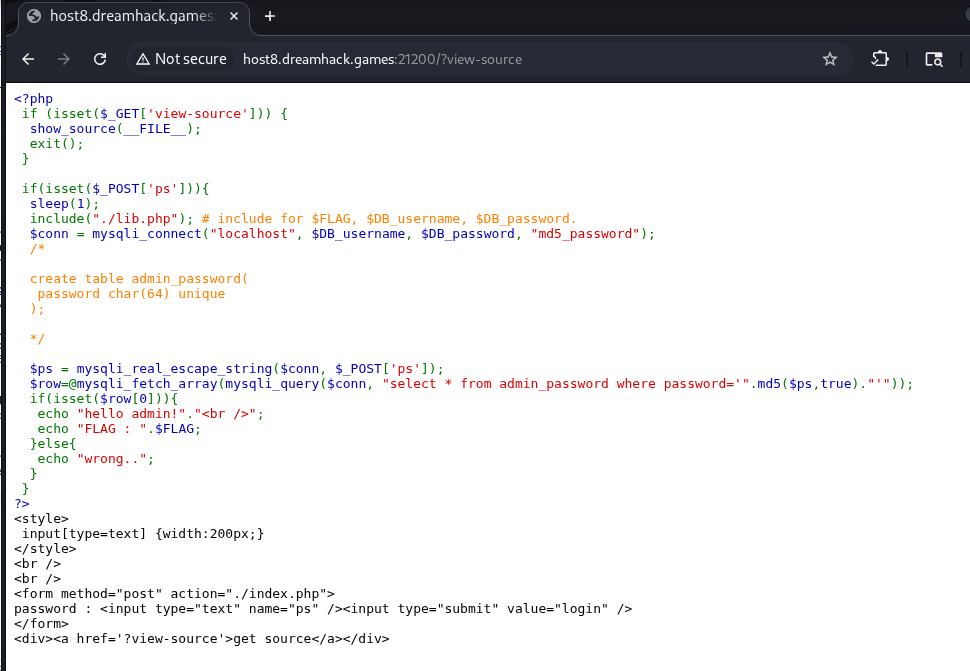
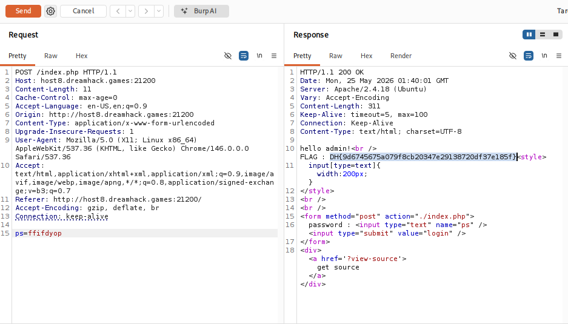

# [Dreamhack] MD5 Password - Web Hacking

## 1. 문제 개요

* **문제 링크:** [Dreamhack - md5 password](https://dreamhack.io/wargame/challenges/337)

* **분야:** Web

* **목표:** PHP md5 함수의 raw_output 특성을 이용한 SQL Injection으로 관리자 계정 로그인 및 플래그 획득.

## 2. 취약점 분석

### 2.1. 소스 코드 확보 및 로직 분석
문제 다운로드 파일에는 더미 파일(`no-need-to-download.txt`)만 존재하므로, 페이지의 `get source`를 클릭해 서버의 실제 소스 코드 확보.



### 2.2. md5() 함수 결함 및 매직 해시 분석
확보한 코드를 분석한 결과, 
입력값에 대한 이스케이프 처리(`mysqli_real_escape_string`)가 존재하나, 이후 `md5` 함수를 통과한 결과값이 아무런 검증 없이 SQL 쿼리에 직접 결합되는 로직 결함 확인.

```php
$ps = mysqli_real_escape_string($conn, $_POST['ps']);
// [!] 취약점 발생: md5(true)의 반환값(Raw Binary)이 쿼리문에 결합되며 의도치 않은 특수문자 삽입
$row=@mysqli_fetch_array(mysqli_query($conn, "select * from admin_password where password='".md5($ps,true)."'"));
```

* **분석 결론:** `md5($ps, true)`는 32자리 16진수 텍스트가 아닌 16바이트의 원시 바이너리(Raw Binary) 데이터를 반환. 매직 해시(Magic Hash) 문자열인 `ffifdyop` 입력 시, 반환된 바이너리 데이터가 데이터베이스에서 ASCII 문자로 강제 해석되며 `'or'6` 형태의 문자열 생성. 결과적으로 `WHERE password=''or'6...'` 쿼리가 완성되고 MySQL 형변환에 의해 무조건 참(True)으로 평가되어 SQL Injection 발생.

### 대표적인 Raw Hash 우회 페이로드 예시

* **MD5 Bypass 페이로드:**
  ```php
  md5("ffifdyop", true) // 실행 결과: 'or'6�]��!r,��b� (쿼리 파괴)
  ```
* **SHA-1 Bypass 페이로드:**
  ```php
  sha1("3fDf ", true)  // 실행 결과: Q�u'='�@�[�t�- o��_-! (u'=' 형태의 인젝션 유발)
  ```

## 3. 공격 수행

### 3.1. 취약점 페이로드 전송
Burp Suite를 사용하여 `index.php`로 전달되는 POST 요청 패킷 캡처. `ps` 파라미터에 변조된 쿼리를 유발하는 페이로드(`ffifdyop`) 삽입 후 전송.



## 4. 획득 결과
Response 패킷 확인 결과, 쿼리문 변조를 통해 관리자 계정 우회 로그인이 성공적으로 이루어졌으며 하드코딩된 서버 플래그 출력.

* **FLAG:** `DH{9d6745675a079f8cb20347e29138720df37e185f}`

## 5. 대응 방안
SQL 쿼리에 입력값이나 특정 함수의 결과값을 직접 결합하는 것은 매우 취약하므로 안전한 쿼리 작성 방식 적용.

* **Prepared Statement 사용:** 바인딩 변수를 사용하여 데이터베이스 엔진이 입력값을 SQL 구문이 아닌 순수 데이터로만 인식하게 처리하여 SQL Injection 원천 차단.

* **보안 해시 함수 도입:** 충돌 취약점이 존재하고 예측 불가능한 결과를 낳을 수 있는 `md5` 대신, 패스워드 전용 단방향 해시 알고리즘(예: `bcrypt`) 사용.

## 6. 블루팀 관점 요약

보안관제 및 침해사고 대응(IR) 관점에서 Raw Hash 특성을 악용한 SQL Injection 인증 우회 시도 탐지.

* **WAF 및 웹 서버 로그 분석:** 로그인 엔드포인트(`index.php`)의 POST 요청 본문(`ps` 파라미터) 모니터링 시, 알려진 매직 해시(Magic Hash) 문자열(`ffifdyop` 등)이 입력값으로 전송되는 트래픽 식별. 정상적인 비밀번호 입력 패턴과 달리 짧고 특이한 고정 문자열이 반복 전송되는 경우 자동화된 우회 시도로 판단.

* **침해사고 대응 (IR) 시나리오:** 동일 IP에서 매직 해시 후보 문자열을 순차적으로 대입하는 시도가 탐지될 경우, 해당 계정(`admin`)의 이후 로그인 성공 여부와 접근 IP를 추적하여 실제 인증 우회 성공 여부 검증. 성공이 확인되면 해당 계정 비밀번호 강제 초기화 및 세션 전체 무효화.

* **네트워크 기반 탐지 룰 제안 (Snort):** 로그인 POST 요청 본문에서 알려진 매직 해시 문자열 패턴 탐지.

```snort
alert tcp $EXTERNAL_NET any -> $HTTP_SERVERS $HTTP_PORTS (msg:"[Web] MD5 Magic Hash SQLi Attempt"; flow:to_server,established; http_method; content:"POST"; http_client_body; content:"ffifdyop"; sid:1000007; rev:1;)
```

## 참고 자료
* **HackTricks:** [SQL Injection - Raw Hash Injection](https://hacktricks.wiki/ko/pentesting-web/sql-injection/index.html?highlight=md5%20raw%20out#raw-hash-authentication-bypass)