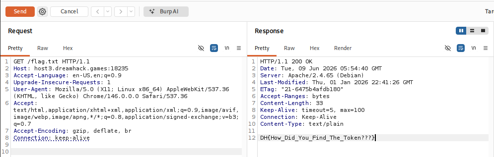

# [DreamHack] MisconFlag - Web Hacking

## 1. 문제 개요

* **문제 링크:** [DreamHack - MisconFlag](https://dreamhack.io/wargame/challenges/2654)

* **분야:** Web

* **목표:** 웹 서버 설정 오류(Misconfiguration)를 파악하고, 불필요한 토큰 검증 로직을 우회하여 웹 루트 디렉토리에 노출된 플래그 파일 획득.

## 2. 취약점 분석
제공된 `Dockerfile`을 분석한 결과, 애플리케이션의 소스 코드(`src/`) 전체를 웹 서버의 퍼블릭 디렉토리(`/var/www/html/`)로 일괄 복사하는 설정 확인.

```dockerfile
FROM php:8.2-apache
COPY src/ /var/www/html/
```

* **분석 결론:** 개발자의 실수로 인해 외부에 노출되지 않아야 할 `flag.txt` 파일이 웹 루트 디렉토리에 복사되어, 브라우저를 통해 누구나 직접 접근할 수 있는 **설정 오류(Misconfiguration)** 취약점 존재.

## 3. 공격 수행
정상적인 토큰 생성 및 검증 로직(`token.php`, `check.php`)을 모두 무시하고, Burp Suite를 사용하여 타겟 서버의 플래그 파일 경로로 직접 요청 전송.

### 3.1. 패킷 캡처 및 직접 요청

1. Burp Suite를 실행하고 타겟 웹 서버로 향하는 기본 HTTP 요청 패킷을 캡처하여 Repeater로 전송.

2. Repeater에서 HTTP 메서드를 `GET`으로 설정하고, 요청 경로를 웹 루트에 복사되어 있는 `/flag.txt`로 직접 수정하여 전송.

3. 서버 내부의 복잡한 검증 우회 등을 거칠 필요 없이, 아파치 웹 서버가 반환하는 `flag.txt`의 실제 내용을 평문으로 응답받아 플래그 획득 성공.



## 4. 획득 결과
Burp Suite의 Response 탭 확인 결과, HTTP 200 OK 상태 코드와 함께 하드코딩된 서버 플래그 출력.

* **FLAG:** `DH{How_Did_You_Find_The_Token???}`

## 5. 대응 방안
웹 서버 구성 시 내부 로직 파일이나 보안상 민감한 파일이 퍼블릭 웹 루트에 포함되지 않도록 디렉토리 구조의 엄격한 분리 적용.

* **웹 루트 디렉토리 분리:** 외부 접근이 필수적으로 허용되어야 하는 파일(`index.php`, `style.css` 등)만 `/var/www/html/`에 위치시키고, `flag.txt`나 핵심 로직 파일은 웹 루트 상위 경로(예: `/var/www/`)로 이동하여 구조적 차단.

* **접근 제어 설정:** Apache 환경 설정(`apache2.conf` 또는 `.htaccess`)이나 Nginx 설정을 통해 웹 루트 내 민감한 확장자(`.txt`, `.bak`, `.env` 등)에 대한 직접적인 웹 접근(URI Access) 완전 차단.