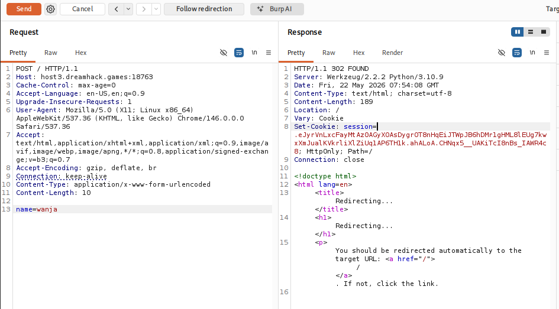
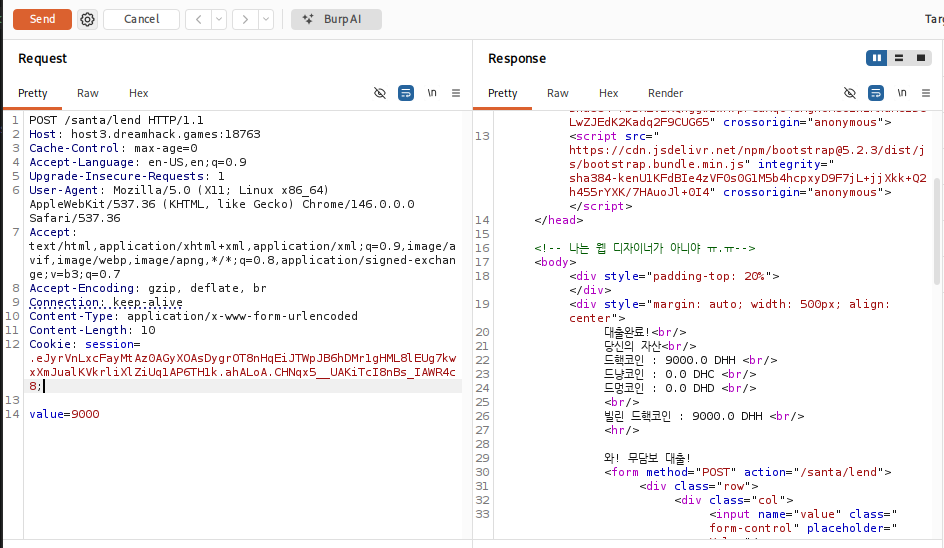
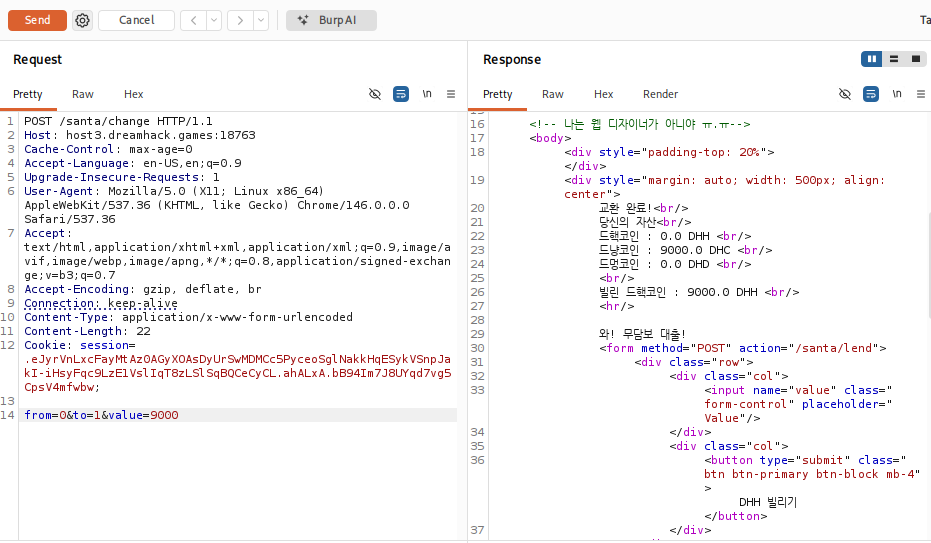
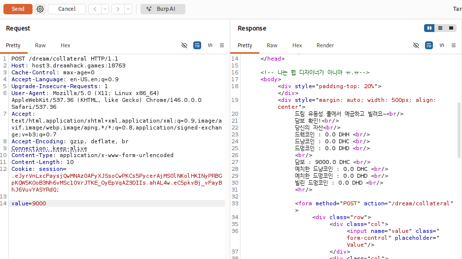
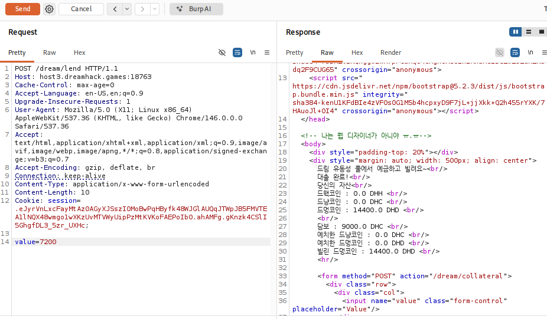
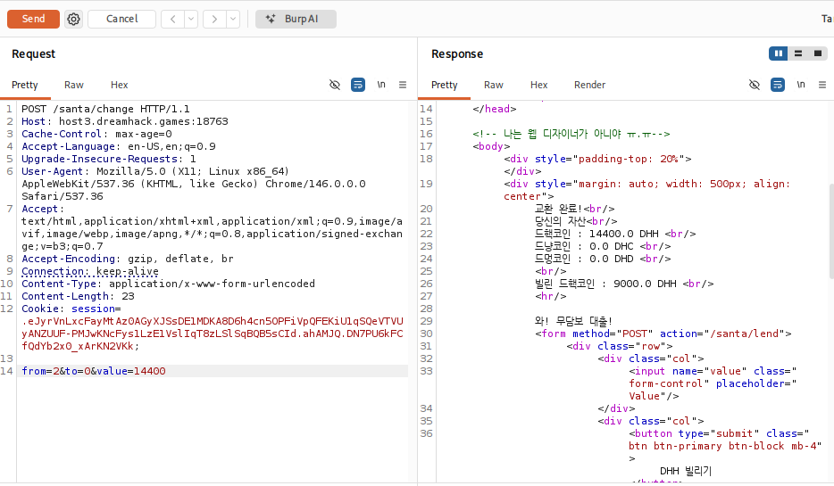
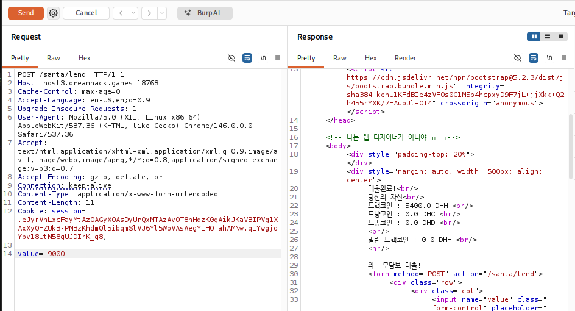
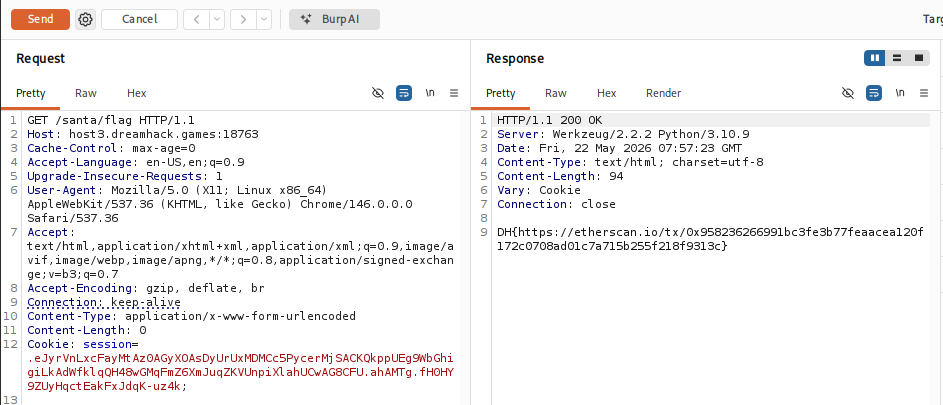

# [Dreamhack] Out of Money - Web Hacking

## 1. 문제 개요

* **문제 링크:** [Dreamhack - out of money](https://dreamhack.io/wargame/challenges/732)

* **분야:** Web

* **목표:** 애플리케이션의 비즈니스 로직 취약점을 악용하여 코인 대출 한도를 우회하고, 부채를 상환하여 플래그 획득.

## 2. 취약점 분석
제공된 `app.py` 소스 코드 분석 결과, `/dream/lend` 엔드포인트에서 대출 한도를 검증할 때 기존의 부채(debt)를 차감하지 않는 논리적 결함 확인.

```python
@app.route("/dream/lend", methods=['POST'])
def dream_loan():
    value = float(request.form['value'])

    dhc_price = get_price('DHC')
    dhd_price = get_price('DHD')

    # [!] 취약점 발생 1: 담보를 기준으로 최대 대출 가능 금액(max_lend)을 산정.
    max_lend = session['col_DHC'] * dhc_price / dhd_price * 0.8

    if session['DHD'] + value < 0.0:
        return render_template("dream.html", session=session, message="더 갚으시게요...?")
        
    # [!] 취약점 발생 2: 기존 부채(debt_DHD)를 전혀 고려하지 않고, 요청 금액(value)과 한도만 비교.
    if max_lend < value:
        return render_template("dream.html", session=session, message="그만큼 빌리기에는 담보가 부족합니다!")

    session['DHD'] += value
    session['debt_DHD'] += value

    return render_template("dream.html", session=session, message="대출 완료!")
```

* **분석 결론:** 대출 검증 로직에서 사용자가 이미 빌린 금액인 `session['debt_DHD']`를 확인하지 않음. 따라서 설정된 최대 한도(`max_lend`) 이내의 금액이라면 무한정 반복해서 대출을 받을 수 있는 비즈니스 로직 취약점 존재.

## 3. 공격 수행
Burp Suite의 Repeater를 활용하여 패킷을 순차적으로 조작 및 전송하여 익스플로잇.

### 3.1. 세션 초기화 및 시드 머니 대출

1. `/` 경로로 POST 요청을 보내어 새로운 세션 발급.



2. `/santa/lend` 경로로 POST 요청(`value=9000`)을 전송하여 초기 자본 9000 DHH 대출.



### 3.2. 자산 환전 및 담보 설정

1. `/santa/change` 경로를 통해 보유한 9000 DHH를 전량 DHC로 환전.



2. `/dream/collateral` 경로에 요청(`value=9000`)을 전송하여 환전한 DHC를 전량 담보로 예치. (이 값을 바탕으로 이후 /dream/lend에서 계산될 최대 대출 한도가 7200으로 결정됨)



### 3.3. 무한 대출 버그 악용 (핵심 로직 우회)

1. `/dream/lend` 경로에 요청(`value=7200`)을 전송하여 한도 꽉 채워 1차 대출 실행. (7200 DHD 획득)

2. 동일한 패킷을 한 번 더 전송하여 기존 부채 검증 누락 취약점 발동. (추가 7200 DHD 대출 성공, 누적 14400 DHD 획득)



### 3.4. 자산 세탁 및 부채 청산

1. 14400 DHD를 `/santa/change` 경로를 통해 다시 14400 DHH로 환전.



2. 문제의 힌트인 "음수 값 허용"을 이용하여 `/santa/lend` 경로에 `value=-9000`을 전송, 초기에 빌렸던 9000 DHH의 빚을 정상적으로 청산.



## 4. 획득 결과
자산 보유 조건과 빚(`debt_DHH = 0.0`) 청산 조건을 모두 만족한 상태로 `/santa/flag`에 GET 요청 전송 결과, 정상적으로 플래그 출력 확인.



* **FLAG:** `DH{https://etherscan.io/tx/0x958236266991bc3fe3b77feaacea120f172c0708ad01c7a715b255f218f9313c}`

## 5. 대응 방안
대출 심사 등 금융 관련 트랜잭션에서는 사용자의 현재 상태(잔여 자산, 기존 부채 등)를 엄격히 합산하여 검증해야 함.

* **로직 검증 강화:** 기존 부채(`debt_DHD`)와 새로 요청한 금액(`value`)의 합이 최대 한도(`max_lend`)를 초과하지 않도록 검증 조건을 `if max_lend < session['debt_DHD'] + value:` 형태로 수정하여 무한 대출 차단.