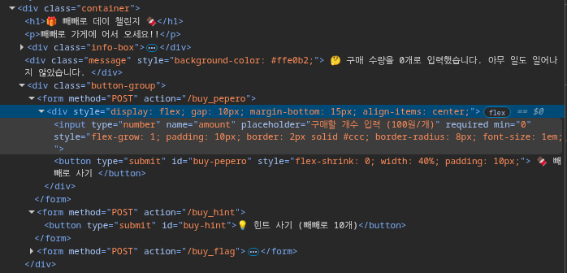
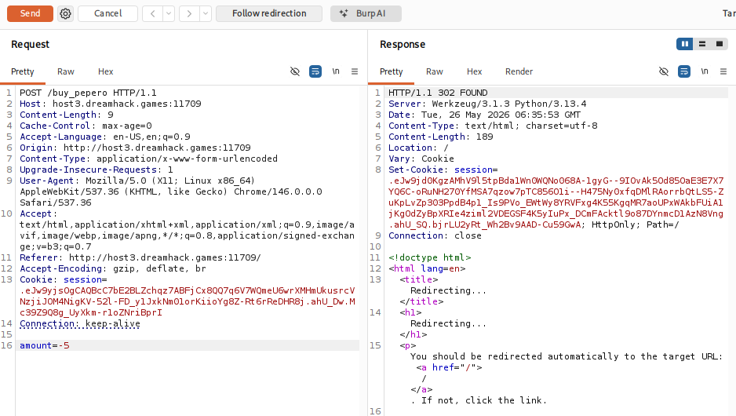
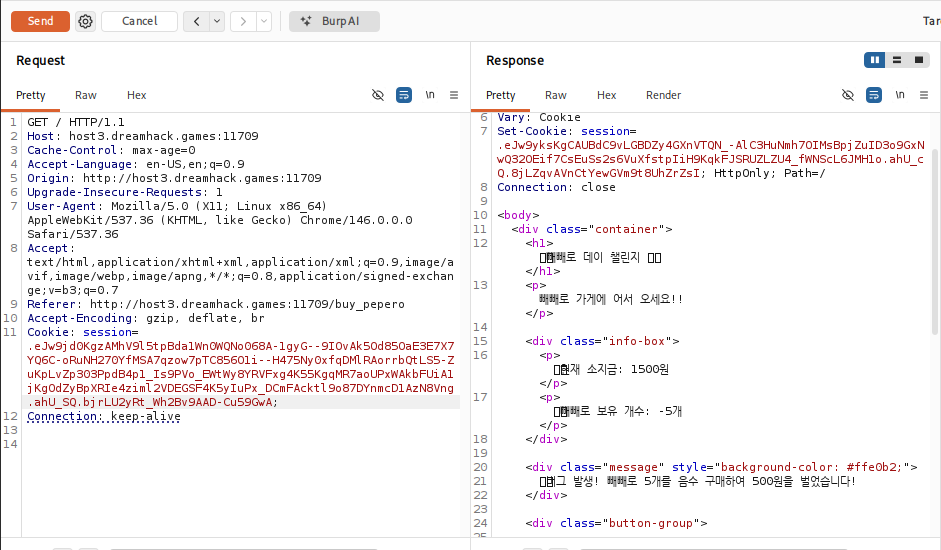
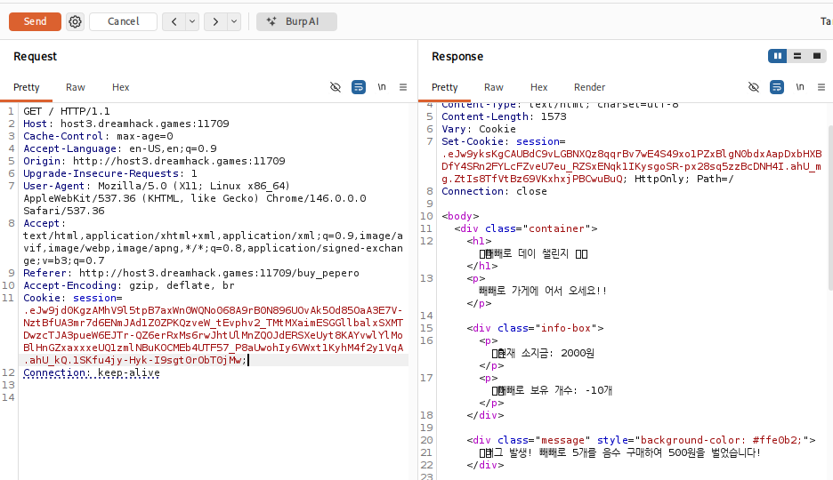
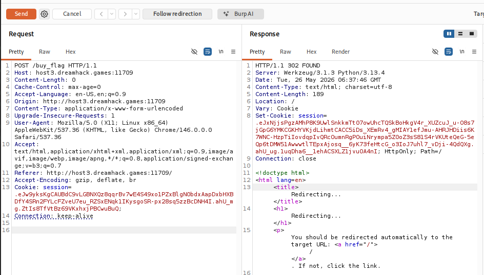
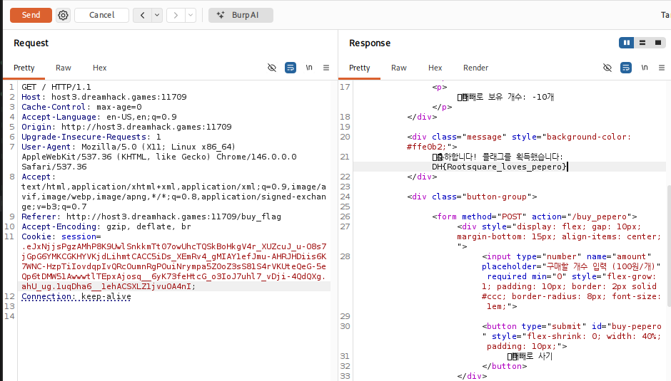

# [Dreamhack] PEPERO - Web Hacking

## 1. 문제 개요

* **문제 링크:** [Dreamhack - PEPERO](https://dreamhack.io/wargame/challenges/2425)

* **분야:** Web

* **목표:** 상점의 결제 로직 취약점(Logic Flaw)을 악용하여 소지금을 부풀린 뒤, 2000원짜리 플래그 구매.

## 2. 취약점 분석
제공된 소스 코드가 없는 블랙박스 환경이므로, 클라이언트 폼과 서버의 응답을 통해 취약점 추론.

**[클라이언트 측 검증 우회]**

* 웹 브라우저 개발자 도구를 통해 HTML 소스 코드를 확인한 결과, 구매 개수 입력 폼에 `min="0"` 속성이 적용되어 있어 일반적인 방법으로는 음수 입력 불가 확인.

* Burp Suite를 사용하여 패킷을 가로채면 클라이언트 측 검증 우회 및 임의의 값 전송 가능.

**[서버 측 비즈니스 로직 취약점]**

* 결제 금액 계산 시 `abs()`와 같은 절대값 처리나 음수 필터링이 누락된 것으로 추정.

* 서버가 `현재 소지금 - (구매 수량 * 100원)` 로직을 사용할 때, 수량에 음수를 전달하면 마이너스 곱셈이 성립되어 오히려 소지금이 증가하는 취약점 존재.

* 사용자의 상태(소지금, 빼빼로 개수)는 서버에서 발급하는 세션 쿠키에 지속적으로 갱신되어 저장됨.

## 3. 공격 수행
Burp Suite를 활용하여 클라이언트 검증을 우회하고 조작된 페이로드를 전송하여 익스플로잇.

### 3.1. 입력값 변조 및 소지금 증식

1. Burp Suite로 캡처한 `POST /buy_pepero` 요청 패킷을 Repeater로 전송.

2. `amount` 파라미터에 소지금을 증가시키기 위한 음수 페이로드(`-5`) 삽입 후 전송.

3. 서버에서 `302 FOUND` 리다이렉트 응답과 함께 발급된 새로운 `Set-Cookie` 값을 복사.

4. 이후 `GET /` 요청 시 복사한 쿠키를 적용하여 전송한 결과, 소지금이 1000원에서 1500원으로 증가한 것 확인.

5. 위와 동일한 과정(음수 전송 -> 새 쿠키 적용)을 한 번 더 반복하여 플래그 구매 요구 금액인 2000원 달성.

### 3.2. 플래그 구매

소지금 2000원이 기록된 최종 세션 쿠키를 적용한 상태로 `POST /buy_flag` 엔드포인트에 요청 전송. 서버 측에서 정상적으로 플래그 구매 처리.

## 4. 획득 결과
플래그 구매 후 새로 발급된 세션 쿠키를 적용하여 메인 페이지 응답 확인 결과, 성공적으로 하드코딩된 플래그 획득.

* **FLAG:** `DH{Rootsquare_loves_pepero}`

## 5. 대응 방안
클라이언트 측 HTML 속성(`min="0"`)에만 의존하는 검증은 프록시 툴에 의해 쉽게 무력화됨. 서버 측 로직에 강력한 입력값 검증 추가 필요.

* **서버 측 양수 검증 로직 추가:** 결제 처리 전, 백엔드 코드에서 사용자 입력값(`amount`)이 0보다 큰 양수인지 확인하는 로직을 반드시 구현하여 비정상적인 금액 계산 차단.