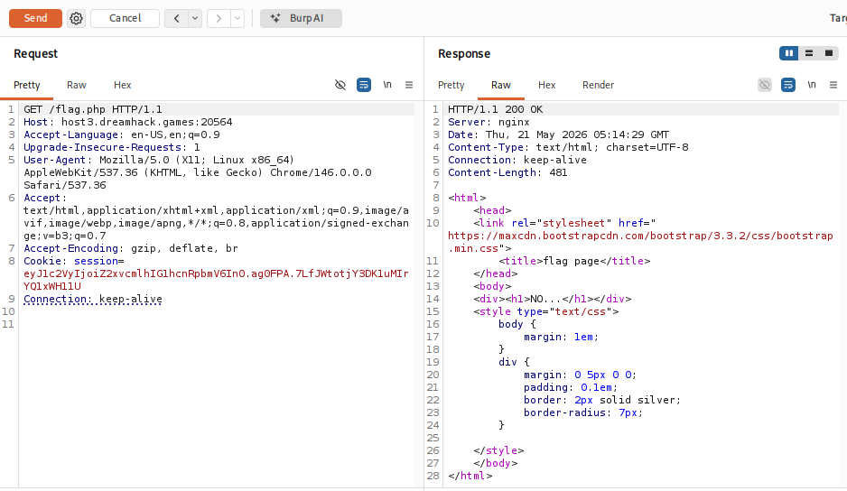
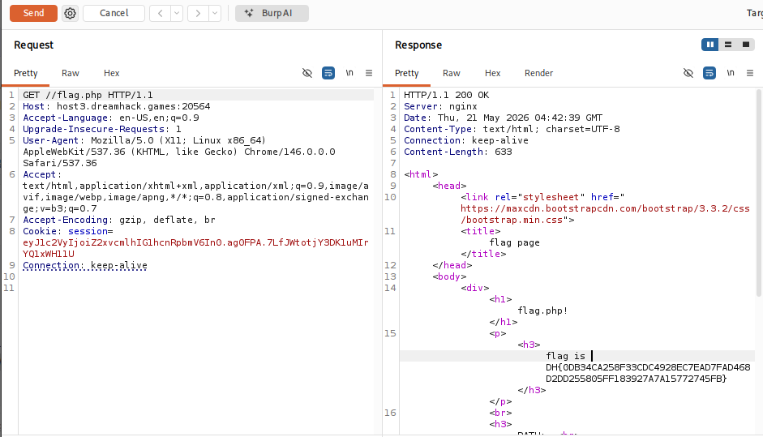

# [Dreamhack] Simple PHParse - Web Hacking

## 1. 문제 개요

* **문제 링크:** [Dreamhack - simple-phparse](https://dreamhack.io/wargame/challenges/1367)

* **분야:** Web

* **목표:** 웹 서버와 PHP `parse_url` 함수 간의 URL 해석 차이(Parser Differential)를 이용한 필터링 우회 및 플래그 탈취.

## 2. 취약점 분석
제공된 `index.php` 소스 코드를 분석한 결과, 사용자 요청 URL을 검증하는 과정에서 파서 불일치(Parser Differential) 취약점 확인.

```php
<?php
  $url = $_SERVER['REQUEST_URI'];
  $host = parse_url($url,PHP_URL_HOST);
  $path = parse_url($url,PHP_URL_PATH);
  $query = parse_url($url,PHP_URL_QUERY);
  echo "<div><h1> host: $host <br> path: $path <br> query: $query<br></h1></div>";

  // [!] 취약점 발생: $path 변수를 기준으로 flag.php 문자열 필터링
  if(preg_match("/flag.php/i", $path)){
      echo "<div><h1>NO....</h1></div>";
  }
  else echo "<div><h1>Cannot access flag.php: $path </h1></div> ";
?>
```

* **분석 결론:** PHP의 `parse_url` 함수는 문자열이 `//`로 시작할 경우 이어지는 문자열을 경로(Path)가 아닌 호스트(Host)로 해석. 반면, Nginx 등 웹 서버는 다중 슬래시(`//`)를 단일 슬래시(`/`)로 정형화하여 정상 경로로 처리. 이를 이용해 검증 대상인 `$path`를 비워 정규표현식(`preg_match`)을 우회하면서 실제 파일에는 접근 가능한 취약점 존재.

## 3. 공격 수행
Nginx 설정 파일이 주어지지 않은 블랙박스 환경이므로, 서버의 응답 반응을 기반으로 단계를 나누어 접근 및 익스플로잇 수행.

### 3.1. 블랙박스 테스트 및 페이로드 분석

1. **초기 접근 및 탐색:** Burp Suite를 통해 `/flag.php` 경로로 직접 요청 전송.

   * **결과:** `index.php` 필터에 걸려 화면에 `NO....` 문구 출력 확인.

   * **판단:** 사용자가 `flag.php`를 요청하더라도 웹 서버단에서 `index.php`로 요청을 강제 리다이렉트하도록 설정되어 있음을 인지.



2. **우회 페이로드 생성:** `index.php` 코드 내의 `$path` 검증 로직을 무력화하기 위해 Request URI를 `//flag.php`로 변조 후 전송.

   * **예상:** 필터링을 통과하여 `else` 구문의 `Cannot access flag.php: ...` 문구가 출력될 것으로 예상.

3. **최종 익스플로잇 및 특이사항 확인:** `//flag.php` 요청 전송 결과, 예외 문구 출력 없이 곧바로 진짜 플래그 화면(`flag.php!`) 렌더링 확인.

   * **결과 분석:** 슬래시 2개(`//`) 요청이 웹 서버의 리다이렉트 규칙은 우회하고, 실제 파일 탐색 시에는 경로가 정형화되어 `flag.php` 주소로 다이렉트 패싱된 것으로 최종 판단.



## 4. 획득 결과
Burp Suite의 Response 탭 확인 결과, 필터링이 우회되어 `flag.php` 내용이 렌더링되며 하드코딩된 서버 플래그 출력.

* **FLAG:** `DH{0DB34CA258F33CDC4928EC7EAD7FAD468D2DD255805FF183927A7A15772745FB}`

## 5. 대응 방안
URL 검증 시 단일 파서(`parse_url`)의 결과에만 의존하는 것은 위험하며, 실제 파일 시스템에 접근하는 경로를 기준으로 검증 로직 구현 필요.

* **서버 환경 변수 활용:** 사용자가 입력한 `$_SERVER['REQUEST_URI']` 대신, 웹 서버 측에서 이미 URL 디코딩 및 정형화를 끝마친 `$_SERVER['SCRIPT_NAME']` 또는 `$_SERVER['PHP_SELF']` 변수를 활용하여 필터링 수행.