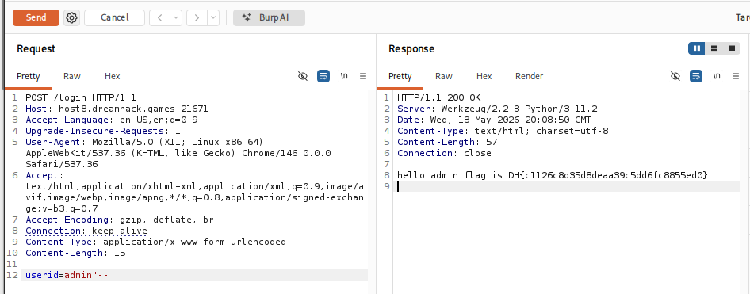

# [Dreamhack] Simple SQLi - Web Hacking

## 1. 문제 개요

* **문제 링크:** [Dreamhack - simple_sqli](https://dreamhack.io/wargame/challenges/24)

* **분야:** Web

* **목표:** SQL Injection 취약점을 이용하여 `admin` 계정으로 로그인하고 플래그 탈취.

## 2. 취약점 분석
제공된 `app.py` 소스 코드를 분석한 결과, `/login` 엔드포인트에서 사용자 입력값이 데이터베이스 쿼리에 필터링 없이 동적으로 직접 할당되는 것을 확인.

```python
@app.route('/login', methods=['GET', 'POST'])
def login():
    # ... (중략) ...
    else:
        userid = request.form.get('userid')
        userpassword = request.form.get('userpassword')
        
        # [!] 취약점 발생: f-string을 사용한 동적 쿼리 생성
        res = query_db(f'select * from users where userid="{userid}" and userpassword="{userpassword}"') 
        
        if res:
            userid = res[0]
            if userid == 'admin':
                return f'hello {userid} flag is {FLAG}'
```

* **분석 결론:** 사용자가 입력한 `userid`와 `userpassword` 값이 입력값 검증이나 이스케이프 처리 없이 f-string을 통해 SQL 쿼리에 직접 삽입되므로, 메타문자(예: `"`, `--`)를 삽입하여 원래 의도와 다른 쿼리를 실행할 수 있는 **SQL Injection** 취약점이 존재함.

## 3. 공격 수행
Burp Suite를 활용하여 웹 브라우저를 거치지 않고 직접 조작된 페이로드를 서버로 전송하여 익스플로잇.

### 3.1. 패킷 캡처 및 페이로드 변조

1. 웹 브라우저에서 메인 경로(`/`)로 접근하는 요청 패킷을 Burp Suite로 캡처하여 Repeater로 전송.

2. Repeater에서 HTTP 메서드를 `POST`로, 요청 경로를 `/login`으로 직접 수정. 이후 파라미터에 SQL Injection 페이로드를 삽입. 큰따옴표(`"`)로 `userid` 문자열을 닫고, 뒤의 비밀번호 검증 로직을 무력화하기 위해 SQLite 주석(`--`)을 추가하여 `userid=admin"--` 형태로 전송.

3. 서버 내부 데이터베이스에서는 쿼리가 다음과 같이 변조되어 실행됨.
   `select * from users where userid="admin"--" and userpassword="..."`
   `--` 이후의 구문이 주석 처리되어 최종적으로 `select * from users where userid="admin"`이 실행되며, 패스워드 검증 없이 `admin` 계정 인증을 우회함.



## 4. 획득 결과
Burp Suite의 Response 탭 확인 결과, `admin` 계정으로 로그인이 성공하여 하드코딩된 본 서버 플래그가 출력됨.

* **FLAG:** `DH{c1126c8d35d8deaa39c5dd6fc8855ed0}`

## 5. 대응 방안
사용자 입력을 SQL 쿼리 문자열에 직접 연결하는 것은 위험하므로, 쿼리의 구조와 데이터를 분리하는 방식을 사용해야 함.

* **Prepared Statement 사용:** 데이터베이스 드라이버에서 제공하는 바인딩 변수(예: `?`, `%s`)를 사용하여 사용자 입력값이 SQL 명령어가 아닌 단순 데이터 스트링으로만 처리되도록 로직을 수정하여 SQL Injection을 완전히 차단함.