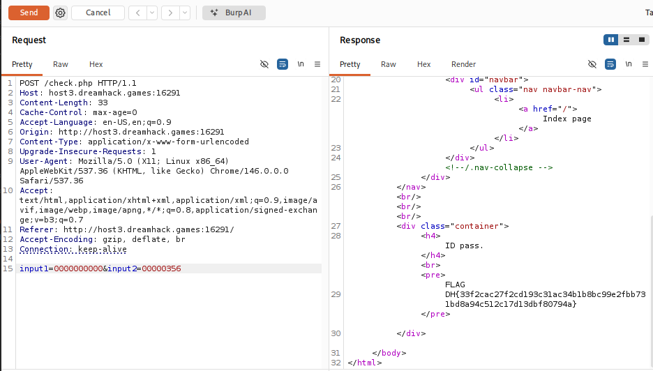

# [Dreamhack] Type c-j - Web Hacking

## 1. 문제 개요

**문제 링크:** [Dreamhack - Type c-j](https://dreamhack.io/wargame/challenges/960)

**분야:** Web

**목표:** PHP Type Juggling 및 명시적 형변환 취약점을 이용하여 인증을 우회하고 플래그 탈취.

## 2. 취약점 분석
제공된 `check.php` 소스 코드를 분석한 결과, 사용자의 입력값과 서버 내 변수를 비교할 때 느슨한 비교(`==`) 연산자를 사용하는 것을 확인.

```php
// check.php 주요 취약점 발췌
$id = getRandStr();
$pw = sha1("1"); // 356a192b7913b04c54574d18c28d46e6395428ab

// [!] 취약점 발생: (int) 명시적 형변환과 느슨한 비교(==) 연산자 동시 사용
if((int)$input_id == $id && strlen($input_id) === 10){
    echo '<h4>ID pass.</h4><br>';
    if((int)$input_pw == $pw && strlen($input_pw) === 8){
        echo "<pre>FLAG\n";
        echo $flag;
        echo "</pre>";
    }
}
```

**분석 결론:** 구버전 PHP 환경에서 문자열을 정수형(`int`)으로 강제 변환 후 `==`로 비교할 때 발생하는 Type Juggling 취약점 존재. 영문자로 시작하는 문자열은 `0`으로 변환되며, 숫자로 시작하는 문자열은 해당 숫자까지만 변환됨. 이를 이용하여 원본 데이터(`$id`, `$pw`)를 정확히 모르더라도 강제 형변환 규칙에 맞춰 비교문을 참(True)으로 만드는 페이로드 구성 가능.

## 3. 공격 수행
서버로 전송되는 Request 패킷을 명확히 제어하기 위해 Burp Suite를 사용하여 HTTP POST 요청을 직접 변조 및 익스플로잇.

### 3.1. 페이로드 구성 및 패킷 변조

1. **PW 우회 (`input2`):** `sha1("1")`의 결과값은 `356...`으로 시작함. 정수 변환 시 `356`이 되므로, 길이가 8자리이면서 정수 356으로 인식되는 `00000356` 대입.

2. **ID 우회 (`input1`):** 무작위 생성되는 10자리 `$id`가 영문자로 시작할 확률(52/62)을 노림. 영문자로 시작할 경우 정수 `0`으로 변환되므로, 길이가 10자리인 `0000000000` 대입.

3. Burp Suite의 Repeater를 활용하여 `input1=0000000000&input2=00000356` 데이터를 POST로 전송. `$id`가 숫자로 시작하여 우회에 실패하더라도, 동일한 패킷을 재전송하여 영문자로 시작하는 `$id`가 세팅될 때까지 반복.



## 4. 획득 결과
Burp Suite의 Response 탭 확인 결과, 두 가지 인증 로직을 모두 통과하여 서버 플래그가 정상적으로 출력됨.

**FLAG:** `DH{33f2cac27f2cd193c31ac34b1b8bc99e2fbb731bd8a94c512c17d13dbf80794a}`

## 5. 대응 방안
서로 다른 타입의 데이터를 비교할 때 내부적인 형변환이 일어나는 느슨한 비교 연산자 사용 지양.

**엄격한 비교 연산자 사용:** 값과 타입을 모두 검사하는 `===` 연산자를 사용하여 의도치 않은 형변환 차단. 본 코드의 경우 `(int)` 강제 캐스팅 로직을 제거하고, 해시값 및 문자열 자체를 안전하게 비교하도록 수정.