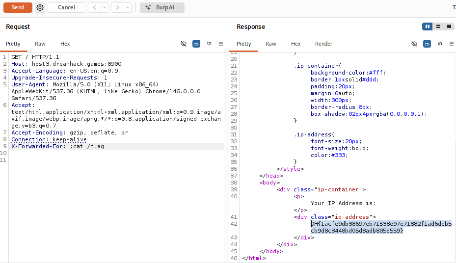

# [Dreamhack] What Is My IP - Web Hacking

## 1. 문제 개요

**문제 링크:** [Dreamhack - what-is-my-ip](https://dreamhack.io/wargame/challenges/1186)

**분야:** Web

**목표:** `X-Forwarded-For` 헤더 변조를 통한 Command Injection 취약점을 이용하여 서버 최상단(`/`)에 위치한 플래그 파일 읽기.

## 2. 취약점 분석

제공된 `app.py` 소스 코드를 분석한 결과, 사용자의 IP를 가져와 시스템 명령어로 실행하는 과정에서 취약점 확인.

```python
@app.route('/')
def flag():
    user_ip = request.access_route[0] if request.access_route else request.remote_addr
    try:
        result = run(
            ["/bin/bash", "-c", f"echo {user_ip}"],
            capture_output=True,
            text=True,
            timeout=3,
        )
# ...
```

**분석 결론:** `request.access_route`는 클라이언트가 변조할 수 있는 HTTP 헤더인 `X-Forwarded-For` 값을 기반으로 생성.

해당 값을 검증 없이 `f-string`을 통해 쉘 명령어(`echo`)에 직접 삽입.

사용자가 명령어 구분자(예: `;`, `$()`)를 포함한 문자열을 전송할 경우 의도치 않은 명령어 실행을 유발하는 Command Injection 발생.

## 3. 공격 수행

Burp Suite를 사용하여 HTTP 요청 패킷을 캡처하고 조작된 페이로드 전송.

### 3.1. 페이로드 변조 및 전송

1. HTTP 요청 헤더에 `X-Forwarded-For: ; cat /flag` 삽입.

2. 서버 내부에서 실행되는 쉘 명령어는 다음과 같이 변조.
   `echo ; cat /flag`
   앞의 `echo` 명령이 빈 문자열을 출력하고 종료된 후, 명령어 구분자 `;`에 의해 `cat /flag` 명령이 연달아 실행.



## 4. 획득 결과

Burp Suite의 Response 탭 확인 결과, 조작된 명령어가 성공적으로 실행되어 HTML 응답 내에 하드코딩된 서버 플래그 출력.

**FLAG:** `DH{1acfe9db38697eb71538e97e71882f1ad6deb5cb9d8c3448bd05d3adb805e559}`

## 5. 대응 방안

`X-Forwarded-For`와 같은 HTTP 헤더 값은 클라이언트 측에서 임의로 조작 가능하므로, 서버 로직에서 그대로 신뢰하고 시스템 명령어에 사용 금지.

**입력값 검증:** 정규표현식 등을 사용하여 입력값이 유효한 IP 주소 형식(`IPv4` 또는 `IPv6`)인지 엄격하게 검사.

**안전한 함수 사용:** 외부 명령어를 쉘을 통해 직접 실행하는 방식 지양. 불가피할 경우 입력값이 쉘 메타문자로 해석되지 않도록 철저한 필터링 및 이스케이프 처리.