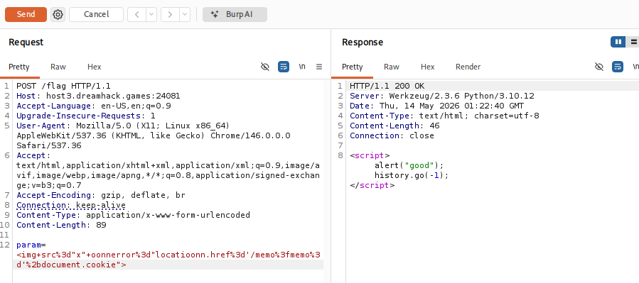
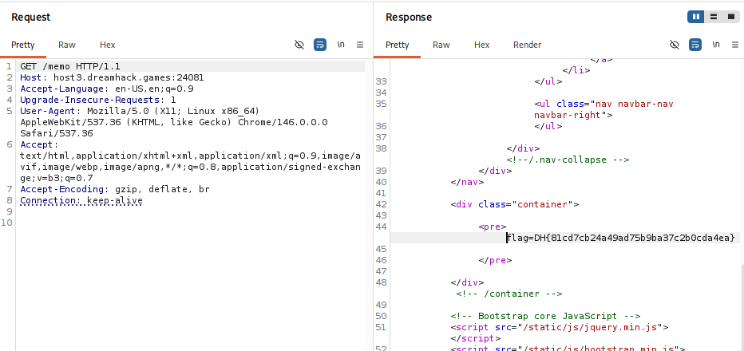

# [Dreamhack] XSS Filtering Bypass - Web Hacking

## 1. 문제 개요

* **문제 링크:** [Dreamhack - XSS Filtering Bypass](https://dreamhack.io/wargame/challenges/433)

* **분야:** Web

* **목표:** 서버의 XSS 필터링 로직을 우회하여 관리자(Bot)의 브라우저에서 악성 자바스크립트를 실행하고, 쿠키에 저장된 플래그를 탈취하여 `/memo` 페이지에 기록.

## 2. 취약점 분석
제공된 `app.py` 소스 코드를 분석한 결과, 사용자의 입력값을 검증하는 `xss_filter` 함수에 취약점이 존재하는 것을 확인.

```python
def xss_filter(text):
    _filter = ["script", "on", "javascript:"]
    for f in _filter:
        if f in text.lower():
            text = text.replace(f, "")
    return text

@app.route("/vuln")
def vuln():
    param = request.args.get("param", "")
    param = xss_filter(param)
    return param
```

* **분석 결론:** `xss_filter` 함수는 `script`, `on`, `javascript:` 문자열을 발견하면 공백(`""`)으로 치환하여 제거. 그러나 `replace` 함수는 발견된 문자열을 **단 한 번만 치환하며 재귀적으로 검사하지 않는다는 취약점**이 존재. 이를 이용하여 필터링 키워드 내부에 동일한 키워드를 중복 삽입하는 단어 겹쳐 쓰기(Doubling) 기법으로 필터링을 우회 가능.

## 3. 공격 수행
Burp Suite를 사용하여 `/flag` 엔드포인트에 조작된 Payload를 전송하고, 필터링 우회 및 XSS를 트리거.

### 3.1. 페이로드 설계 및 필터링 우회

1. 관리자 봇의 세션(쿠키)을 탈취하여 `/memo` 페이지로 전달해야 하므로 `document.cookie`와 `location.href` 객체가 필요.

2. `script` 태그 대신 `img` 태그의 `onerror` 이벤트 핸들러를 사용.

3. `onerror`와 `location` 문자열 내부에는 필터링 대상인 `on`이 포함되어 있어 서버 전송 시 `err`, `locati`로 변조.

4. 이를 우회하기 위해 `on` 문자열 중간에 다시 `on`을 삽입하여 `oonnerror`, `locatioonn` 형태로 페이로드를 작성함. 서버의 `replace` 함수가 중간의 `on`을 제거하면 정상적인 `onerror`, `location`으로 복원.

* **최종 Payload:**
  ```html
  
  ```

### 3.2. 공격 페이로드 전송

1. Burp Suite의 Repeater를 통해 `/flag` 엔드포인트로 POST 요청 전송.

2. `param` 데이터에 위에서 작성한 페이로드를 URL 인코딩하여 삽입 후 전송.

3. 관리자 봇이 취약한 `/vuln` 페이지에 접속하면서 페이로드가 실행되고, 봇의 쿠키(Flag)가 `/memo` 페이지로 전송.



## 4. 획득 결과
Burp Suite를 통해 `/memo` 엔드포인트로 GET 요청을 보낸 결과, 관리자 봇의 브라우저에서 실행된 스크립트에 의해 쿠키값이 성공적으로 기록된 것을 확인.

* **FLAG:** `DH{81cd7cb24a49ad75b9ba37c2b0cda4ea}`



## 5. 대응 방안
단순히 특정 문자열을 `replace` 함수로 한 번만 지우는 블랙리스트 방식의 필터링은 다양한 우회 기법(대소문자 혼용, 단어 중복 삽입 등)에 취약.

* **안전한 치환 로직 구현:** 정규표현식 등을 사용하여 필터링 대상 문자열이 완전히 사라질 때까지 재귀적으로 검사하고 제거.

* **HTML Entity 인코딩:** 사용자의 입력값이 HTML 태그나 자바스크립트로 해석되지 않도록 출력 시점(`return param` 부분)에 `<` 는 `&lt;`, `>` 는 `&gt;`, `"` 는 `&quot;` 등으로 치환하는 방어 기법을 적용. Flask의 경우 Jinja2 템플릿 엔진의 자동 이스케이프 기능을 활용하는 것이 안전.