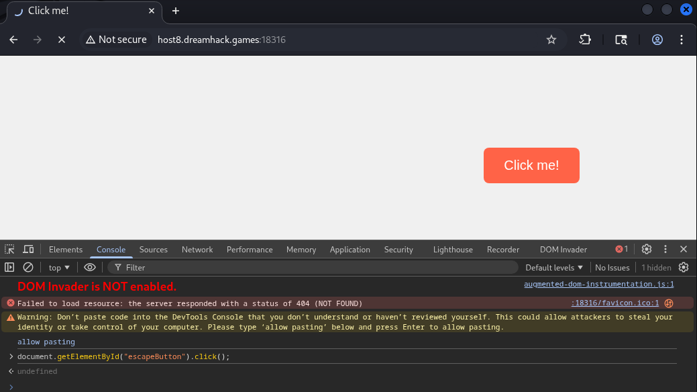
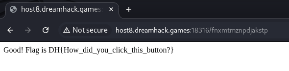

# [Dreamhack] Click me! - Web Hacking

## 1. 문제 개요

* **문제 링크:** [Dreamhack - Click me!](https://dreamhack.io/wargame/challenges/1989)

* **분야:** Web

* **목표:** 프론트엔드 환경에서 자바스크립트 이벤트를 우회하고 DOM 요소를 강제로 조작하여 플래그 탈취.

## 2. 취약점 분석
제공된 웹 페이지를 개발자 도구(Elements 탭)에서 분석한 결과, 사용자가 'Click me!' 버튼을 물리적으로 클릭하지 못하도록 클라이언트 단에서 방해 로직이 구현되어 있음을 확인.

**[핵심 자바스크립트 코드 분석]**
```javascript
const escapeButton = document.getElementById("escapeButton");
const ESCAPE_DISTANCE = 200;

// 1. 방해 로직: 마우스가 버튼 근처(200px 이내)로 오면 버튼을 랜덤한 위치로 이동시킴
document.addEventListener("mousemove", (event) => {
    // ... (좌표 계산 로직 생략) ...
    if (distance < ESCAPE_DISTANCE) {
        moveButtonRandomly();
    }
});

// 2. 목표 로직: 버튼이 '클릭' 되어야만 플래그가 있는 페이지로 리다이렉션 됨
escapeButton.addEventListener("click", () => {
    window.location.href = "/fnxmtmznpdjakstp";
});
```

* **버튼 속성 (`tabindex="-1"`):** HTML 태그 자체에 탭 이동을 막아두어 키보드의 `Tab` 키 + `Enter` 조합을 통한 클릭을 원천 차단함.

* **분석 결론:** 물리적인 마우스 접근과 키보드 접근이 모두 막혀있으나, 최종 목적지(`/fnxmtmznpdjakstp`)로 가기 위한 이벤트 자체는 브라우저에 그대로 노출됨. 따라서 브라우저 개발자 도구 콘솔을 통해 직접 DOM 객체에 접근하여 강제로 `click` 이벤트를 발생시키면 우회 가능.

## 3. 공격 수행
브라우저 개발자 도구를 활용하여 클라이언트 사이드 제한을 우회하고 강제 클릭 이벤트를 트리거함.

### 3.1. 개발자 도구 콘솔(Console) 활용

1. 브라우저 개발자 도구를 열고 **Console** 탭으로 이동.

2. 아래의 자바스크립트 코드를 입력하여 `escapeButton` ID를 가진 요소에 직접 `click()` 메서드를 호출.

```javascript
// 마우스 접근 우회 및 강제 클릭 이벤트 발생
document.getElementById("escapeButton").click();
```



3. 코드가 실행되면서 버튼 클릭 이벤트가 정상적으로 트리거되어 플래그가 포함된 페이지로 이동됨.

## 4. 획득 결과
자바스크립트 실행 직후, 성공 메시지와 함께 플래그가 출력됨을 확인.



* **FLAG:** `DH{How_did_you_click_this_button?}`

## 5. 대응 방안
본 문제는 클라이언트 사이드의 DOM 조작 및 이해도를 묻기 위한 의도적인 퍼즐 형태이나, 실제 웹 서비스 설계 시 다음과 같은 점에 유의해야 함.

* **서버 사이드 검증의 중요성:** 사용자의 특정 액션(클릭, 폼 제출 등)에 대한 권한 검증이나 중요한 비즈니스 로직(플래그 발급 등)은 절대 클라이언트 단(HTML/JS)에 의존해서는 안 됨.

* 클라이언트에서 전송되는 모든 데이터 및 이벤트는 조작 가능함을 전제로 하고, 반드시 백엔드(Server-side)에서 유효성 검증을 거쳐야 함.