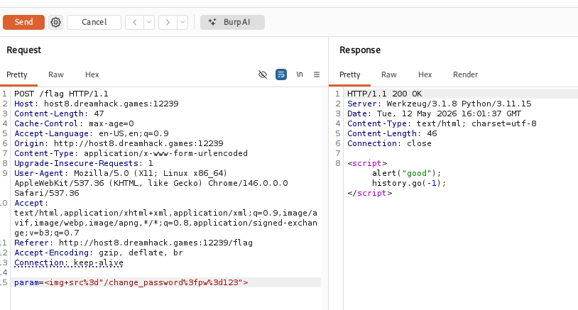
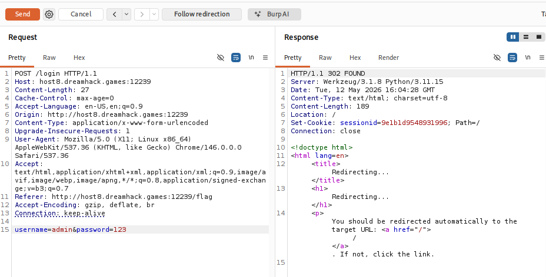
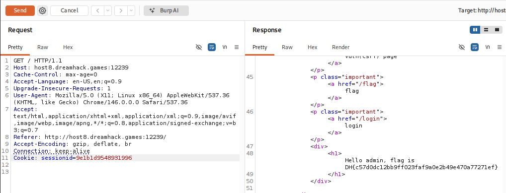

# [Dreamhack] CSRF-2 - Web Hacking

## 1. 문제 개요
* **문제 링크:** [Dreamhack - csrf-2](https://dreamhack.io/wargame/challenges/269)

* **분야:** Web

* **목표:** 관리자(admin) 봇을 대상으로 CSRF 공격을 수행하여 관리자의 비밀번호를 임의로 변경한 후, 해당 계정으로 직접 로그인하여 숨겨진 플래그를 탈취.

## 2. 취약점 분석
제공된 소스코드(`app.py`)를 분석한 결과, 관리자 봇의 자동화된 동작과 검증이 누락된 비밀번호 변경 로직이 결합하여 CSRF 취약점이 발생.

### 2.1. 관리자 봇의 동작 로직 (`/flag`, `check_csrf`, `read_url`)
사용자가 `/flag`에 `param`을 제출하면, 서버는 임시로 `admin` 세션을 생성하고 봇에게 이 세션을 부여한 뒤 `/vuln` 페이지를 방문.

```python
users = {
    'guest': 'guest',
    'admin': FLAG  # admin 비밀번호 자체가 flag라 직접 로그인 불가
}

@app.route("/")
def index():
    ...
    return render_template('index.html', text=f'... {"flag is " + FLAG if username == "admin" else "..."}')

@app.route("/flag", methods=["GET", "POST"])
def flag():
    # ... (중략) ...
    elif request.method == "POST":
        param = request.form.get("param", "")
        session_id = os.urandom(16).hex()
        session_storage[session_id] = 'admin' # 1. 봇을 위한 admin 세션 생성
        # 2. 봇에게 admin 쿠키를 쥐여주고 check_csrf 호출
        if not check_csrf(param, {"name":"sessionid", "value": session_id}):
            return '<script>alert("wrong??");history.go(-1);</script>'
        return '<script>alert("good");history.go(-1);</script>'

def check_csrf(param, cookie={"name": "name", "value": "value"}):
    # 3. 봇이 방문할 최종 URL 조합 (URL 인코딩 포함)
    url = f"http://127.0.0.1:8000/vuln?param={urllib.parse.quote(param)}"
    return read_url(url, cookie) # 4. read_url을 통해 접속
```

### 2.2. 취약한 필터링 및 렌더링 (`/vuln`)
봇이 접속하는 `/vuln` 페이지는 XSS 방어를 위해 문자열을 필터링하지만, `frame`, `script`, `on` 키워드만 막고 있어 `` 같은 다른 HTML 태그는 우회 가능.

```python
@app.route("/vuln")
def vuln():
    param = request.args.get("param", "").lower()
    xss_filter = ["frame", "script", "on"]
    for _ in xss_filter:
        param = param.replace(_, "*")
    return param # 필터링을 통과한 태그(예: )가 그대로 브라우저에 렌더링됨
```

### 2.3. 무방비한 상태 변경 API (`/change_password`)
비밀번호 변경에 검증 로직이 없고 현재 접속자의 세션만 확인함.

```python
@app.route("/change_password")
def change_password():
    pw = request.args.get("pw", "")
    session_id = request.cookies.get('sessionid', None)
    try:
        username = session_storage[session_id]
    except KeyError:
        return render_template('index.html', text='please login')

    # [!] 취약점 발생 : CSRF 검증 없이, 접속자의 username(admin)의 비밀번호를 바로 덮어씀
    users[username] = pw 
    return 'Done'
```

* **분석 결론:** admin 계정의 비밀번호가 FLAG 값 그 자체로 설정되어 있어 직접 로그인이 불가능하며, /에서 admin으로 로그인된 상태여야만 FLAG가 노출되는 구조. 따라서 CSRF로 admin의 비밀번호를 알고 있는 값으로 강제 변경하는 것이 유일한 공격 경로. 공격자가 `` 페이로드를 전송하면, 봇이 `admin` 쿠키를 가진 상태로 이 태그를 렌더링하게 되고, 브라우저가 이미지를 불러오기 위해 위 라우트로 요청을 보내면서 관리자의 비밀번호가 즉시 변경.

## 3. 공격 수행
Burp Suite의 Repeater 기능을 활용하여 웹 UI를 거치지 않고 직접 HTTP 통신을 조작하여 공격을 수행.

### 3.1. CSRF 페이로드 전송 (관리자 비밀번호 조작)

1. `/flag` 엔드포인트로 POST 요청을 구성.

2. `param` 데이터에 관리자의 비밀번호를 `123`으로 변경시키는 페이로드인 ``를 URL 인코딩하여 전송.

3. 응답으로 `<script>alert("good");history.go(-1);</script>`를 확인. 이는 관리자 봇이 성공적으로 덫을 밟고 `admin`의 비밀번호를 `123`으로 변경했음을 의미함.



### 3.2. 관리자 계정 로그인 및 세션 획득

1. `/login` 엔드포인트로 POST 요청을 전송.

2. `username=admin&password=123` 페이로드를 담아 전송.

3. `302 FOUND` 리다이렉션 응답과 함께, `Set-Cookie` 헤더를 통해 관리자 권한의 새로운 세션 아이디(`sessionid=9e1b1d9548931996`)를 발급받음.



### 3.3. 플래그 획득

1. 발급받은 관리자의 세션 쿠키(`Cookie: sessionid=9e1b1d9548931996`)를 헤더에 포함하여 메인 페이지(`/`)로 GET 요청을 전송.

2. 응답 바디(Response Body)에 렌더링된 텍스트에서 `admin` 계정 전용으로 출력되는 플래그를 확인.



## 4. 획득 결과
Burp Suite 응답 렌더 텍스트 내에서 관리자 전용 문구와 함께 하드코딩된 플래그를 발견함.

* **FLAG:** `DH{c57d0dc12bb9ff023faf9a0e2b49e470a77271ef}`

## 5. 대응 방안
웹 애플리케이션은 사용자의 의도와 무관하게 상태를 변경하는 요청이 실행되는 것을 막기 위해 추가적인 검증 절차를 도입해야 함.

* **현재 비밀번호 검증 로직 추가:** `/change_password`와 같이 중요한 개인 정보를 변경하는 기능에서는 반드시 '기존 비밀번호'를 함께 입력받아 확인하는 절차를 구현.

* **CSRF 토큰(Anti-CSRF Token) 도입:** 상태를 변경하는 모든 폼(Form) 요소 및 API 요청에 세션별로 난수화된 토큰을 포함시키고, 서버에서 요청을 처리하기 전 해당 토큰의 유효성을 검증.

* **SameSite 쿠키 속성 설정:** 세션 쿠키 발급 시 `SameSite=Lax` 또는 `Strict` 옵션을 적용하여, 외부 사이트나 악의적인 크로스 오리진 요청 시 세션 쿠키가 자동으로 첨부되지 않도록 차단.

## 6. 블루팀 관점 요약

보안관제 및 침해사고 대응(IR) 관점에서 CSRF를 이용한 관리자 상태 변경 공격 모니터링 및 방어.

* **WAF 및 웹 서버 로그 분석:** `/change_password` 엔드포인트가 상태를 변경하는 민감 기능임에도 `GET` 메서드로 처리되는 설계 자체가 위험 신호. Access 로그에서 `Referer` 헤더가 누락되었거나 자사 도메인이 아닌 외부 출처로 기록된 상태에서 해당 엔드포인트가 호출된 트래픽 우선 식별.

* **침해사고 대응 (IR) 시나리오:** `/flag` 또는 `/vuln` 등 페이로드 제출 엔드포인트 호출 직후, 내부 봇으로 추정되는 요청원(주로 서버 내부 IP)에서 `/change_password` 호출이 짧은 시간 내 연속 발생할 경우 CSRF 트리거 성공으로 간주. 해당 시간대에 변경된 계정의 비밀번호를 즉시 재설정하고 발급된 세션 전체 무효화.

* **네트워크 기반 탐지 룰 제안 (Snort):** 비밀번호 변경 요청이 GET 방식으로 쿼리스트링에 평문 비밀번호를 포함하여 전송되는 비정상 패턴 탐지.

```snort
alert tcp $EXTERNAL_NET any -> $HTTP_SERVERS $HTTP_PORTS (msg:"[Web] CSRF - Password Change via GET Request"; flow:to_server,established; http_method; content:"GET"; http_uri; content:"/change_password"; content:"pw="; distance:0; sid:1000008; rev:1;)
```