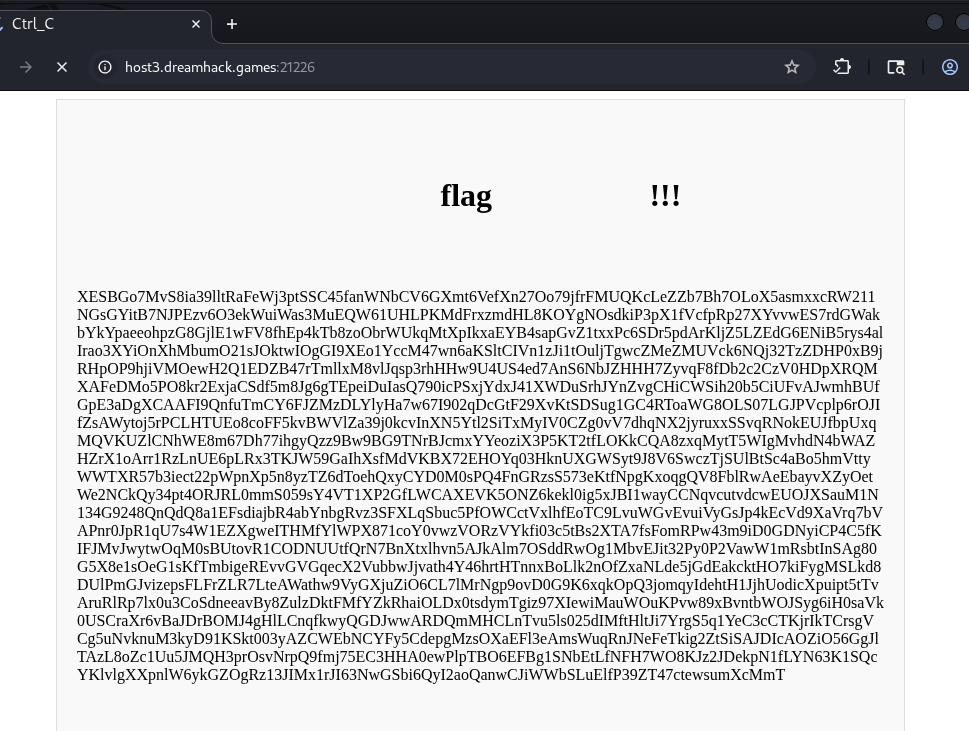
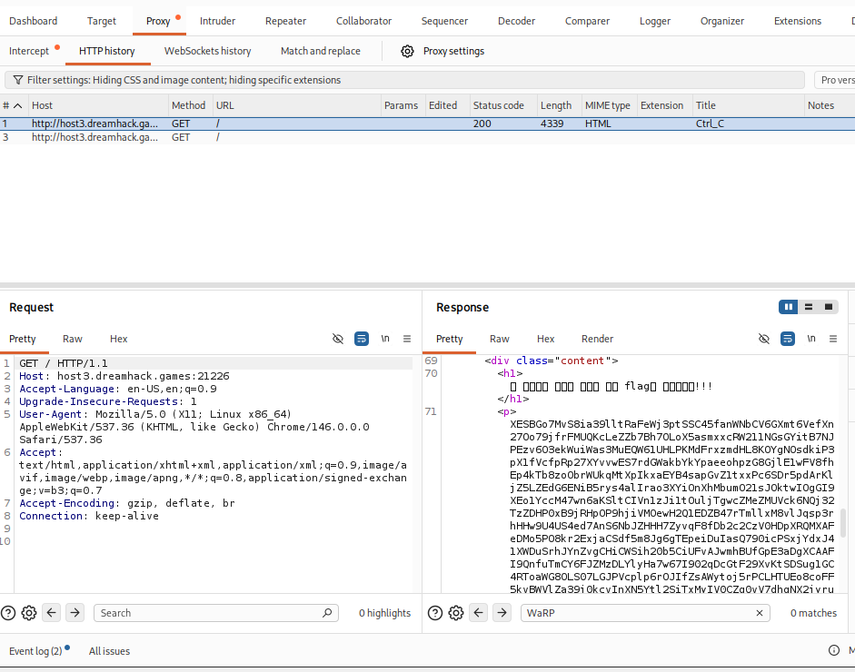
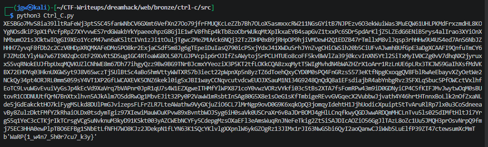

# [Dreamhack] Ctrl-C - Web

## 1. 문제 개요

* **문제 링크:** [Dreamhack - Ctrl-C](https://dreamhack.io/wargame/challenges/1846)

* **분야:** Web

* **목표:** 프론트엔드 환경의 텍스트 복사 차단 로직을 프록시 도구로 우회하여 원본 데이터를 추출하고, 이를 제공된 파이썬 스크립트(디코더)에 주입하여 하드코딩된 플래그를 복호화.

## 2. 취약점 분석
제공된 `Ctrl_C.py` 코드를 분석한 결과, 사용자 입력값을 해싱(SHA-256) 및 Base64 인코딩 후 특정 범위를 슬라이싱하여 거대한 정수와 XOR 연산(`^`)을 수행하는 구조임을 확인.

```python
import hashlib
import base64

def bytes_to_long(a):
    return int.from_bytes(a, byteorder='big')
def long_to_bytes(a):
    return a.to_bytes((a.bit_length()+7)//8, byteorder='big')

print(long_to_bytes(548488142063681088110499188198346596132432266189304030893626^bytes_to_long(base64.b64encode(hashlib.sha256(input().rstrip().encode('utf-8')).digest())[13:36])))
```



* **분석 결론:** 웹 브라우저 화면에 출력된 엄청난 길이의 텍스트는 사실 XOR 암호화를 풀기 위한 '열쇠'임. 브라우저의 자바스크립트 기반 우클릭/드래그 방지 기능은 프록시 도구(Burp Suite)의 HTTP 응답 패킷 열람을 통해 손쉽게 우회 가능함. 원본 텍스트를 추출하여 로컬 스크립트의 페이로드로 사용해야 함.

## 3. 공격 수행
Kali Linux와 프록시 도구를 연계하여 복호화 로직을 실행.

### 3.1. Burp Suite를 활용한 원본 데이터 추출

1. 브라우저를 통해 문제 웹 페이지에 접근.

2. **Burp Suite**의 `HTTP history` 탭에서 대상 서버로부터 전달된 `Response` 패킷을 확인.

3. 자바스크립트의 방해를 받지 않는 Pretty 응답 데이터 중 `<p>` 태그 하위의 난독화된 텍스트 덩어리 전체를 복사.



### 3.2. 복호화 스크립트 실행 및 플래그 획득

1. 로컬 환경의 터미널에서 파이썬 디코더 스크립트(`python3 Ctrl_C.py`)를 실행.

2. `input()` 대기 상태에서 프록시 도구에서 추출한 텍스트를 그대로 붙여넣기 한 후 엔터 입력.

3. 스크립트 내부의 XOR 역산 로직이 정상적으로 수행되며 바이트 배열 형태의 플래그가 출력되는 것을 확인.



## 4. 획득 결과
스크립트 실행 결과, 파이썬 콘솔에 출력된 플래그를 획득함.

* **FLAG:** `WaRP{1_w4n7_5h0r7cu7_k3y}`

## 5. 대응 방안

웹 환경에서 클라이언트(브라우저)로 한 번 전송된 데이터는 사용자가 프록시 도구를 통해 어떻게든 열람하고 추출할 수 있으므로, 자바스크립트나 CSS를 이용한 프론트엔드 레벨의 복사/접근 차단 로직에 보안을 의존해서는 안 됨.

* **서버 사이드 접근 통제:** 민감한 데이터나 핵심 텍스트는 클라이언트로 무조건 전송한 뒤 화면에서만 가리는 방식이 아니라, 서버 측에서 사용자의 권한을 먼저 검증한 후 정당한 요청에만 데이터를 응답하도록 구현해야 함.

* **서버 단 검증 로직 구현:** 캡차(CAPTCHA)나 CSRF 토큰 등을 활용하여 서버와 통신하는 주체가 정상적인 브라우저 환경의 사용자인지, 아니면 단순 자동화/프록시 툴인지 서버 사이드에서 식별하고 통제하는 방안을 적용해야 함.