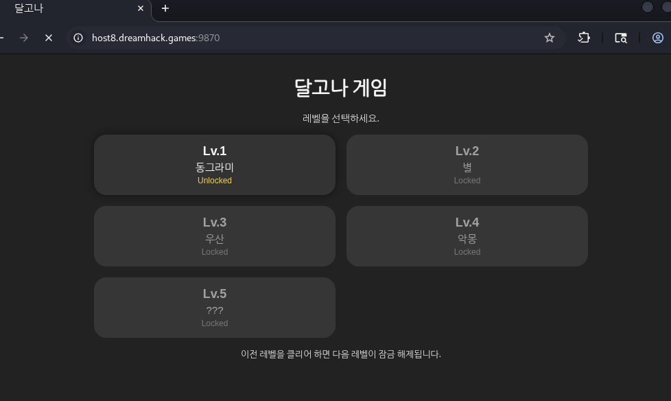
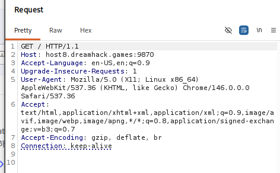
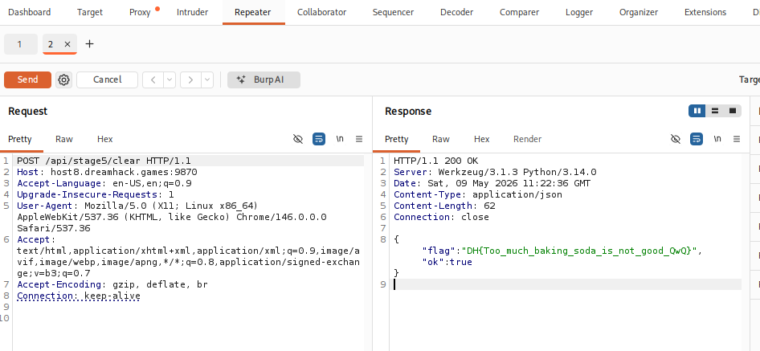

# [Dreamhack] Dalgona (달고나) - Web Hacking

## 1. 문제 개요

* **문제 링크:** [Dreamhack - 달고나](https://dreamhack.io/wargame/challenges/2468)

* **분야:** Web

* **목표:** 프론트엔드 진행 로직을 우회하여 서버의 최종 클리어 API를 강제 호출하고 플래그 획득.

## 2. 취약점 분석
제공된 소스코드(`app.py`)를 분석한 결과, 최종 레벨 클리어를 처리하는 엔드포인트가 노출되어 있으며 이전 단계 클리어 여부에 대한 서버사이드 검증 로직이 부재함을 확인.



```python
@app.route("/api/stage5/clear", methods=["POST"])
def api_stage5_clear():
    return jsonify({"ok": True, "flag": load_flag()})
```

* **분석 결론:** `/api/stage5/clear` 엔드포인트에 `POST` 요청을 보내면 정상 처리되며 플래그를 반환함. 프론트엔드의 잠금 해제 상태와 무관하게 공격자가 프록시 툴을 이용해 직접 해당 API로 패킷을 전송하면 게임 로직 우회가 가능함.

## 3. 공격 수행
Burp Suite를 사용하여 서버로 전송되는 패킷을 가로채고 조작하여 취약점을 공략.

### 3.1. HTTP Method 및 Endpoint 조작

1. 브라우저를 통해 문제 서버(`host8.dreamhack.games:9870`)에 접근.

2. Burp Suite의 **Repeater** 기능을 활용하여 기본 접근 시 발생하는 `GET /` 요청을 캡처.

3. 캡처된 패킷의 엔드포인트를 소스코드에서 확인한 `/api/stage5/clear`로 수정.

4. HTTP Method를 `GET`에서 `POST`로 변경한 후 서버로 전송.

5. 서버로부터 `200 OK` 응답과 함께 JSON 형태로 플래그가 반환된 것을 확인.





## 4. 획득 결과
조작된 패킷의 응답 바디에서 플래그를 발견함.

* **FLAG:** `DH{Too_much_baking_soda_is_not_good_QwQ}`

## 5. 대응 방안
클라이언트(브라우저)에서 보내는 요청은 언제든지 조작이 가능하므로, 중요한 상태 변경이나 보상(플래그 반환 등)을 수행하는 API는 반드시 서버 측에서 무결성을 검증해야 함.

* **서버사이드 상태 검증 보완:** 사용자의 게임 진행 상태(Lv.1 ~ Lv.4 클리어 여부)를 프론트엔드에 의존하지 않고 서버의 세션이나 DB에서 관리해야 함. `/api/stage5/clear` 호출 시 해당 사용자가 이전 단계를 모두 합법적으로 클리어했는지 서버단에서 교차 검증하는 로직 추가 필요.