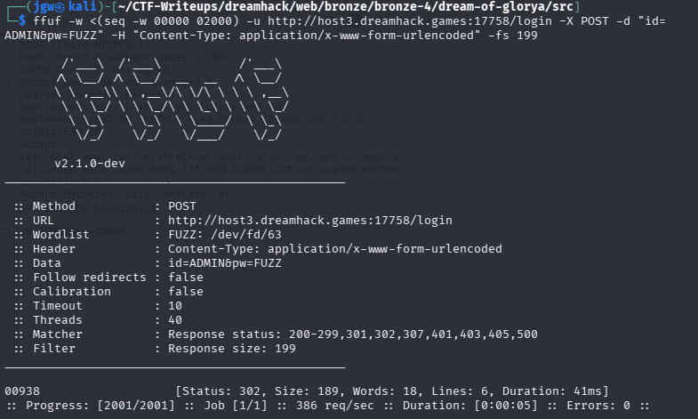
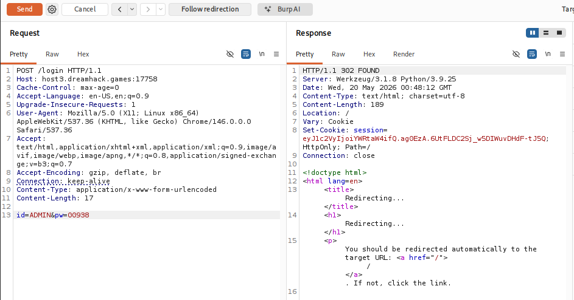
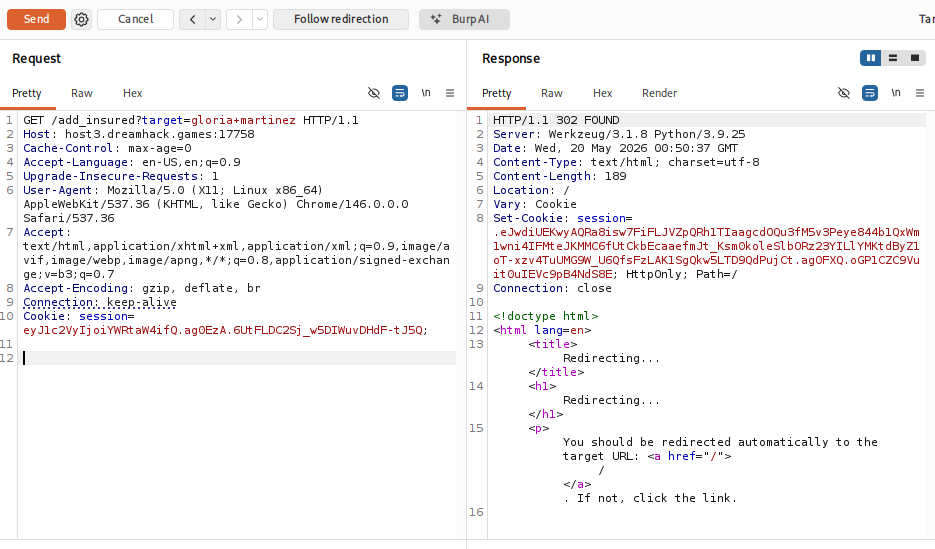
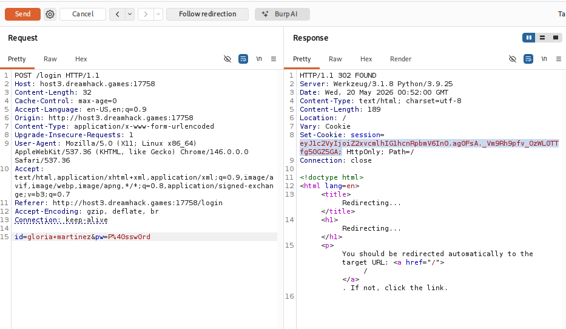
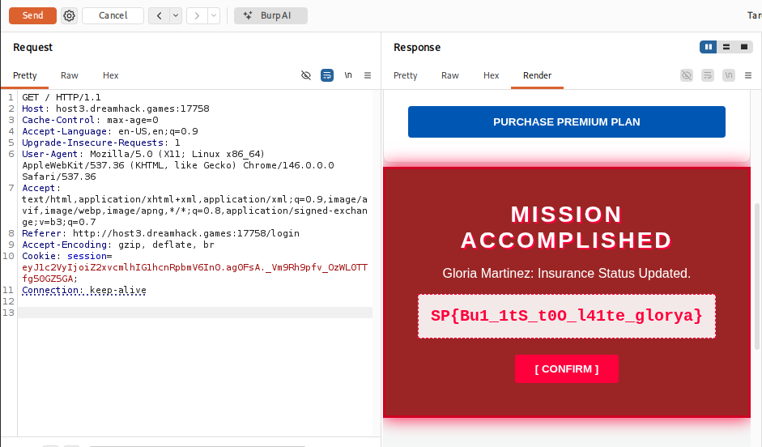

# [Dreamhack] Dream of glorya - Web Hacking

## 1. 문제 개요

* **문제 링크:** [Dreamhack - Dream of glorya](https://dreamhack.io/wargame/challenges/2871)

* **분야:** Web

* **목표:** 로그인 로직 결함(대소문자 변환)과 취약한 난수 생성 로직을 이용해 `admin` 권한을 획득하고, 대상 계정의 보험 가입 상태를 변조하여 플래그 탈취.

## 2. 취약점 분석
제공된 `app.py` 소스 코드를 분석한 결과, `/login` 엔드포인트의 입력값 검증 순서 결함 및 취약한 관리자 패스워드 범위 설정에서 취약점 확인.

```python
# [!] 취약점 1: 문자열 정규화 순서 결함을 이용한 필터링 우회
if user_input == "admin":
    flash("H4cker.. dont access my account!")
    return redirect(url_for('index'))

user_input = (user_input.upper()).lower()

# [!] 취약점 2: 범위가 매우 좁은 취약한 패스워드 생성 (브루트포스 가능)
ADMIN_PW = str(random.randint(0, 2000)).zfill(5)
```

* **분석 결론:** 사용자가 `ADMIN`을 입력할 경우 첫 번째 `admin` 필터링 검사를 우회하며, 직후 `upper().lower()` 로직을 거치며 시스템 내부에서 최종적으로 `admin` 계정으로 인식. 또한, 관리자 비밀번호가 `00000`~`02000` 사이의 2001개 숫자로 한정되어 있어 자동화 공격(Brute-force)에 매우 취약.

## 3. 공격 수행
`ffuf`를 이용한 패스워드 탐색 및 `Burp Suite`를 활용한 세션 권한 악용 수행.

### 3.1. 관리자 패스워드 브루트포스 (ffuf)

1. 터미널에서 프로세스 치환(`<(seq -w 00000 02000)`)을 활용하여 `ffuf` 페이로드 리스트 생성 및 POST 요청 전송.

2. 로그인 실패 리다이렉트 응답 사이즈(`-fs 199`)를 필터링하여 유효한 응답 추출. 진짜 비밀번호 `00938` 획득.



### 3.2. 관리자 로그인 및 세션 발급

1. Burp Suite의 Repeater를 이용하여 `/login` 경로로 POST 요청 전송.

2. 아이디를 대문자 `ADMIN`으로 전송하여 로직을 우회하고, 탈취한 비밀번호 `00938` 대입. HTTP 302 응답과 함께 `admin` 권한이 담긴 세션 쿠키 발급 확인.



### 3.3. 보험 가입 로직 강제 실행 (권한 악용)

1. 획득한 `admin` 세션 쿠키를 헤더에 삽입한 후, 타겟 대상을 쿼리에 포함하여 `/add_insured?target=gloria+martinez`로 GET 요청 전송.

2. 권한 검증 우회 후 타겟 유저의 `is_insured` 속성이 `True`로 정상 변조.



### 3.4. 타겟 유저 로그인 및 플래그 렌더링 요청

1. 실제 플래그를 확인하기 위해 `id=gloria+martinez&pw=P@ssw0rd` 정보로 `/login` POST 요청을 전송하여 타겟 계정의 세션 쿠키 획득.



2. 발급받은 `gloria martinez` 세션 쿠키를 포함하여 메인 페이지(`/`)에 GET 요청 전송. 로직 상의 플래그 렌더링 조건 만족 확인.



## 4. 획득 결과
Burp Suite의 Response Render 탭 확인 결과, 숨겨져 있던 대시보드 플래그가 정상 출력.

* **FLAG:** `SP{Bu1_1tS_t00_l41te_glorya}`

## 5. 대응 방안
입력값 검증 우회 및 무차별 대입 공격에 대비하여 로그인 로직 수정 및 인증 수단 강화 필요.

* **입력값 정규화 순서 변경:** 아이디 입력값 검증 시, `user_input.upper().lower()`와 같은 문자열 정규화 작업을 먼저 거친 이후에 `admin` 차단 조건문을 실행하도록 로직 순서 변경.

* **안전한 암호 체계 및 Rate Limit 적용:** `random.randint` 방식의 취약한 패스워드 범위 지정을 제거하고 안전한 패스워드 정책 도입. 추가로 반복적인 패스워드 대입을 차단하기 위해 계정 잠금 또는 로그인 횟수 제한(Rate Limiting) 구현.