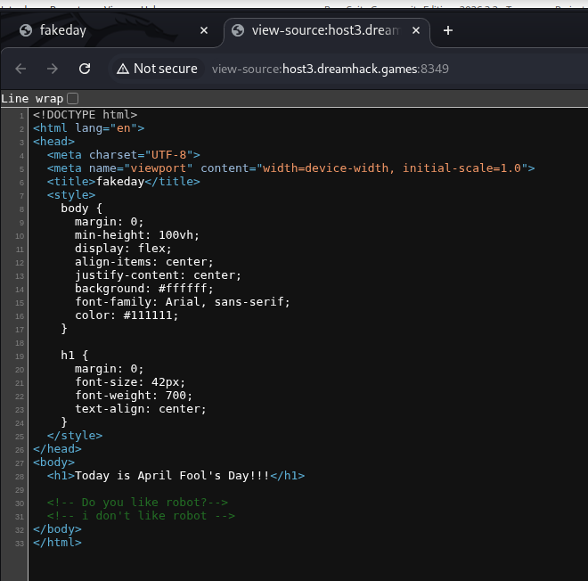
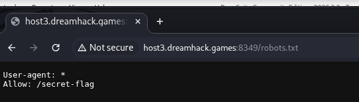
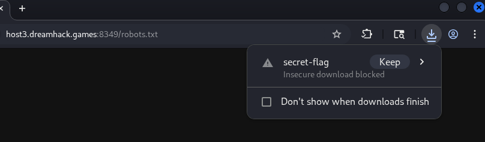
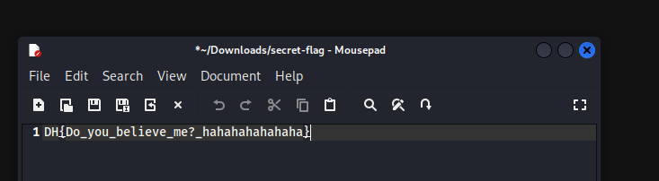

# [Dreamhack] Fakeday - Web Hacking

## 1. 문제 개요
* **문제 링크:** [Dreamhack - fakeday](https://dreamhack.io/wargame/challenges/2838)

* **분야:** Web

* **난이도:** Bronze 4

* **목표:** '만우절(4월 1일)' 컨셉과 '블랙박스'라는 설정이 만들어낸 심리적 함정을 피해 진짜 플래그 획득.

## 2. 취약점 분석
제공된 웹 페이지를 탐색하며 블랙박스 환경에서의 단서 수집을 진행함.

* **분석 결론:** 메인 페이지 소스코드 하단에 주석이 존재. 이는 검색 엔진 봇의 접근을 제어하는 `robots.txt` 파일을 확인하라는 힌트로 판단됨.

## 3. 공격 수행
일반적인 웹 해킹 방법론에 따라 서버의 숨겨진 경로를 탐색하고 HTTP 요청을 변조하는 등 다양한 시도를 진행함.

### 3.1. 숨겨진 경로 탐색 및 함정 발견
1. 힌트를 바탕으로 `robots.txt`에 접근하여 `Allow: /secret-flag` 디렉터리 경로를 획득함.

2. 브라우저를 통해 `/secret-flag` 경로로 접근 시 특정 파일이 다운로드됨.

3. 다운로드된 파일을 열어본 결과, `DH{Do_you_believe_me?_hahahahahahaha}` 플래그를 발견 했으나 오답.

### 3.2. HTTP 패킷 변조 및 심화 분석

1. 거짓 플래그에 속은 후, Burp Suite의 Repeater를 활용하여 패킷 조작 시도.

2. 주석의 힌트를 이용하여 `User-Agent`를 `robot`으로 변조했으나 실패.

3. 문제의 컨셉이 '만우절'인 점을 생각해 `Date` 헤더를 `2026-04-01`로 조작하거나, HTTP Method를 `POST`로 변경해 보았으나 정답을 알아내지 못함.

### 3.3. 발상의 전환 및 원본 파일 확인
1. 계속된 실패 후, "블랙박스 문제임에도 불구하고 굳이 '문제 파일 다운로드' 버튼이 제공된 이유"에 대해 의문을 갖게 됨.

2. 공격 초기에 무시했던 첨부 파일(`flag.txt`)을 확인해 보기로 함.

3. 해당 파일 내부에 작성된 텍스트를 드림핵 플래그 제출란에 입력하여 정답 처리됨을 확인.

## 4. 획득 결과
복잡한 웹 취약점 공격이나 패킷 변조 없이, 문제 사이트에서 처음부터 제공한 첨부 파일 자체가 정답이었음.

* **FLAG:** `DH{fake_flag}`

## 5. 대응 방안

본 문제는 만우절 이벤트성 문제로 기술적 취약점보다는 심리적 허점을 공략했으나, 공격 과정에서 노출된 설정 미흡 사례를 바탕으로 다음과 같은 보안 권고 사항을 도출할 수 있음.

* **robots.txt 오남용 주의:** `robots.txt`에 민감한 경로(예: `/secret-flag`)를 명시하는 것은 공격자에게 공격 지점을 알려주는 결과를 초래함. 보안이 필요한 경로는 파일 명시가 아닌 서버 설정 및 인증 로직을 통해 접근을 제어해야 함.

* **소스 코드 주석 관리:** 개발 단계의 힌트나 주석이 운영 환경에 노출될 경우 공격의 단서가 됨. 배포 파이프라인에서 주석을 자동으로 제거하는 프로세스 도입이 필요함.