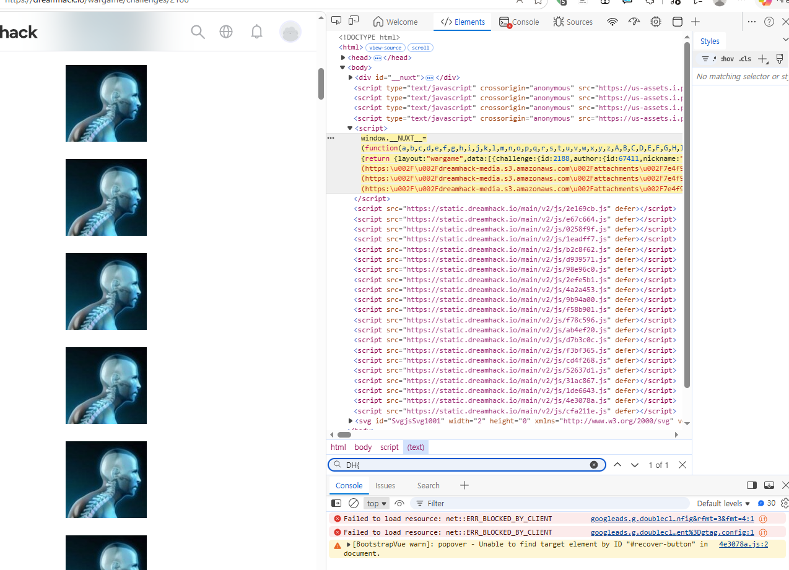
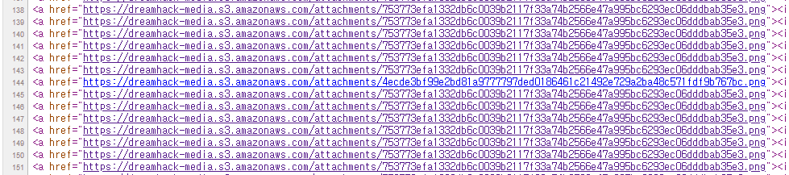

# [Dreamhack] Find Real One - Web Hacking

## 1. 문제 개요

* **문제 링크:** [Dreamhack - Find Real One](https://dreamhack.io/wargame/challenges/2188)

* **분야:** Web, Misc

* **목표:** 웹 브라우저의 기본 검사 도구를 활용하여, 수많은 동일한 더미 데이터 속에서 유일하게 다른 특징을 가진 원본 데이터를 식별하고 플래그를 획득.

## 2. 취약점 분석

* 제공된 `Readme.txt` 힌트를 통해 "개발자 도구로 빠른 웹 검사!"를 수행해야 함을 확인.

* 문제 페이지 접속 시 육안으로는 동일해 보이는 거북목 엑스레이 사진들이 무수히 많이 나열되어 있음.

* **분석 결론:** 서버사이드 로직 없이 프론트엔드 HTML 상에 정적으로 렌더링된 수백 개의 `` 태그 중, 오직 단 한 개의 태그만이 다른 파일 경로를 가리키거나 숨겨진 힌트를 포함하고 있을 것으로 추정.

## 3. 공격 수행

### 3.1. 개발자 도구를 이용한 초기 탐색 (시행착오)

1. 브라우저 개발자 도구를 열고 **Elements** 탭에서 플래그 포맷인 `DH{` 키워드를 검색 시도.

2. 그러나 드림핵 플랫폼 자체의 복잡한 스크립트(`window.__NUXT__`) 데이터와 상당히 많은 이미지 주소 텍스트가 함께 검색에 걸리면서, 정확한 플래그의 위치를 식별하는 데 어려움을 겪음.

### 3.2. 페이지 소스 보기를 통한 분석

복잡한 DOM 트리와 스크립트를 배제하고 순수한 HTML 문서 구조만 확인하기 위해 방향을 선회.

1. 문제 페이지에서 브라우저 기본 기능인 **페이지 소스 보기(`Ctrl + U`)** 실행.

2. 수백 줄에 걸쳐 동일한 해시값을 가진 이미지 링크(`...753773efa...png`)들이 반복되는 패턴을 시각적으로 스크롤하며 검사.

3. 소스 코드의 144번째 라인에서, 주변의 더미 파일들과 파일명이 다른 이미지 주소(`4ecde3bf99e2bd81a9777797ded0186461c21492e729a2ba48c571fdf9b767bc.png`)를 식별.

4. 식별해 낸 유일한 경로의 링크를 클릭하여 진짜 이미지를 로드한 결과, 이미지 뷰어 한가운데에 노출된 플래그를 확인.

## 4. 획득 결과
소스 코드 내 유일하게 변조된 파일 경로를 추적하여 숨겨진 플래그 이미지 발견.

* **FLAG:** `DH{Correct_Take_Flag_UwU}`

## 5. 대응 방안
본 문제는 웹 개발자 도구 및 소스 분석 능력을 테스트하기 위해 의도적으로 설계된 CTF 워게임임. 

* **보안 관점:** 실제 서비스 환경에서는 민감한 정보나 정답 데이터가 클라이언트 측 정적 HTML 소스 코드에 평문이나 유추 가능한 형태로 렌더링되지 않도록 주의해야 함. 중요한 데이터는 서버사이드에서 검증을 거친 후, 권한이 있는 사용자에게만 동적으로 응답하도록 설계해야 함.