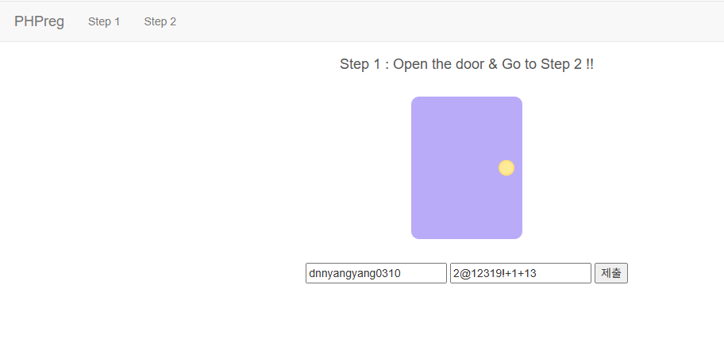
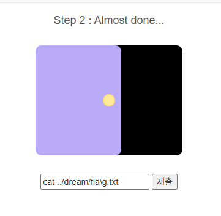
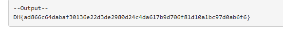

# [Dreamhack] PHPreg - Web Hacking

## 1. 문제 개요

* **문제 링크:** [Dreamhack - phpreg](https://dreamhack.io/wargame/challenges/873)

* **분야:** Web

* **목표:** PHP의 `preg_match` 및 `preg_replace` 필터링 로직을 분석하고 우회하여, 최종적으로 서버 내에 위치한 플래그(`../dream/flag.txt`) 탈취.

## 2. 취약점 분석
제공된 `step2.php` 소스 코드를 분석한 결과, 단계별로 다음과 같은 필터링 및 취약점이 존재함을 확인.

```php
<?php
          // POST request
          if ($_SERVER["REQUEST_METHOD"] == "POST") {
            $input_name = $_POST["input1"] ? $_POST["input1"] : "";
            $input_pw = $_POST["input2"] ? $_POST["input2"] : "";

            // pw filtering
            if (preg_match("/[a-zA-Z]/", $input_pw)) {
              echo "alphabet in the pw :(";
            }
            else{
              $name = preg_replace("/nyang/i", "", $input_name);
              $pw = preg_replace("/\d*\@\d{2,3}(31)+[^0-8\"]\!/", "d4y0r50ng", $input_pw);
              
              if ($name === "dnyang0310" && $pw === "d4y0r50ng+1+13") {

                // ... (HTML UI 출력 부분 생략) ...

                $cmd = $_POST["cmd"] ? $_POST["cmd"] : "";

                if ($cmd === "") {
                }
                // cmd filtering
                else if (preg_match("/flag/i", $cmd)) {
                  echo "<pre>Error!</pre>";
                }
                else{
                  echo "<pre>--Output--\n";
                  system($cmd); // 취약점 발생 지점
                  echo "</pre>";
                }
              }
            }
          }
      ?>
```

* **Step 1: 문자열 치환 및 정규식 검사**

  * `Nickname`: 입력값 중 `nyang` 문자열을 공백(`""`)으로 치환함. 지워진 후 원하는 문자열이 남도록 하는 **재귀적 문자열 구성**이 필요.

  * `Password`: 알파벳 포함 여부를 검사(`/[a-zA-Z]/`)하여 필터링한 뒤, 특정 정규식 패턴(`/\d*\@\d{2,3}(31)+[^0-8\"]\!/`)을 찾아 `d4y0r50ng`으로 치환함.

* **Step 2: Command Injection**

  * 사용자가 입력한 명령어(`$cmd`)를 `system()` 함수로 직접 실행하는 취약점 존재.

  * 단, `preg_match("/flag/i", $cmd)`를 통해 `flag`라는 단어가 포함되면 실행을 차단하므로, 리눅스 쉘의 특수 문자를 이용한 **명령어 필터링 우회**가 필요함.

## 3. 공격 수행
서버 환경에서 다음 과정을 통해 필터링을 우회하고 플래그를 획득.

### 3.1. Step 1: 필터링 우회 및 인증

1. **Nickname 우회:** `nyang`이 삭제된 후 `dnyang0310`이 되어야 하므로, 문자열 중간에 `nyang`을 삽입하여 입력.

   * **Payload:** `dnnyangyang0310`

2. **Password 우회:** 알파벳을 쓰지 않고 정규식 패턴을 통과시킨 뒤, 뒤에 `+1+13`을 붙여 최종 비교군을 생성.

   * **Payload:** `2@12319!+1+13`

   * 매칭 과정: `2`(\d*) + `@`(\@) + `12`(\d{2,3}) + `31`((31)+) + `9`([^0-8\"]) + `!`(\!) 순서로 매칭되어 앞부분이 `d4y0r50ng`로 치환됨.

   

### 3.2. Step 2: Command Injection 및 플래그 획득
1. `system()` 호출 시 `flag` 문자열 필터링을 피하기 위해 리눅스 쉘의 이스케이프 문자(`\`)를 활용.

2. **Payload:** `cat ../dream/fla\g.txt`

3. 서버 쉘은 `fla\g`를 `flag`로 정상 인식하여 목표 파일의 내용을 출력함.



## 4. 획득 결과
공격 성공 후 출력된 결괏값에서 최종 하드코딩된 플래그를 발견함.



* **FLAG:** `DH{ad866c64dabaf30136e22d3de2980d24c4da617b9d706f81d10a1bc97d0ab6f6}`

## 5. 대응 방안
웹 애플리케이션에서 사용자의 입력을 처리할 때 발생할 수 있는 검증 미흡 및 인젝션 취약점을 막기 위해 다음과 같은 조치가 필요함.

* **입력값 검증 및 치환 로직 개선:** `preg_replace`를 이용한 단순 문자열 제거는 재귀적 중첩 방식에 취약하므로, 반복문을 통한 다중 검사를 수행하거나 화이트리스트 기반의 검증을 도입.

* **OS 명령어 인젝션 방지:** 사용자의 입력이 `system()`, `exec()` 등 시스템 함수에 직접 전달되지 않도록 아키텍처를 설계. 부득이한 경우 `escapeshellcmd()`나 `escapeshellarg()`를 사용하여 쉘 메타문자가 실행되는 것을 방지.