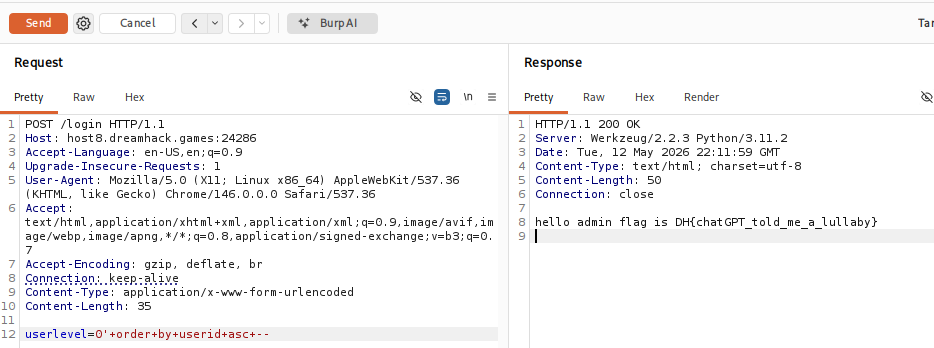

# [Dreamhack] Simple_SQLi_Chatgpt - Web Hacking

## 1. 문제 개요

* **문제 링크:** [Dreamhack - simple_sqli_chatgpt](https://dreamhack.io/wargame/challenges/769)

* **분야:** Web

* **목표:** SQLite 데이터베이스 환경에서 발생하는 SQL Injection 취약점을 이용하여 `admin` 계정으로 로그인하고 숨겨진 플래그 탈취.

## 2. 취약점 분석
제공된 `app.py` 소스코드를 분석한 결과, `/login` 엔드포인트에서 사용자의 입력값(`userlevel`)을 아무런 검증 없이 Python의 f-string을 사용하여 SQL 쿼리문에 직접 삽입하고 있음을 확인.

```python
# [!] - 취약점이 발생하는 부분
userlevel = request.form.get('userlevel')
res = query_db(f"select * from users where userlevel='{userlevel}'")
```

```python
db.execute(f'insert into users(userid, userpassword, userlevel) values ("guest", "guest", 0), ("admin", "{binascii.hexlify(os.urandom(16)).decode("utf8")}", 0);')
# guest가 먼저 저장
```

```python
def query_db(query, one=True):
# one=True -> 첫 번째 행만 가져옴
```

**분석 결론:** 

1. `query_db` 함수는 기본적으로 여러 결과 중 첫 번째 행(`rv[0]`)만을 반환하도록 설계되어 있음.

2. DB 초기화 코드를 보면 `guest`와 `admin` 모두 `userlevel`이 `0`으로 설정되어 있으며, `guest`가 먼저 삽입됨.

3. 따라서 정상적인 `userlevel=0` 요청 시 항상 `guest`가 먼저 조회되어 반환됨.

4. 공격자는 SQL Injection을 통해 `ORDER BY` 구문을 삽입하여 정렬 순서를 조작, `admin` 튜플이 첫 번째 결과로 반환되도록 유도해야 함.

## 3. 공격 수행
Burp Suite를 사용하여 로그인 POST 요청 패킷을 가로채고 페이로드를 주입하여 취약점을 검증.

### 3.1. HTTP 패킷 조작 및 공격 페이로드 주입

1. Flask 서버가 POST 데이터를 정상적으로 파싱할 수 있도록 `Content-Type` 헤더를 `application/x-www-form-urlencoded`로 수정.

2. `userlevel` 파라미터에 다음과 같은 SQLi 페이로드를 URL 인코딩하여 주입.
   * **Payload:** `0' order by userid asc -- `
   * **Encoded:** `userlevel=0'+order+by+userid+asc+--+`

3. **동작 원리:** 삽입된 페이로드로 인해 서버에서 최종적으로 실행되는 쿼리는 `select * from users where userlevel='0' order by userid asc --'`가 됨. `userid`를 기준으로 오름차순(ASC) 정렬하므로 알파벳 'a'로 시작하는 `admin` 계정이 최상단으로 올라오게 되어 인증을 우회함.



## 4. 획득 결과
패킷 전송 결과, 인증 로직(`userid == 'admin'`)을 통과하여 서버 응답(Response)으로 하드코딩된 플래그가 출력됨을 확인.

* **FLAG:** `DH{chatGPT_told_me_a_lullaby}`

## 5. 대응 방안
사용자 입력값을 SQL 쿼리 문자열에 직접 이어 붙이는 방식(f-string, 문자열 포매팅 등)은 SQL Injection 공격에 매우 취약하므로 지양해야 함.

* **안전한 쿼리 작성 (Prepared Statement 적용):** 입력값을 쿼리의 구조와 분리하여 처리하는 파라미터화된 쿼리(Parameterized Query)를 사용하도록 코드를 수정해야 함.

```python
# 수정된 코드 예시 (안전한 방식)
# f-string을 제거하고, 입력값을 ? (또는 DB 모듈에 맞는 치환자)로 대체한 뒤 인자로 넘김
res = query_db("select * from users where userlevel=?", [userlevel])
```