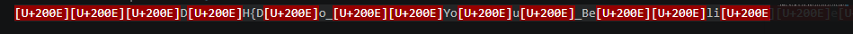

# [Dreamhack] Space (공백) - Web / Misc

## 1. 문제 개요
* **문제 링크:** [Dreamhack - Space (공백)](https://dreamhack.io/wargame/challenges/2182)

* **분야:** Web, Misc

* **목표:** 웹 페이지상에 보이지 않게 삽입된 유니코드 제어 문자를 식별하고, 불순물이 제거된 순수한 플래그 문자열을 추출.

## 2. 취약점 분석
제공된 `README.txt` 파일과 웹 페이지 소스를 분석한 결과, 육안으로는 정상적인 플래그 형식(`DH{...}`)으로 보이나 실제 데이터 사이사이에 특수 문자가 삽입되어 있음을 확인.
```markdown
‎‎‎D‎H{D‎o_‎‎Yo‎u‎_Be‎‎li‎‎e‎ve‎_‎W‎ha‎t‎_y‎o‎u‎_S‎e‎e‎_o‎n‎_t‎h‎e_‎w‎eb‎?‎}‎‎‎
```


* **분석 결론:** 텍스트 내에 <b>LRM(Left-to-Right Mark, U+200E)</b>과 같은 유니코드 제어 문자가 포함되어 있음. 이러한 문자는 브라우저 렌더링 시 화면에 표시되지 않지만, 데이터상으로는 엄연히 존재하기 때문에 그대로 복사하여 제출할 경우 서버의 문자열 검증 로직을 통과할 수 없음. 

## 3. 공격 수행

1. `README.txt`에 적힌 텍스트를 그대로 복사하여 플래그 제출란에 붙여넣었으나 오답 처리됨.

2. 복사한 텍스트를 VS Code에서 확인해 보니, 육안으론 안 보이던 붉은색 제어 문자(`[U+200E]`)들이 섞여 있는 것을 발견함.

3. 해당 불순물 문자들을 전부 지워버리고, 순수한 플래그 텍스트만 남겨서 다시 제출.


## 4. 획득 결과
정제된 문자열을 제출하여 플래그 인증에 성공함.

* **FLAG:** `DH{Do_You_Believe_What_you_See_on_the_web?}`

## 5. 대응 방안
유니코드에는 시각적으로는 구분할 수 없으나 시스템적으로는 다른 의미를 갖는 다양한 제어 문자 및 호모글리프가 존재함. 이는 피싱 공격이나 코드 난독화에 악용될 수 있음.

* **입력값 정제:** 사용자로부터 중요한 데이터를 입력받을 때, 아스키(ASCII) 범위를 벗어나는 비가시적 제어 문자가 포함되어 있는지 검사하고 이를 제거하는 화이트리스트 기반의 필터링 로직이 필요함.

* **보안 도구 활용:** 개발 환경(IDE)이나 로그 분석 도구에서 비가시적 문자를 강조 표시하는 기능을 활성화하여, 데이터 변조 여부를 상시 모니터링해야 함.

## [부록] 주의해야 할 비가시적/기만적 유니코드

보안 분석 시 눈에 보이는 텍스트와 실제 데이터가 다를 수 있음을 인지하고, 아래와 같은 문자들을 주의해야 함.

| 문자명 (약어) | 유니코드 | 특징 및 보안 위협 |
| :--- | :--- | :--- |
| **Left-to-Right Mark (LRM)** | `U+200E` | 텍스트 방향을 왼쪽에서 오른쪽으로 설정. 이번 문제처럼 데이터 검증 로직을 방해함. |
| **Zero-Width Space (ZWSP)** | `U+200B` | 폭이 0인 공백. 눈에 안 보이지만 문자열 길이를 늘려 필터링(ex: admin 우회)에 악용됨. |
| **Right-to-Left Override (RLO)** | `U+202E` | 이후 문자의 방향을 우→좌로 반전. 파일명 확장자 속이기(ex: `virus[RLO]gpj.exe` -> `virusexe.jpg`)에 사용. |
| **Hangul Filler** | `U+3164` | 한글 채움 문자. 화면엔 공백으로 보이나 데이터로 인식되어 투명 아이디 등에 악용됨. |
| **Homoglyphs** | 다양함 | `a`(라틴)와 `а`(키릴)처럼 모양은 같으나 코드가 다른 문자. 피싱 도메인 제작에 악용됨. |

### 분석 팁
* **Hex 확인:** 터미널에서 `xxd` 명령어로 파일의 헥사 값을 확인하면 보이지 않는 문자가 드러남.

* **cat -A:** 리눅스 터미널에서 `cat -A [파일명]`을 사용하면 제어 문자를 가시적인 기호로 변환하여 출력해 줌.