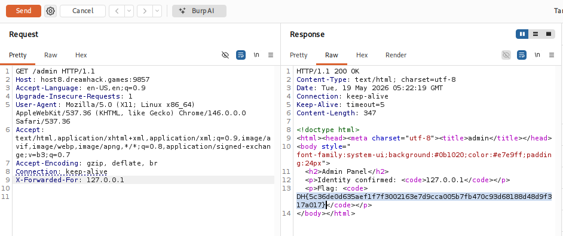

# [Dreamhack] Whoami - Web Hacking

## 1. 문제 개요

* **문제 링크:** [Dreamhack - whoami](https://dreamhack.io/wargame/challenges/2663)

* **분야:** Web

* **목표:** X-Forwarded-For 헤더 조작을 통해 로컬 호스트(127.0.0.1)로 위장하여 `/admin` 페이지에 접근하고 플래그 획득.

## 2. 취약점 분석
제공된 `index.js` 소스 코드를 분석한 결과, 사용자의 엔드포인트 접근을 제어하고 로컬 권한을 검증하는 흐름에서 로직 결함 확인.

```javascript
// [1] 사용자 IP 식별 함수
function getClientIp(req) {
  const xff = req.headers["x-forwarded-for"];
  if (typeof xff === "string" && xff.length) {
    return xff.split(",")[0].trim();
  }
  return req.socket?.remoteAddress || "";
}

// [2] 로컬 호스트 여부 검증 함수
function isLocal(ip) {
  ip = normalizeIp(ip);
  return ip === "127.0.0.1" || ip === "::1";
}

// [3] 관리자 페이지 라우팅 및 플래그 출력 로직
app.get("/admin", (req, res) => {
  const raw = getClientIp(req);
  const ip = normalizeIp(raw);

  if (!isLocal(ip)) {
    res.status(403);
    // ... 접근 거부 HTML 출력
    return;
  }

  // ... 관리자 패널 및 플래그 출력
  res.end(`... <p>Flag: <code>${htmlEscape(FLAG)}</code></p> ...`);
});
```

**[로직 흐름 및 취약점 발생 원리]**

1. **취약한 IP 식별**: `getClientIp` 함수가 네트워크 소켓 정보 대신 사용자가 임의 조작 가능한 HTTP `X-Forwarded-For` 헤더를 우선 신뢰하여 IP 추출.

2. **권한 우회 조건**: `/admin` 라우터 접근 시 `isLocal(ip)` 검증을 거치며, 해당 결과가 `false`일 경우 `403 Forbidden` 반환 후 함수 종료(`return`).

3. **플래그 노출**: 검증 결과가 `true`일 경우 차단벽을 통과하여 서버 메모리에 하드코딩된 내부 `FLAG` 변수 값을 화면에 그대로 출력.

* **분석 결론:** 인가 처리에 조작 가능한 헤더 값을 무조건적으로 신뢰하여 발생한 인증 우회 취약점 존재. HTTP 요청 패킷에 `X-Forwarded-For: 127.0.0.1` 헤더를 강제로 주입할 경우, 조건문 검증을 무사히 통과하여 관리자 세션 없이도 플래그 탈취 가능.

## 3. 공격 수행
Burp Suite의 Repeater 기능을 활용하여 HTTP 요청 헤더 변조 및 익스플로잇.

### 3.1. 패킷 변조 및 페이로드 전송

1. 웹 브라우저에서 메인 경로(`/`)로 접근하는 요청 패킷을 Burp Suite로 캡처하여 Repeater로 전송.

2. Repeater에서 요청 경로를 `/admin`으로 수정 후, HTTP 요청 패킷 하단에 `X-Forwarded-For: 127.0.0.1` 헤더를 수동으로 추가.



## 4. 획득 결과
Burp Suite의 Response 탭 확인 결과, 로컬 관리자 인증 성공 및 하드코딩된 서버 플래그 출력 확인.

* **FLAG:** `DH{5c36de0d635aef1f7f3002163e7d9cca005b7fb470c93d68188d48d9f317a017}`

## 5. 대응 방안
인증 및 인가 처리에 사용자가 임의로 조작할 수 있는 HTTP 헤더(XFF 등)를 직접적으로 신뢰하는 것은 위험하므로, 안전한 IP 식별 로직 구현 필요.

* **안전한 IP 식별 로직 사용:** 신뢰할 수 있는 리버스 프록시나 로드 밸런서 환경이 아니라면, 조작 가능한 XFF 헤더 대신 네트워크 소켓에서 제공하는 실제 접속 클라이언트 IP(`req.socket.remoteAddress`)를 최우선으로 검증하도록 코드 수정.