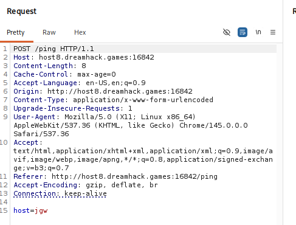
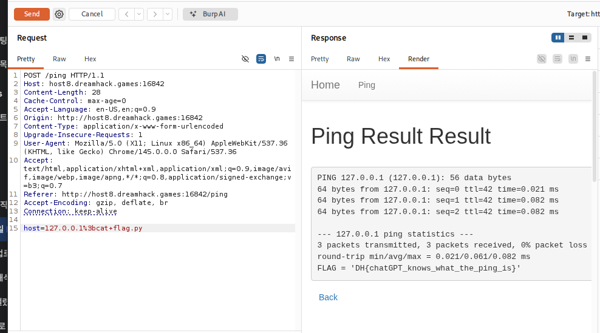

# [Dreamhack] command-injection-chatgpt - Web Hacking

## 1. 문제 개요

* **문제 링크:** [Dreamhack - command-injection-chatgpt](https://dreamhack.io/wargame/challenges/768)

* **분야:** Web

* **목표:** Command Injection 취약점을 이용하여 서버 내 `flag.py` 파일의 내용을 탈취.

## 2. 취약점 분석
제공된 `app.py` 소스 코드를 분석한 결과, `/ping` 엔드포인트에서 사용자 입력값이 명령어 실행 함수에 필터링 없이 전달되는 것을 확인.
```python
@APP.route('/ping', methods=['GET', 'POST'])
def ping():
    if request.method == 'POST':
        host = request.form.get('host')
        cmd = f'ping -c 3 {host}'  # [!] 취약점 발생: f-string을 사용한 직접적인 명령어 삽입
        try:
            output = subprocess.check_output(['/bin/sh', '-c', cmd], timeout=5)
            return render_template('ping_result.html', data=output.decode('utf-8'))
       # ... (중략) ...

    return render_template('ping.html')
```

*   **분석 결과:** 사용자가 입력한 `host` 값이 `cmd` 변수에 직접 포함되어 `/bin/sh -c`를 통해 실행. 이 과정에서 세미콜론과 같은 쉘 메타문자를 사용하면 의도치 않은 추가 명령어를 실행할 수 있는 **Command Injection**이 가능.

* **분석 결론:** `/ping` 라우트에서 `request.form.get('host')`로 받은 값을 아무런 필터링 없이 쉘 명령어 문자열(`f'ping -c 3 {host}'`)에 직접 삽입하고 있음. 

* 리눅스 쉘 환경에서 명령어를 순차적으로 실행하게 해주는 세미콜론(`;`) 등의 메타문자를 이용하면, 의도된 `ping` 명령어 외에 임의의 시스템 명령어를 추가로 실행할 수 있는 Command Injection 취약점이 존재함.

## 3. 공격 수행
Burp Suite를 활용하여 웹 프론트엔드를 거치지 않고 직접 조작된 페이로드를 서버로 전송하여 취약점을 검증.

### 3.1. 패킷 캡처 및 페이로드 변조
1. 웹 브라우저에서 임의의 값(`jgw`)을 입력하여 POST 요청 패킷을 Burp Suite로 캡처.

 

2. Repeater로 패킷을 전송한 뒤, `host` 파라미터 값에 Command Injection 페이로드를 삽입. 세미콜론(`;`)과 공백 등의 특수문자를 URL 인코딩하여 `127.0.0.1%3bcat+flag.py` 형태로 전송.

3. 서버 내부에서는 `ping -c 3 127.0.0.1; cat flag.py` 명령어가 통째로 실행됨. 앞의 `ping` 명령이 정상 실행된 후, 이어서 `cat flag.py`가 실행되어 응답(Response) 화면에 플래그가 출력됨.

 

## 4. 획득 결과
Burp Suite의 Render 탭 확인 결과, `ping` 통계 정보 하단에 출력된 하드코딩된 플래그를 발견함.

* **FLAG:** `DH{chatGPT_knows_what_the_ping_is}`

## 5. 대응 방안
사용자 입력을 OS 명령어로 직접 전달하는 것은 위험하므로, 입력값 검증과 안전한 함수 사용이 필요함.

* **입력값 검증:** 정규표현식을 사용하여 사용자 입력값이 유효한 IP 주소 형식인지 엄격하게 화이트리스트 기반으로 검증해야 함.

* **안전한 API 사용:** `subprocess` 모듈 사용 시 명령어와 인자를 리스트 형태로 분리하여 전달(예: `subprocess.run(['ping', '-c', '3', host])`)하면, 쉘 메타문자가 단순 문자열로 처리되어 Injection을 방지할 수 있음.