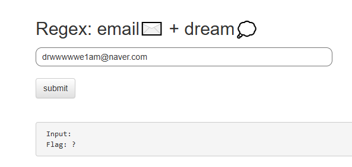
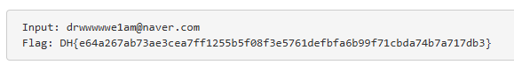

# [Dreamhack] ex-reg-ex - Web Hacking

## 1. 문제 개요
* **문제 링크:** [Dreamhack - ex-reg-ex](https://dreamhack.io/wargame/challenges/834)

* **분야:** Web

* **목표:** 파이썬 Flask 서버의 소스 코드를 분석하고, 서버에서 요구하는 특정 정규표현식 규칙을 만족하는 입력값을 찾아 플래그를 획득.

## 2. 취약점 분석
제공된 `app.py` 소스 코드를 분석한 결과, 사용자 입력값(`input_val`)을 검증하는 로직에서 특정 패턴의 정규표현식을 사용하고 있음을 확인.

```python
try:
    FLAG = open("./flag.txt", "r").read()       # flag is here!
except:
    FLAG = "[**FLAG**]"

@app.route("/", methods = ["GET", "POST"])
def index():
    input_val = ""
    if request.method == "POST":
        input_val = request.form.get("input_val", "")
        m = re.match(r'dr\w{5,7}e\d+am@[a-z]{3,7}\.\w+', input_val)
        if m:
            return render_template("index.html", pre_txt=input_val, flag=FLAG)
    return render_template("index.html", pre_txt=input_val, flag='?')
```

* **분석 결론:** 서버는 `re.match(r'dr\w{5,7}e\d+am@[a-z]{3,7}\.\w+', input_val)` 코드를 통해 입력값을 검사. 이 조건문(`if m:`)을 통과해야만 `flag.txt`의 내용을 화면에 렌더링하므로, 해당 정규식 문법을 정확히 해석하여 일치하는 문자열(이메일 형식)을 페이로드로 구성.
  * `dr` : 반드시 'dr'로 시작
  * `\w{5,7}` : 알파벳/숫자 5~7글자
  * `e` : 문자 'e'
  * `\d+` : 숫자 1개 이상
  * `am@` : 문자 'am@'
  * `[a-z]{3,7}` : 소문자 3~7글자
  * `\.` : 마침표(.) 기호
  * `\w+` : 알파벳/숫자 1개 이상

## 3. 공격 수행
정규식 분석 결과를 바탕으로 서버가 요구하는 페이로드를 생성하여 검증을 통과.

### 3.1. 페이로드 생성 및 폼 제출
1. 분석한 정규표현식 규칙에 맞추어 더미 문자열을 조합. (예: `dr` + `wwwwww` + `e` + `1` + `am@` + `naver` + `.` + `com`)

2. 최종 페이로드인 `drwwwwwwe1am@naver.com`을 도출.

3. 서버의 웹 페이지에 접속하여 입력창에 도출한 페이로드를 입력.



### 3.2. 검증 우회 및 플래그 획득
1. `submit` 버튼을 클릭하여 POST 요청을 전송.

2. 서버사이드의 `re.match()` 검증 로직을 통과하여 플래그가 화면에 출력되는 것을 확인.

## 4. 획득 결과
검증 로직 통과 결과, 화면에 출력된 플래그를 성공적으로 탈취함.



* **FLAG:** `DH{e64a267ab73ae3cea7ff1255b5f08f3e5761defbfa6b99f71cbda74b7a717db3}`

## 5. 대응 방안

* **입력값 검증 적용:** 사용자의 입력값은 항상 신뢰할 수 없는 데이터로 간주. 본 문제의 코드처럼 서버사이드에서 화이트리스트 기반의 엄격한 정규표현식을 사용하여 예상치 못한 특수기호나 악의적인 스크립트(XSS, SQLi 등)가 실행 로직으로 넘어가지 않도록 원천 차단해야 함.