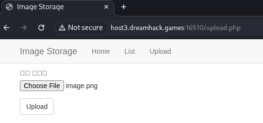
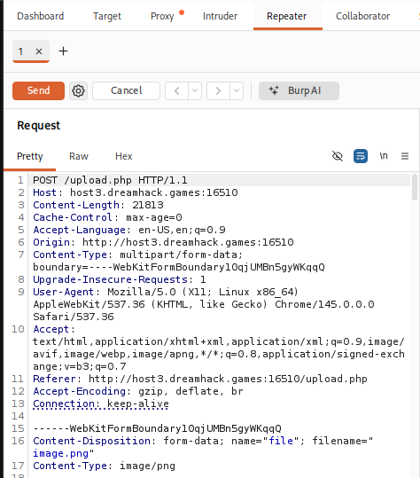
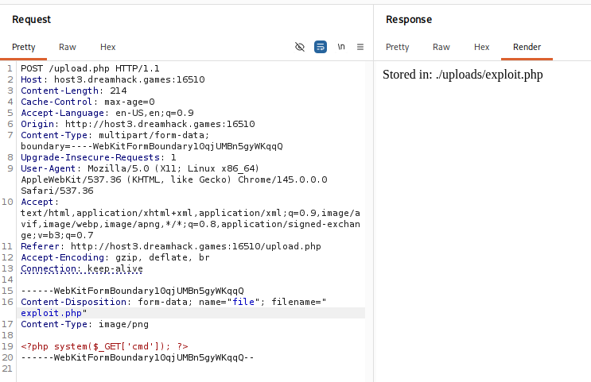
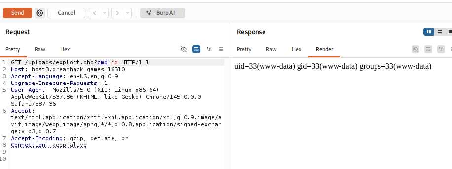
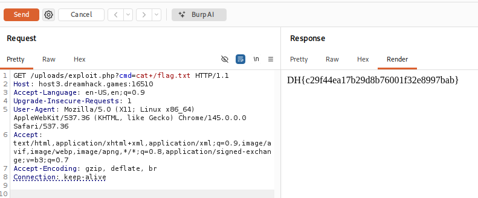

# [Dreamhack] image-storage - Web Hacking

## 1. 문제 개요

* **문제 링크:** [Dreamhack - image-storage](https://dreamhack.io/wargame/challenges/38)

* **분야:** Web

* **목표:** 파일 업로드 기능의 취약점을 이용하여 웹셸을 업로드하고, 원격 코드 실행을 통해 서버 루트 디렉토리에 숨겨진 플래그 탈취.

## 2. 취약점 분석
제공된 웹 서비스의 이미지 업로드 기능(`/upload.php`)을 분석한 결과, 업로드되는 파일의 확장자나 내용(Content-Type)에 대한 서버사이드 검증이 누락되어 있음을 확인.

```php
$directory = './uploads/';
$file = $_FILES["file"];
$error = $file["error"];
$name = $file["name"];
$tmp_name = $file["tmp_name"];

// ... (중략) ...

if (file_exists($directory . $name)) {
    echo $name . " already exists. ";
}else {
    if(move_uploaded_file($tmp_name, $directory . $name)){
        echo "Stored in: " . $directory . $name;
    }
}
```

* **분석 결론:** 공격자는 정상적인 이미지 파일 대신 악의적인 PHP 스크립트 파일을 업로드할 수 있으며, 해당 파일이 업로드 디렉토리(`./uploads/`)에 저장된 후 실행될 수 있는 **파일 업로드 취약점**이 존재함.

## 3. 공격 수행
 Burp Suite의 프록시 및 리피터 기능을 활용하여 패킷을 실시간으로 변조하는 방식으로 공격을 수행.

### 3.1. 웹셸 업로드 패킷 변조
1. 정상적인 이미지 파일을 선택하여 업로드를 시도하고, Burp Suite로 해당 POST 패킷을 인터셉트.

2. 업로드되는 파일명(`filename`)을 `image.png`에서 `exploit.php`로 변조.

3. 본문의 불필요한 이미지 바이너리 데이터를 삭제하고, URL 파라미터로 시스템 명령어를 실행할 수 있는 웹셸 코드(`<?php system($_GET['cmd']); ?>`)를 삽입하여 전송.





4. 서버 응답을 통해 `exploit.php` 파일이 `./uploads/` 경로에 성공적으로 업로드되었음을 확인.



### 3.2. 원격 코드 실행 및 플래그 탈취
1. Burp Suite의 Repeater 탭을 이용하여 업로드된 웹셸(`/uploads/exploit.php`)에 접근.

2. `GET` 요청의 파라미터로 `?cmd=id`를 전달하여, 서버 명령어 실행 권한을 정상적으로 획득했는지 검증.



3. 시스템 탐색 후, 최종적으로 `?cmd=cat+/flag.txt` 명령어를 전송하여 서버 최상단에 위치한 플래그 파일의 내용을 읽어옴.



## 4. 획득 결과
명령어 실행 결과, 응답 본문에서 하드코딩된 플래그를 발견함.

* **FLAG:** `DH{c29f44ea17b29d8b76001f32e8997bab}`

## 5. 대응 방안
임의의 스크립트 파일이 서버에 업로드되고 실행되는 것을 원천적으로 차단하기 위해 다중 보안 검증 로직을 구현해야 함.

* **확장자 검증:** 파일 업로드 시 `.jpg`, `.png`, `.gif` 등 허용된 안전한 확장자만 업로드되도록 서버단에서 검증.

* **파일 실행 권한 제거:** 업로드된 파일이 저장되는 `uploads` 디렉토리 내에서는 서버사이드 스크립트(PHP, JSP 등)가 실행되지 않도록 웹 서버 설정 수정.

* **파일 이름 난독화:** 업로드되는 파일의 이름을 사용자가 입력한 이름 그대로 저장하지 않고, 랜덤한 해시값(UUID 등)으로 변경하여 저장.