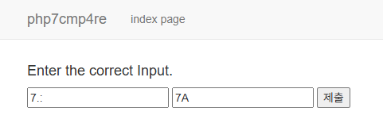
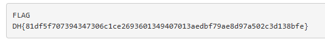

# [Dreamhack] php7cmp4re - Web Hacking

## 1. 문제 개요
* **문제 링크:** [Dreamhack - php7cmp4re](https://dreamhack.io/wargame/challenges/1113)

* **분야:** Web

* **목표:** PHP 7.x 환경에서의 '느슨한 비교(Loose Comparison)' 및 '타입 저글링(Type Juggling)' 취약점을 이해하고, 이를 활용하여 필터링 우회 후 플래그 획득.

## 2. 취약점 분석
제공된 `check.php` 소스 코드를 분석한 결과, `$input_1`과 `$input_2` 값에 대해 엄격하지 않은 비교 연산자(`<`, `>`)를 사용하여 검증 로직의 취약점이 발생함.

```php
<?php
    require_once('flag.php');
    error_reporting(0);
    // POST request
    if ($_SERVER["REQUEST_METHOD"] == "POST") {
      $input_1 = $_POST["input1"] ? $_POST["input1"] : "";
      $input_2 = $_POST["input2"] ? $_POST["input2"] : "";
      sleep(1);

      if($input_1 != "" && $input_2 != ""){
        if(strlen($input_1) < 4){
          if($input_1 < "8" && $input_1 < "7.A" && $input_1 > "7.9"){
            if(strlen($input_2) < 3 && strlen($input_2) > 1){
              if($input_2 < 74 && $input_2 > "74"){
                echo "</br></br></br><pre>FLAG\n";
                echo $flag;
                echo "</pre>";
              } else echo "<br><br><br><h4>Good try.</h4>";
            } else echo "<br><br><br><h4>Good try.</h4><br>";
          } else echo "<br><br><br><h4>Try again.</h4><br>";
        } else echo "<br><br><br><h4>Try again.</h4><br>";
      } else{
        echo '<br><br><br><h4>Fill the input box.</h4>';
      }
    } else echo "<br><br><br><h3>WHat??!</h3>";
    ?> 
```

* **분석 결론 1 (`$input_1`):**

  * 조건: `strlen < 4` 이며 `"7.9" < $input_1 < "7.A"`, `"8"` 미만이어야 함.

  * 취약점: PHP에서 문자열 비교는 아스키코드를 기준으로 이루어짐. 숫자 `9`와 문자 `A` 사이에는 특수기호(`:`, `;`, `<`, `=`, `>`, `?`, `@`)가 존재함.

* **분석 결론 2 (`$input_2`):**

  * 조건: 길이는 정확히 2자리(`1 < strlen < 3`)이며, `74`(숫자)보다 작고 `"74"`(문자열)보다 커야 함.

  * 취약점: PHP 7.x에서는 숫자가 포함된 문자열(예: `"7A"`)을 숫자와 비교할 때, 영문자가 나오기 전까지만 잘라서 정수로 변환함. 즉, `"7A"`는 숫자 `7`로 평가되어 `7 < 74`를 만족시킴. 동시에 문자열 비교에서는 `"7A" > "74"` 를 만족함.

## 3. 공격 수행
분석한 취약점을 바탕으로 검증 로직을 모두 우회하는 페이로드를 구성하여 POST 요청을 전송.

### 3.1. 페이로드 구성
1. `$input_1` 값으로 `7.:` 입력 
2. `$input_2` 값으로 `7A` 입력 
3. 해당 값을 입력 폼에 넣음




## 4. 획득 결과
검증 로직을 성공적으로 우회하여 `flag.php`에 정의된 플래그 출력 확인.

* **FLAG:** `DH{81df5f707394347306c1ce2693601349407013aedbf79ae8d97a502c3d138bfe}`



## 5. 대응 방안
PHP 애플리케이션 개발 시, 자료형의 변환으로 인한 예기치 않은 동작을 방지하기 위해 엄격한 검증을 수행해야 함.

* **엄격한 비교 연산자 사용:** 데이터의 값뿐만 아니라 타입(Type)까지 일치하는지 확인하는 `===`, `!==` 연산자를 사용하여 느슨한 비교 취약점 원천 차단.

* **입력값 타입 검증 및 캐스팅:** `is_numeric()` 등의 함수로 입력값이 예상한 타입인지 먼저 확인하거나, 연산 전 명시적으로 형 변환(Type Casting) 수행.

* **PHP 버전 업데이트:** PHP 8.0 이상부터는 숫자와 숫자가 아닌 문자열의 비교 방식이 보다 안전하고 상식적으로 변경되었으므로, 가급적 최신 버전의 PHP 환경을 유지.