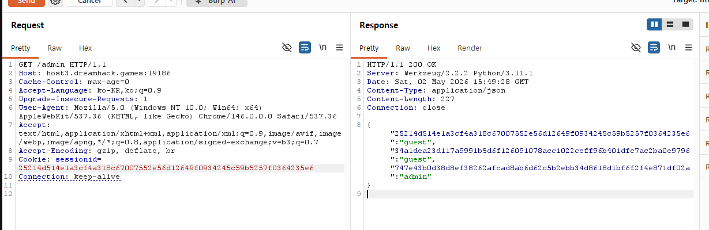
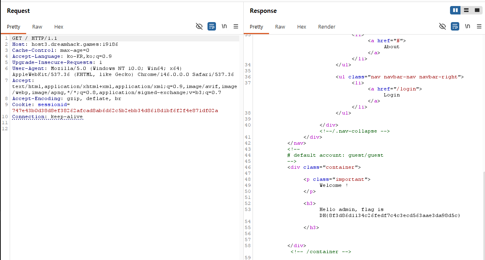

# [Dreamhack] session-basic - Web Hacking

## 1. 문제 개요

* **문제 링크:** [Dreamhack - session-basic](https://dreamhack.io/wargame/challenges/409)

* **분야:** Web

* **목표:** 서버의 취약한 라우팅을 분석하여 관리자(admin)의 세션 ID를 탈취하고, 이를 쿠키에 적용하여 권한을 우회해 플래그 획득.

## 2. 취약점 분석
제공된 `app.py` 소스코드를 분석한 결과, `/admin` 엔드포인트에 치명적인 **정보 노출** 취약점이 존재함을 확인.

```python
@app.route('/admin')
def admin():
    # developer's note: review below commented code and uncomment it (TODO)

    #session_id = request.cookies.get('sessionid', None)
    #username = session_storage[session_id]
    #if username != 'admin':
    #    return render_template('index.html')

    return session_storage
```

* **분석 결론:** 개발자가 디버깅 편의를 위해 `/admin` 라우팅 내부의 세션 인가 검증 로직을 모두 주석 처리해 둔 상태. 그 결과, 아무런 검증 없이 `return session_storage` 구문이 실행되어 현재 서버 메모리에 저장된 모든 활성 사용자의 세션 정보가 평문으로 노출됨.

## 3. 공격 수행
웹 프록시 도구인 Burp Suite의 Repeater 기능을 활용하여 서버와 통신하는 HTTP 패킷을 가로채고 조작하는 방식으로 공격을 진행.

### 3.1. 관리자 세션 정보 탈취
1. Burp Suite를 통해 타겟 서버의 `/admin` 페이지로 향하는 `GET` 요청 패킷을 캡처하여 Repeater로 전송.

2. 패킷을 서버로 전송한 결과, 응답 본문에 서버의 `session_storage` 딕셔너리 값이 JSON 형태로 반환됨을 확인.

3. 노출된 데이터 중 `admin` 계정에 매핑된 세션 ID(`747e43b0d38d8ef38262afcad8ab6d62c5b2ebb34d8618d1bf6f2f4e871df02a`)를 탈취.



### 3.2. 패킷 조작 및 세션 위조
1. 탈취한 관리자의 세션 ID를 활용하여 메인 페이지(`/`)에 접근하기 위해 기존 Request 패킷을 수정.

2. HTTP 요청 경로를 `GET / HTTP/1.1`로 변경.

3. 요청 헤더의 `Cookie` 값을 탈취한 `admin`의 세션 ID로 변조한 뒤 서버에 재전송.



## 4. 획득 결과
변조된 쿠키를 통해 관리자 세션으로 성공적으로 인증이 우회되었으며, 서버의 응답에서 숨겨진 플래그가 출력됨을 확인.

* **FLAG:** `DH{8f3d86d1134c26fedf7c4c3ecd563aae3da98d5c}`

## 5. 대응 방안
운영 환경 배포 시, 개발 과정에서 사용된 디버깅 코드나 시스템 내부 정보가 노출되는 API는 반드시 제거해야 함.

* **소스코드 보안 패치:** `/admin` 라우팅 내부의 주석을 해제하여, 요청자의 쿠키에 담긴 `sessionid`가 실제 `admin` 계정의 것인지 검사하는 **인가 및 접근 통제 로직**을 정상적으로 동작하도록 복구해야 함.