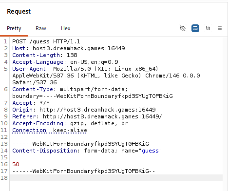
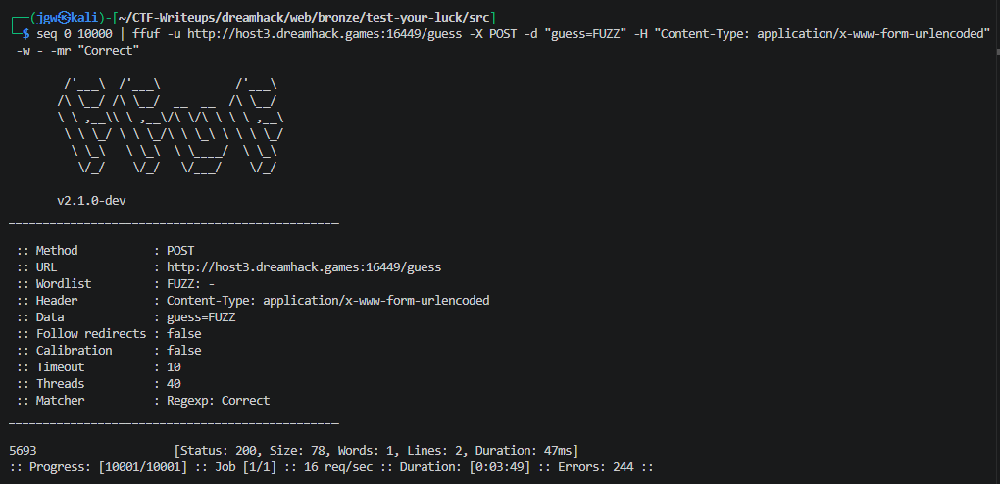
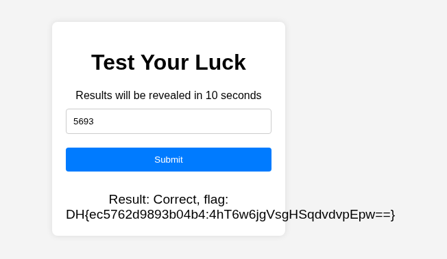

# [Dreamhack] test-your-luck - Web

## 1. 문제 개요
* **문제 링크:** [Dreamhack - test-your-luck](https://dreamhack.io/wargame/challenges/1955)
* **분야:** Web

* **목표:** 0부터 10000 사이의 무작위 숫자를 맞추는 웹 애플리케이션에서, 횟수 제한이 없는 점을 이용해 브루트 포스(Brute Force) 공격으로 플래그를 획득.


## 2. 취약점 분석
제공된 `app.py` 소스 코드를 분석한 결과, 서버의 난수 생성 및 검증 로직에서 브루트 포스 공격을 허용하는 취약점을 확인.

### 2.1. 소스 코드 취약점 파악 (app.py)
```python
# [Lines 6-7] 서버 구동 시 1회만 난수 생성
NUMBER_RANGE = (0, 10000)
TARGET_NUMBER = random.randint(*NUMBER_RANGE) 

# ... (생략) ...

# [Lines 20-27] 요청 검증 로직
@app.route('/guess', methods=['POST'])
def guess_number():
    user_guess = int(request.form['guess'])

    if user_guess == TARGET_NUMBER:
        return jsonify({"result": "Correct", "flag": flag()})
    else:
        return jsonify({"result": "Incorrect", "flag": "Try again~!"})
```
* **탐색 공간의 협소함:** `TARGET_NUMBER`가 `0`에서 `10000` 사이의 값으로 고정되어 있어 전체 경우의 수가 10,001개에 불과함.

* **무제한 인증 시도:** 사용자가 `/guess` 엔드포인트로 무한정 POST 요청을 보내어 오답을 내더라도, 세션을 차단하거나 요청 속도를 제한하는 방어 로직이 전혀 없음.

### 2.2. 패킷 구조 분석 및 공격 설계

Burp Suite를 통해 통신 패킷을 캡처하여, 브라우저가 서버로 데이터를 전송하는 정확한 규격을 분석. 이를 통해 자동화 공격에 필요한 핵심 파라미터들을 추출.



**[파악된 핵심 정보]**

* **엔드포인트 및 메서드:** `POST /guess`

* **파라미터명:** 사용자의 입력값은 `guess`라는 이름의 변수에 담겨 전송됨을 확인.

* **데이터 형식:** 브라우저의 기본 폼 전송 방식인 `multipart/form-data`를 사용함.

**[공격 도구 전환 및 페이로드 최적화]**

경우의 수가 10,001개(0~10000)이므로 무차별 대입(Brute Force) 공격 수행. 

초기에는 Burp Suite의 Intruder 기능을 고려하였으나, 무료(Community) 버전의 속도 제한으로 인해 1만 번의 요청을 보내는 데 시간이 오래 걸리는 문제 발생.

따라서 공격 효율성을 높이기 위해 초고속 퍼징 도구인 <b>`ffuf`</b>를 사용하기로 결정. 또한, `ffuf`에서 페이로드를 간결하게 구성하기 위해, 복잡한 구분선(boundary)이 필요한 `multipart/form-data` 형식 대신 서버가 호환하여 처리할 수 있는 **`application/x-www-form-urlencoded`** 헤더로 데이터 형식을 변환하여 공격을 수행할 예정.

## 3. 공격 수행
분석 결과 파악된 HTTP 요청 구조를 바탕으로, 자동화 공격의 효율성을 극대화하기 위한 전략을 수립하여 공격을 진행함.

### 3.1. 수행 전략

* **포맷 변환:** 원래 브라우저는 `multipart/form-data` 형식을 사용하지만, 페이로드 구성을 단순화하고 네트워크 오버헤드를 줄이기 위해 서버가 호환 가능한 `application/x-www-form-urlencoded` 형식으로 변환하여 시도함.

* **도구 선택:** 초고속 퍼징 도구인 `ffuf`를 사용하여 10,001개의 경우의 수를 빠르게 전수 조사함.

### 3.1. ffuf를 활용한 브루트 포싱

1. 리눅스 내장 명령어인 `seq`를 사용하여 0부터 10000까지의 숫자를 생성하고, 파이프(`|`)를 통해 `ffuf`의 워드리스트로 전달.

2. `Content-Type: application/x-www-form-urlencoded` 헤더를 명시하여 서버가 폼 데이터를 정상적으로 인식하도록 조치.

3. 오탐지를 방지하기 위해 응답 본문에 정답을 의미하는 "Correct" 문자열이 포함된 패킷만 화면에 출력하도록 정규식 매치(`-mr "Correct"`) 옵션 적용.

```bash
seq 0 10000 | ffuf -u http://host3.dreamhack.games:16449/guess -X POST -d "guess=FUZZ" -H "Content-Type: application/x-www-form-urlencoded" -w - -mr "Correct"
```



## 4. 획득 결과
브루트 포싱 수행 결과, 정답 숫자인 `5693`을 성공적으로 도출함. 해당 값을 문제 페이지에 입력하여 최종 플래그를 획득.



* **FLAG:** `DH{ec5762d9893b04b4:4hT6w6jgVsgHSqdvdvpEpw==}`

## 5. 대응 방안
해당 웹 애플리케이션은 사용자 입력값과 정답의 일치 여부만 검증할 뿐, 무차별 대입 공격에 대한 애플리케이션 계층의 방어가 완전히 누락되어 있음.

* **요청 속도 제한:** 단일 IP 또는 세션에서 짧은 시간 내에 비정상적으로 많은 횟수의 검증 요청이 들어올 경우, 응답을 지연시키거나 일정 시간 동안 접근을 차단하는 로직을 구현해야 함.

* **인증 시도 횟수 제한 및 CAPTCHA 도입:** 일정 횟수 이상 오답 입력 시 계정을 잠그거나, 봇을 이용한 폼 자동 제출을 차단하기 위해 CAPTCHA 검증 단계를 강제해야 함.