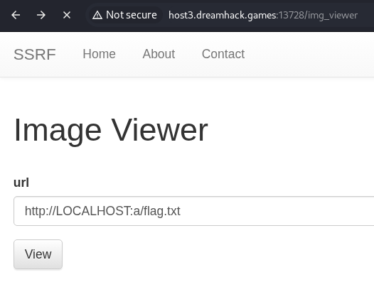
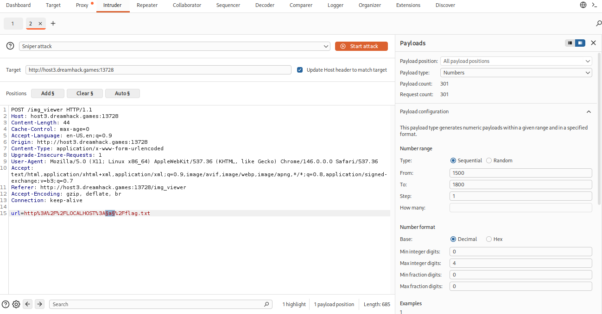
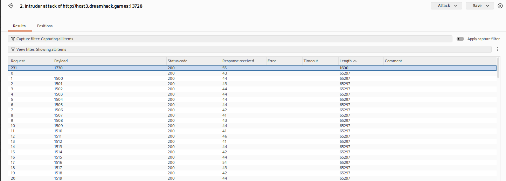
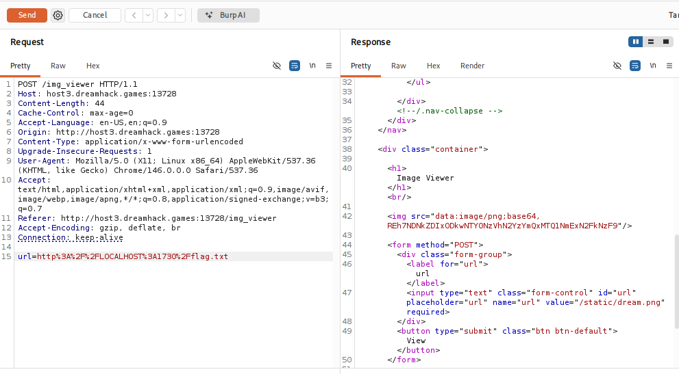
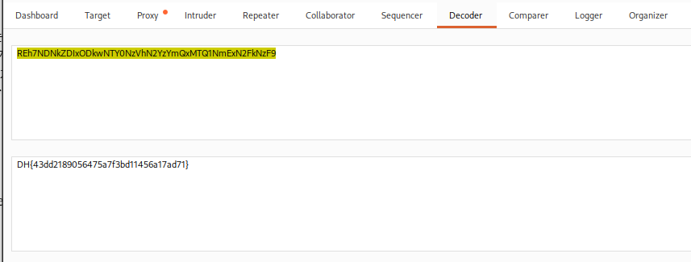

# [Dreamhack] Web-SSRF - Web Hacking

## 1. 문제 개요

* **문제 링크:** [Dreamhack - web-ssrf](https://dreamhack.io/wargame/challenges/75)

* **분야:** Web

* **목표:** SSRF 취약점을 이용해 `/app/flag.txt`에 저장된 플래그 획득

## 2. 취약점 분석
제공된 `app.py` 소스 코드 분석 결과, `/img_viewer` 라우트는 `url` 파라미터를 받아 `requests.get()`으로 요청을 보낸 뒤 응답 바이트를 base64로 인코딩해 그대로 화면에 반환하는 이미지 프록시 구조로 확인. 로컬호스트 접근 차단을 위한 필터가 존재하나, `urlparse().netloc` 문자열에 `"localhost"` 또는 `"127.0.0.1"`이 포함되는지만 검사하는 단순 문자열 매칭 방식으로, 대소문자를 구분하지 않는 DNS 해석 특성을 반영하지 못해 우회 가능한 구조로 확인. 또한 앱 실행 시 `http.server.SimpleHTTPRequestHandler`가 작업 디렉터리(`/app`) 기준으로 파일을 서빙하는 로컬 서버가 1500~1800 사이 랜덤 포트로 별도 기동되며, 이 포트를 통해 `flag.txt`에 접근 가능한 구조로 확인.

```python
# [app.py] img_viewer 라우트 - netloc 문자열 매칭 필터
# ... (중략) ...
elif ("localhost" in urlp.netloc) or ("127.0.0.1" in urlp.netloc):
    data = open("error.png", "rb").read()
    img = base64.b64encode(data).decode("utf8")
    return render_template("img_viewer.html", img=img)
try:
    data = requests.get(url, timeout=3).content
    img = base64.b64encode(data).decode("utf8")
except:
    data = open("error.png", "rb").read()
    img = base64.b64encode(data).decode("utf8")
# ... (중략) ...
```

```python
# [app.py] 작업 디렉터리(/app) 기준 파일 서빙용 로컬 서버, 랜덤 포트 기동
local_port = random.randint(1500, 1800)
local_server = http.server.HTTPServer(
    (local_host, local_port), http.server.SimpleHTTPRequestHandler
)
```

```dockerfile
# [Dockerfile] 앱 파일 복사 및 작업 디렉터리 지정
ADD ./deploy /app
WORKDIR /app
```

* **분석 결론:** `netloc` 문자열 매칭 필터는 대소문자를 구분하지 않는 `LOCALHOST` 표기로 우회 가능하며, `requests` 라이브러리의 DNS 해석 단계에서는 정상적으로 루프백 주소로 연결됨. 우회된 요청은 랜덤 포트(1500~1800)로 기동된 로컬 파일 서버의 `/flag.txt` 경로에 도달해야 하므로, 필터 우회와 포트 브루트포스를 결합한 공격이 최종 경로로 확인.

## 3. 공격 수행

1. `app.py` 소스코드 확인 및 `/img_viewer` 폼에 임의 포트로 baseline 요청 전송, 실패 시 고정된 `error.png` 응답 길이 확인.



2. Burp Intruder Sniper attack으로 `url` 파라미터에 필터 우회 payload를 설정, 페이로드 위치에 포트 번호(1500~1800, Numbers 타입)를 지정.

```http
// Payload - netloc 대소문자 우회 + 포트 브루트포스 위치 지정
url=http%3A%2F%2FLOCALHOST%3A§a§%2Fflag.txt
```



3. 301개 요청에 대한 응답 Length 정렬 결과, 포트 1730에서만 응답 길이가 1600으로 타 요청(65297)과 다르게 확인. 해당 포트가 로컬 파일 서버의 정답 포트로 판단.



4. Burp Repeater로 확정된 포트(1730)를 포함한 요청을 재전송, Response에서 base64로 인코딩된 flag.txt 원문이 `` 태그에 담겨 반환됨을 확인.

```http
// Payload - 확정된 포트를 포함한 최종 요청
url=http%3A%2F%2FLOCALHOST%3A1730%2Fflag.txt
```



5. Burp Decoder로 추출한 base64 문자열 디코딩, 플래그 원문 획득.



## 4. 획득 결과
`netloc` 필터의 대소문자 미구분 특성을 이용해 로컬호스트 차단을 우회하고, 랜덤 기동된 로컬 파일 서버 포트를 브루트포스로 특정해 `flag.txt`를 base64 응답으로 획득, 디코딩 결과에서 플래그 확인.

* **FLAG:** `DH{43dd2189056475a7f3bd11456a17ad71}`

## 5. 대응 방안
사용자 입력 URL을 검증 없이 요청 대상으로 사용하는 구조와, 문자열 매칭 기반의 취약한 필터링 로직이 결합되어 발생한 취약점이므로, 입력 검증 로직과 아키텍처 양쪽에서의 대응 필요.

* **IP 기반 검증으로 전환:** `netloc` 문자열 포함 여부가 아닌, `socket.gethostbyname()`으로 실제 IP를 해석한 뒤 `ipaddress` 모듈로 루프백(127.0.0.0/8, ::1) 및 사설 대역(10.0.0.0/8, 172.16.0.0/12, 192.168.0.0/16) 여부를 판정하여 차단.

* **스킴/포트 화이트리스트 적용:** `http`, `https` 외 스킴은 거부하고, 허용된 포트 목록 외 임의 포트로의 접근을 차단.

* **리다이렉트 검증:** `requests.get()`의 `allow_redirects=True` 기본값으로 인해 필터를 통과한 정상 URL이 내부 IP로 리다이렉트되는 우회를 방지하기 위해, 리다이렉트 발생 시마다 재검증하거나 `allow_redirects=False` 처리.

* **민감 파일 및 내부 서비스 분리:** `flag.txt`와 같은 민감 파일을 애플리케이션 실행 디렉터리 바깥에 저장하고, `SimpleHTTPRequestHandler`와 같이 디렉터리 전체를 무인증으로 서빙하는 내부 서버 자체를 제거.

* **네트워크 레벨 통제:** 애플리케이션 서버가 자기 자신 및 내부망으로 아웃바운드 요청을 보낼 필요가 없다면, 방화벽/iptables 수준에서 루프백 및 내부 대역으로의 자체 요청을 차단.

## 6. 블루팀 관점 요약
보안관제 및 침해사고 대응(IR) 관점에서, SSRF를 통한 내부 리소스 접근 및 랜덤 포트 브루트포스 행위 탐지.

* **WAF 및 웹 서버 로그 분석:** Access 로그에서 `url` 파라미터에 `localhost`, `127.0.0.1`의 대소문자 변형, IP 10진수/16진수/8진수 표기(`2130706433`, `0x7f000001`, `0177.0.0.1`), IPv6 루프백(`[::1]`) 등 우회성 표기가 포함된 요청 식별.

* **침해사고 대응(IR) 시나리오:** 동일 세션/IP에서 동일 엔드포인트(`/img_viewer`)로 짧은 시간 내 수백 건의 요청이 연속으로 발생하며 포트 번호만 순차적으로 변화하는 패턴이 확인될 경우, 랜덤 포트 브루트포스 시도로 판단하고 해당 세션의 전체 요청 이력 및 최종 성공 응답(응답 크기 이상치) 여부 전수 조사.

* **네트워크 기반 탐지 룰 제안 (Snort 3):**

  - `POST` 요청 바디 내 `url=` 파라미터에 `localhost`(대소문자 무관) 또는 `127.0.0.1` 우회 표기가 포함된 패턴 탐지.

  - `alert tcp $EXTERNAL_NET any -> $HTTP_SERVERS $HTTP_PORTS (msg:"[Web] SSRF via netloc Filter Bypass - Loopback Access Attempt"; flow:to_server,established; http_method; content:"POST"; http_uri; content:"/img_viewer"; http_client_body; content:"url=http"; nocase; pcre:"/url=http%3A%2F%2F(localhost|127\.0\.0\.1|127\.1|0x7f)/i"; sid:1000006; rev:1;)`