# [Allsafe] Certificate Pinning Bypass - Reversing

## 1. 문제 개요

* **문제 링크:** [Allsafe - Certificate Pinning Bypass (v.1.6 Release)](https://github.com/t0thkr1s/allsafe-android/releases/tag/v.1.6)

* **분야:** Reversing, Mobile

* **목표:** OkHttp 기반 인증서 피닝(Certificate Pinning) 검증 로직을 분석하여 우회 지점을 특정하고, Frida를 이용한 런타임 후킹으로 MITM 프록시(Burp Suite) 경유 트래픽 검증 성공

## 2. 취약점 분석
제공된 APK(`allsafe.apk`)를 JADX로 분석한 결과, 인증서 피닝 검증 로직이 두 단계로 분리되어 있으며, 검증에 사용되는 pin 값을 실행 시점에 서버로부터 직접 수집하는 구조로 확인됨. 이 수집 로직이 실행되는 시점에 따라 피닝 무결성이 오염될 수 있는 설계 결함 확인.

```java
// [CertificatePinning.java] pin 값 추출 로직 - 화면 진입 시 자동 실행
private void extractPeerCertificateChain() {
    // 의도적으로 틀린 해시(INVALID_HASH)로 접속을 시도하여 실패를 유도
    OkHttpClient okHttpClient = new OkHttpClient.Builder().certificatePinner(new CertificatePinner.Builder().add("httpbin.io", INVALID_HASH).build()).build();
    // ... (중략) ...
    okHttpClient.newCall(request).enqueue(new AnonymousClass2());
}
```

```java
// [CertificatePinning$2.java] 실패 예외 메시지에서 실제 pin 값 파싱
public /* synthetic */ void lambda$onFailure$0(IOException e) {
    String message = e.getMessage();
    if (message != null) {
        CertificatePinning.this.hashes.clear();
        // ... (중략) ...
        for (String line : lines) {
            if (!line.trim().equals(CertificatePinning.INVALID_HASH) && line.trim().startsWith("sha256")) {
                String pin = line.trim().split(":")[0].trim();
                CertificatePinning.this.hashes.add(pin);   // 서버 응답에서 추출한 해시를 그대로 신뢰
            }
        }
    }
}
```

```java
// [CertificatePinning.java] 버튼 클릭 시 실제 검증에 사용되는 pin 값
public /* synthetic */ void lambda$onCreateView$0(View v) {
    CertificatePinner.Builder certificatePinner = new CertificatePinner.Builder();
    for (String hash : this.hashes) {   // extract 단계에서 저장된 해시를 그대로 사용
        certificatePinner.add("httpbin.io", hash);
    }
    // ... (중략) ...
}
```

```java
// [okhttp3.CertificatePinner] check()가 실제로 check$okhttp()를 호출하는 구조
public final void check(String hostname, List<? extends Certificate> peerCertificates) {
    // ... (중략) ...
    check$okhttp(hostname, new Function0<List<? extends X509Certificate>>() {
        // ... (중략) ...
    });
}

public final void check$okhttp(String hostname, Function0<? extends List<? extends X509Certificate>> cleanedPeerCertificatesFn) {
    List<Pin> listFindMatchingPins = findMatchingPins(hostname);
    // ... (중략) ...
    if (Intrinsics.areEqual(pin.getHash(), sha256)) {
        return;   // 실제 pin 일치 여부를 비교하는 지점
    }
}
```

* **분석 결론:** `CertificatePinning.java` 자체에는 pin 값을 비교하는 로직이 없고, `OkHttpClient`에 장착된 `okhttp3.CertificatePinner` 객체(`.certificatePinner(...)`)로 검증이 위임되는 구조. 해당 라이브러리 클래스를 직접 디컴파일하여 대조한 결과, 소스상의 `check(String, List)`는 내부적으로 `check$okhttp(String, Function0)`를 호출하는 껍데기 함수이며, 실제 pin 비교(`Intrinsics.areEqual`) 로직은 `check$okhttp` 안에 위치함을 확인. 이는 OkHttp 4.x가 Kotlin inline 함수로 컴파일되며 발생하는 특성으로, 소스코드 상의 메서드명과 런타임에 실제 호출되는 심볼명이 다를 수 있음을 의미하며, 검증 로직 자체가 앱 코드가 아닌 라이브러리 내부에 있어 Frida를 이용한 런타임 후킹으로 무력화 가능.

## 3. 공격 수행

1. JADX-GUI로 APK 디컴파일 후 `CertificatePinning` 클래스 식별. 화면 진입 시 자동 실행되는 `extractPeerCertificateChain()`과 버튼 클릭 시 실행되는 `lambda$onCreateView$0()` 두 로직의 실행 시점 차이 파악.

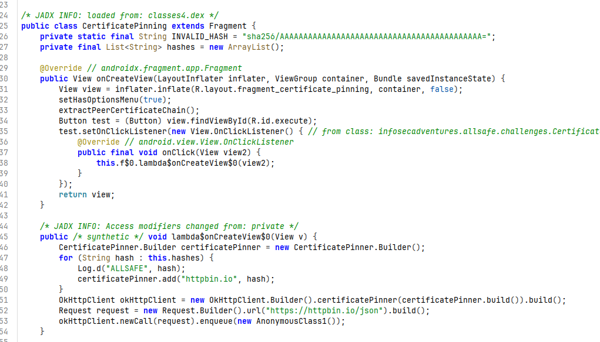

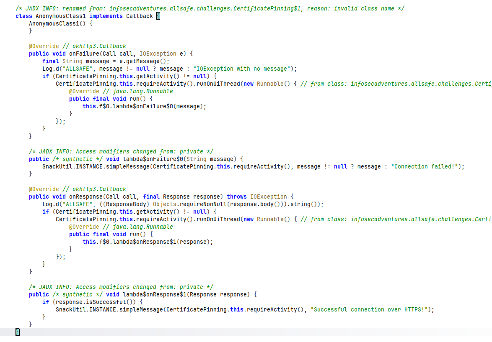

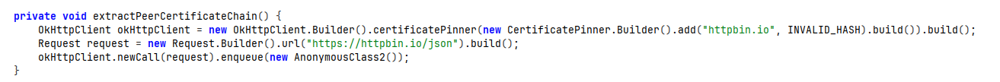

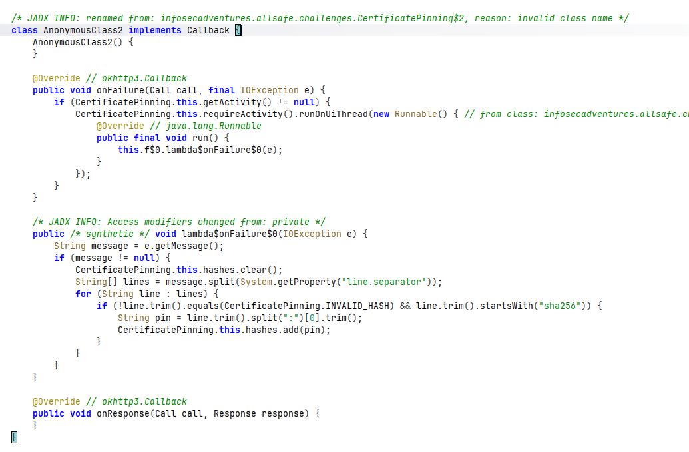

2. 별도의 프록시나 후킹 없이 앱을 그대로 실행하여 `SEND REQUEST` 버튼 클릭. 아무 개입 없이도 정상적으로 연결이 성공함을 확인. 이 성공은 실제로 MITM 개입 여부와 무관하게 나타나는 것으로, 피닝 우회 여부를 증명하지 못하므로 트래픽을 직접 가로채어 검증할 필요성 확인.

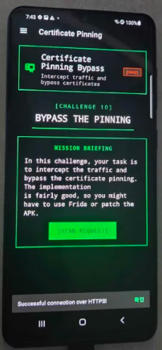

3. Burp Suite를 MITM 프록시로 구성. Proxy Listener를 `All interfaces`로 바인딩하여 외부 기기에서도 접근 가능하도록 설정.

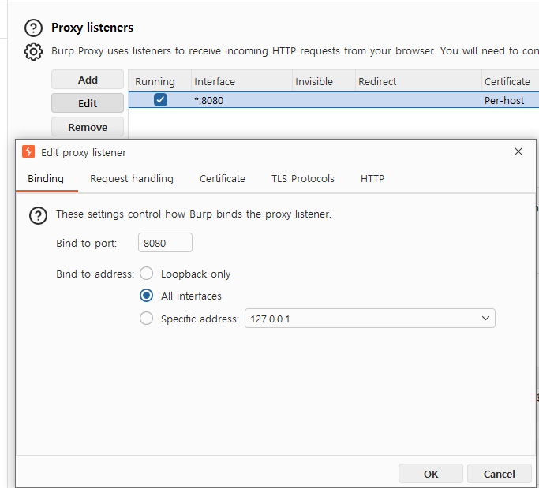

`ipconfig`로 분석 PC의 실제 IPv4 주소(192.168.0.28) 확인.

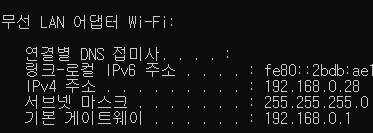

4. 확인한 PC IP를 기준으로, 루팅된 테스트 단말(Galaxy A31)의 Wi-Fi 프록시 호스트/포트를 Burp 리스너 주소(192.168.0.28:8080)로 수동 설정.

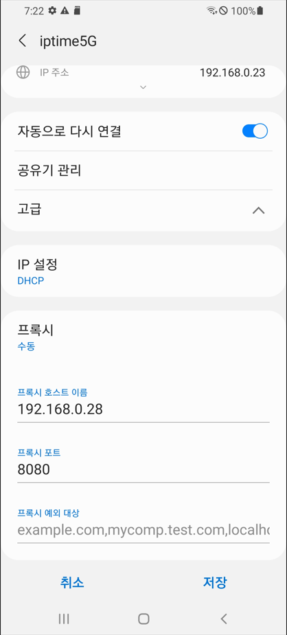

5. Burp CA 인증서를 단말에 설치 후 Magisk `AlwaysTrustUserCerts` 모듈로 user store 인증서를 신뢰 대상으로 지정. 인증서 신뢰 등록 상태 확인.

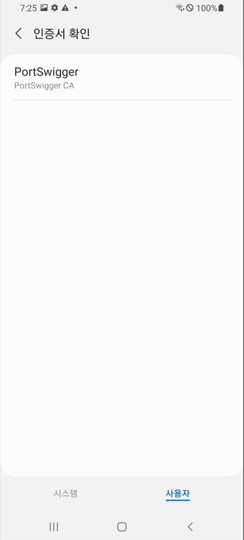

6. 프록시 활성화 상태로 `SEND REQUEST` 버튼 재실행. 하드코딩된 진짜 pin 값과 Burp의 위조 인증서 해시가 불일치하여 `Certificate pinning failure!` 예외 발생, 피닝 로직이 정상 작동 중임을 확인.

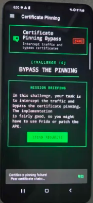

7. `CertificatePinning.java` 자체에는 해당 예외 메시지를 생성하는 로직이 없어, 화면에 노출된 예외 문구("Peer certificate chain")를 JADX Text Search로 코드 전체에서 역추적. 검색 결과 `okhttp3.CertificatePinner.check$okhttp()` 함수 내부에서 해당 문자열이 조립됨을 확인, 실제 pin 검증 로직의 위치를 특정.

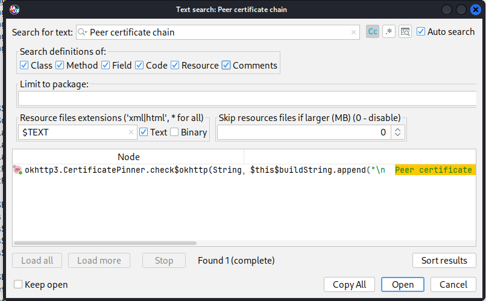

8. 특정된 `check$okhttp()` 함수 코드 확인. `Intrinsics.areEqual(pin.getHash(), sha256)`으로 실제 pin 비교가 이루어지며, 불일치 시 `Certificate pinning failure!` 예외 메시지가 조립되어 던져지는 구조임을 확인.

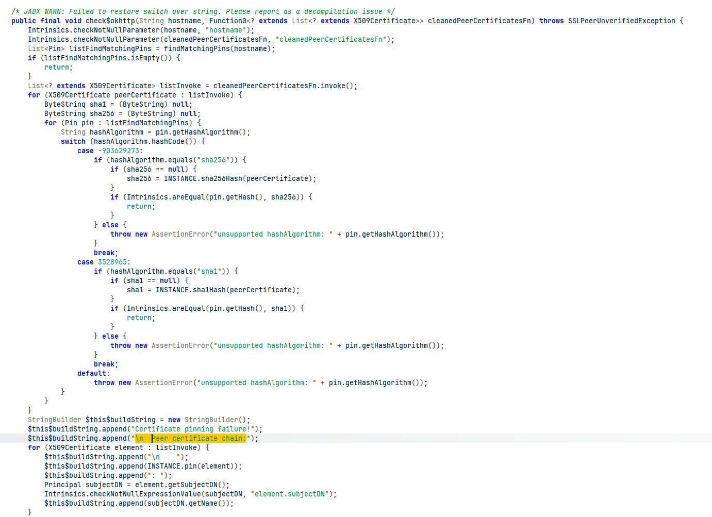

9. `check$okhttp(String, Function0)`를 후킹 대상으로 Frida 스크립트 작성.

```javascript
// [hook.js] Certificate Pinning 우회 스크립트
Java.perform(function () {
    var CertificatePinner = Java.use("okhttp3.CertificatePinner");

    CertificatePinner["check$okhttp"].overload('java.lang.String', 'kotlin.jvm.functions.Function0').implementation = function (hostname, cleanedPeerCertificatesFn) {
        console.log("[*] bypassed : " + hostname);
        return;
    };

    console.log("[*] hook installed");
});
```

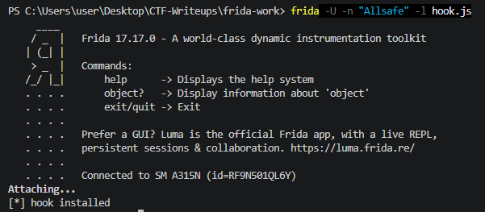

10. 후킹이 적용된 상태로 `SEND REQUEST` 버튼 재실행. 콘솔에 우회 로그 출력과 동시에 단말 화면에 성공 메시지 확인.

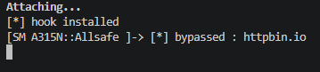

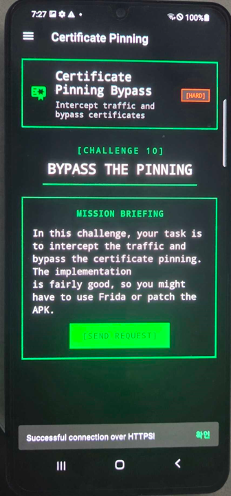

11. Burp HTTP history에서 해당 요청의 응답 본문이 평문 JSON으로 정상 캡처된 것을 최종 확인, 프록시가 실제로 트래픽을 복호화하여 가로챈 상태에서 우회가 성립했음을 검증.

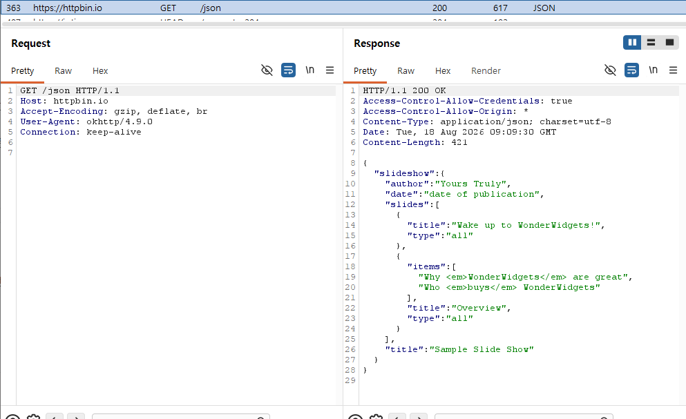

## 4. 획득 결과
Frida 후킹 적용 후 `SEND REQUEST` 버튼 실행 시 프록시가 개입된 상태에서도 인증서 피닝 검증이 무력화되어 정상 응답 수신 확인.

* **성공 메시지:** `Successful connection over HTTPS!`

* **검증 근거:** Burp HTTP history에 `https://httpbin.io/json` 요청이 평문 JSON 응답(200 OK)으로 캡처됨

## 5. 대응 방안
인증서 피닝 구현 시 pin 값의 신뢰 획득 경로와 검증 로직의 견고성을 함께 고려하는 시큐어 코딩 적용 필요.

* **Pin 값 하드코딩:** 런타임에 서버로부터 pin 값을 동적으로 수집하는 방식은 MITM 개입 시점에 따라 신뢰 근거 자체가 오염될 수 있으므로, 배포 시점에 검증된 pin 값을 코드 내 상수로 고정하여 사용.

* **다중 pin 및 백업 pin 구성:** 단일 서버 인증서 해시만 고정하지 않고, 중간 CA 또는 백업 키 해시를 함께 등록하여 인증서 교체 시에도 우회 없이 정상 갱신 가능한 구조 설계.

* **런타임 조작 탐지 결합:** 순수 pinning만으로는 Frida 등 동적 계측 도구에 의한 검증 로직 우회를 막을 수 없으므로, 루트 탐지 및 Frida/Xposed 탐지 로직을 pinning 검증과 결합하여 다층 방어 구성.

* **네이티브 계층 이전:** Java/Kotlin 계층의 검증 로직은 후킹 대상이 되기 쉬우므로, 핵심 검증 로직을 JNI/네이티브 코드로 이전하여 정적/동적 분석 난이도 상승.

## 6. 블루팀 관점 요약
본 취약점은 단말 내부에서 발생하는 로컬 검증 로직 결함과 동적 계측 도구(Frida)를 이용한 런타임 조작이 결합된 형태로, 네트워크 트래픽 자체는 정상 TLS 통신처럼 관측되어 전통적인 네트워크 기반 장비만으로는 탐지 한계 존재.
호스트 기반 관점에서는 frida-server 프로세스 실행 흔적, Magisk 등 루팅 관리 도구의 시스템 인증서 저장소(system store) 변조 흔적, 그리고 앱 내 하드코딩된 검증 관련 문자열을 기반으로 한 위협 헌팅 및 YARA 탐지 룰 구성 가능.

### 6.1. YARA 탐지 룰 (IoC)
분석 과정에서 도출된 패키지명, 피닝 검증 관련 클래스/문자열, 성공·실패 노출 메시지를 기반으로 탐지하는 YARA 룰 제안.

```yara
rule Detect_Allsafe_CertificatePinning_Bypass {
    strings:
        // 타겟 패키지 및 대상 클래스
        $pkg_name = "infosecadventures.allsafe" ascii
        $class_name = "CertificatePinning" ascii

        // pin 추출 시 사용되는 의도적 오답 해시
        $invalid_hash = "sha256/AAAAAAAAAAAAAAAAAAAAAAAAAAAAAAAAAAAAAAAAAAA=" ascii

        // 대상 호스트
        $target_host = "httpbin.io" ascii

        // 성공/실패 노출 메시지
        $msg_success = "Successful connection over HTTPS!" ascii
        $msg_fail = "Certificate pinning failure!" ascii

    condition:
        $pkg_name and $class_name and (
            $invalid_hash or
            $target_host or
            any of ($msg_*)
        )
}
```