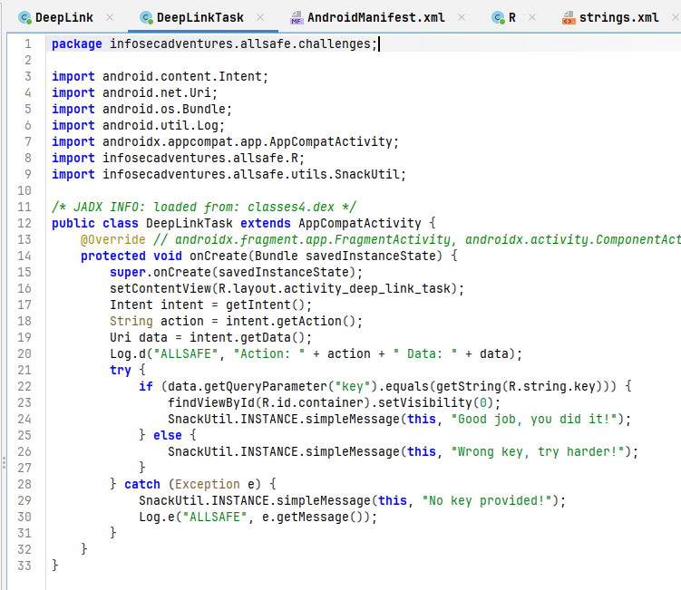
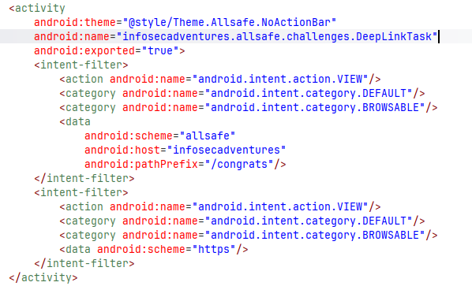
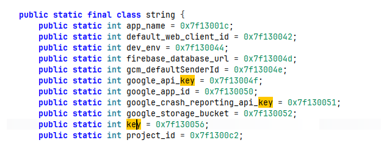
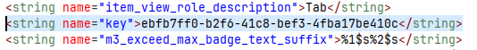
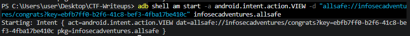

# [Allsafe] Deep Link Exploitation - Reversing

## 1. 문제 개요

* **문제 링크:** [Allsafe - Deep Link Exploitation (v.1.6 Release)](https://github.com/t0thkr1s/allsafe-android/releases/tag/v.1.6)

* **분야:** Reversing, Mobile

* **목표:** 안드로이드 애플리케이션의 딥링크(Deep Link) 처리 로직과 매니페스트(Manifest)를 정적 분석하여, 숨겨진 딥링크 URI 스키마 및 검증용 키(Key) 값 획득 후 ADB를 통한 트리거.

## 2. 취약점 분석
제공된 APK(`allsafe.apk`)를 JADX로 분석한 결과, 딥링크 인텐트를 처리하는 액티비티와 설정 파일에서 노출 및 평문 비교 취약점 확인.

```xml
<!-- [AndroidManifest.xml] DeepLinkTask 액티비티 딥링크 인텐트 필터 -->
<!-- ... (중략) ... -->
<activity
    android:theme="@style/Theme.Allsafe.NoActionBar"
    android:name="infosecadventures.allsafe.challenges.DeepLinkTask"
    android:exported="true">
    <intent-filter>
        <!-- ... (중략) ... -->
        <data
            android:scheme="allsafe"
            android:host="infosecadventures"
            android:pathPrefix="/congrats"/>
    </intent-filter>
    <!-- ... (중략) ... -->
</activity>
<!-- ... (중략) ... -->
```

```java
// [DeepLinkTask.java] 딥링크 파라미터 검증 로직
// ... (중략) ...
public class DeepLinkTask extends AppCompatActivity {
    // ... (중략) ...
    protected void onCreate(Bundle savedInstanceState) {
        // ... (중략) ...
        Uri data = intent.getData();
        // ... (중략) ...
        try {
            if (data.getQueryParameter("key").equals(getString(R.string.key))) {
                findViewById(R.id.container).setVisibility(0);
                SnackUtil.INSTANCE.simpleMessage(this, "Good job, you did it!");
            } else {
                SnackUtil.INSTANCE.simpleMessage(this, "Wrong key, try harder!");
            }
        } catch (Exception e) {
            // ... (중략) ...
        }
    }
}
```

```xml
<!-- [strings.xml] 하드코딩된 검증 키 값 -->
<!-- ... (중략) ... -->
<string name="key">ebfb7ff0-b2f6-41c8-bef3-4fba17be410c</string>
<!-- ... (중략) ... -->
```

* **분석 결론:** 딥링크 파라미터 검증이 클라이언트 리소스에 평문으로 하드코딩된 값(`R.string.key`)과의 단순 문자열 비교에 전적으로 의존하는 구조. 서버 사이드 검증이나 동적 토큰 없이 정적 분석만으로 정답 키 값이 그대로 노출되므로, 별도의 런타임 우회 없이 해당 값을 조합한 딥링크 URI를 직접 호출하는 것만으로 검증 로직 통과 가능.

## 3. 공격 수행

1. JADX-GUI를 사용하여 앱 디컴파일 후, 딥링크 로직을 처리하는 `DeepLinkTask` 클래스 식별. 전달받은 인텐트의 URI 데이터에서 `key` 파라미터 값을 추출하여 `R.string.key`와 비교하는 `if`문 로직 파악.



2. `AndroidManifest.xml` 파일에서 `DeepLinkTask` 액티비티에 설정된 `<intent-filter>` 검토. 액티비티 외부 노출 속성(`android:exported="true"`)과 딥링크 호출을 위한 URI 구성 요소(`scheme="allsafe"`, `host="infosecadventures"`, `pathPrefix="/congrats"`) 확인.



3. 소스코드에서 비교 대상으로 지정된 `R.string.key`의 실제 값을 알아내기 위해 R 클래스 탐색.



4. `strings.xml`에서 하드코딩된 평문 형태의 키 값(`ebfb7ff0-b2f6-41c8-bef3-4fba17be410c`) 획득.



5. 식별된 스키마와 획득한 키 값을 조합하여 완성된 딥링크 URI(...) 작성. 터미널에서 ADB 쉘을 이용해 `am start` 명령어로 해당 인텐트 직접 트리거.



6. 명령 전송 즉시 안드로이드 단말기에서 `DeepLinkTask` 액티비티 실행. 하드코딩된 키 값 검증 로직을 통과하여 "Congratulations!" 화면과 함께 성공 메시지 팝업 출력.


## 4. 획득 결과
터미널에서 딥링크 트리거 명령 전송 즉시 안드로이드 단말기에서 액티비티 실행. 하드코딩된 키 값 검증 로직을 통과하여 성공 메시지 팝업 출력.

* **성공 메시지:** `Good job, you did it!`

## 5. 대응 방안
안드로이드 앱 개발 시 컴포넌트의 불필요한 외부 노출을 제한하고, 중요 인증 데이터가 소스코드 및 리소스 파일에 평문으로 남지 않도록 시큐어 코딩 적용.

* **Exported 속성 최소화:** 인텐트 필터가 선언된 액티비티는 외부 앱에서 임의로 호출 가능. 명시적으로 외부 연동이 필요한 딥링크가 아니라면 `AndroidManifest.xml`에서 해당 컴포넌트의 속성을 `android:exported="false"`로 설정하여 접근 통제.

* **민감 정보 하드코딩 금지:** 접근 권한을 제어하는 키 값이나 API 토큰 등을 `strings.xml` 혹은 소스코드 내부에 하드코딩하는 방식 지양. 중요 데이터는 안드로이드 Keystore 시스템을 활용하여 암호화 저장하거나, 난독화 및 서버 사이드에서의 동적 검증 방식으로 대체.

* **딥링크 파라미터 유효성 검증 강화:** 외부 인텐트를 통해 전달된 URI 데이터는 신뢰할 수 없는 입력값으로 취급. 앱 내부 처리 로직으로 넘기기 전에 데이터 타입, 길이, 패턴 등을 검증하고, 예외 처리를 철저히 하여 비정상적인 입력으로 인한 우회 방지.

## 6. 블루팀 관점 요약
본 취약점은 네트워크 통신 없이 안드로이드 기기 내부의 IPC(Intent) 메커니즘과 앱 구성 결함을 이용하므로, WAF나 IPS 같은 전통적인 네트워크 기반 장비로는 위협 탐지 불가.
모바일 엔드포인트(MDM)나 EDR 솔루션을 통해 서드파티 앱 또는 ADB 쉘(Shell) 환경에서 권한이 없는 비정상적인 액티비티 강제 호출(`am start`) 행위 모니터링 요구.
정적 분석 관점에서는 디컴파일러를 통해 분석 대상 APK의 고유한 딥링크 스키마, 취약한 패키지 구조, 하드코딩된 특정 키 문자열 등을 추출하여 침해 사고 지표(IoC)로 활용한 YARA 탐지 룰 구성 가능.

### 6.1. YARA 탐지 룰 (IoC)
분석 과정에서 도출된 패키지명, 하드코딩된 딥링크 검증 키, 성공 노출 메시지를 기반으로 탐지하는 YARA 룰 제안.

```yara
rule Detect_Allsafe_DeepLink_Vulnerability {
    strings:
        // 타겟 패키지 및 딥링크 스키마 관련 문자열
        $pkg_name = "infosecadventures.allsafe" ascii
        $uri_scheme = "allsafe://infosecadventures/congrats" ascii
        
        // 앱 내 하드코딩된 고유 검증 키
        $hardcoded_key = "ebfb7ff0-b2f6-41c8-bef3-4fba17be410c" ascii
        
        // 딥링크 우회 시 출력되는 특정 노출 메시지
        $msg_success = "Good job, you did it!" ascii
        $msg_fail = "Wrong key, try harder!" ascii

    condition:
        $pkg_name and (
            $uri_scheme or 
            $hardcoded_key or 
            any of ($msg_*)
        )
}
```