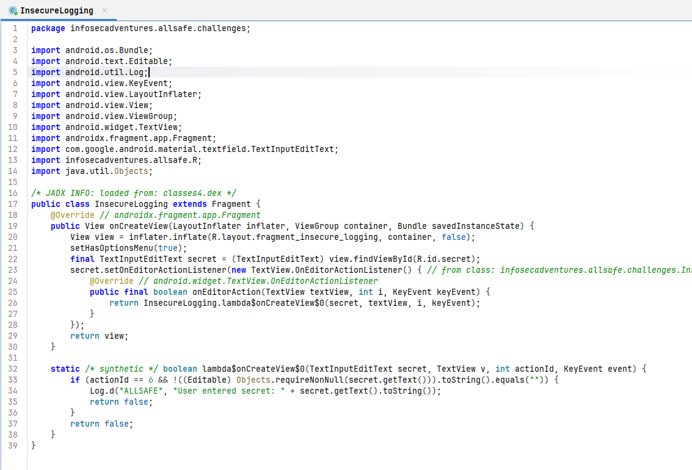
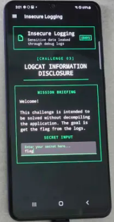
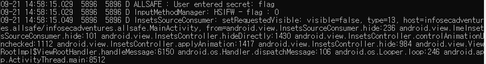

# [Allsafe] Insecure Logging - Reversing

## 1. 문제 개요

* **문제 링크:** [Allsafe - Insecure Logging (v.1.6 Release)](https://github.com/t0thkr1s/allsafe-android/releases/tag/v.1.6)

* **분야:** Reversing, Mobile

* **목표:** 안드로이드 애플리케이션의 로그(Logcat) 출력 로직을 정적/동적 분석하여, 사용자 입력값이 검증 없이 평문으로 기록되는지 확인.

## 2. 취약점 분석
제공된 APK(`allsafe.apk`)를 JADX로 분석한 결과, 시크릿 입력 처리 로직에서 사용자 입력값을 검증 없이 로그로 기록하는 취약점 확인.

```java
// [InsecureLogging.java] 시크릿 입력 처리 로직
static /* synthetic */ boolean lambda$onCreateView$0(TextInputEditText secret, TextView v, int actionId, KeyEvent event) {
    if (actionId == 6 && !((Editable) Objects.requireNonNull(secret.getText())).toString().equals("")) {
        Log.d("ALLSAFE", "User entered secret: " + secret.getText().toString());
        return false;
    }
    return false;
}
```

* **분석 결론:** 키보드 Done(`actionId == 6`) 입력 시 별도의 정답 비교나 검증 로직 없이, 입력값이 빈 문자열이 아니라는 조건만 통과하면 `secret.getText()`를 그대로 `Log.d` 문자열에 concat하여 기록하는 구조. 서버 사이드 검증이나 마스킹 처리 없이 사용자 입력 원문이 logcat에 평문으로 남는 취약점.

## 3. 공격 수행

1. JADX-GUI로 APK를 디컴파일하여 `InsecureLogging` 클래스 확인. 시크릿 입력 필드의 `onEditorAction` 리스너가 `Log.d`로 입력값을 그대로 기록하는 지점 식별.



2. `adb shell pidof infosecadventures.allsafe`로 프로세스 PID 확인 후, 해당 PID를 대상으로 `adb logcat --pid` 명령어 실행 대기.


3. 단말기에서 Insecure Logging 챌린지(`LOGCAT INFORMATION DISCLOSURE`) 화면 진입. Secret Input 필드에 임의 값(`flag`) 입력 후 키보드 Done 트리거.



4. logcat 출력 확인. 입력한 값(`flag`)이 별도 가공 없이 `User entered secret: flag` 형태로 그대로 노출.



## 4. 획득 결과
로그캣 모니터링을 통해 시크릿 입력 필드에 입력한 값이 검증이나 마스킹 없이 평문으로 노출되는 것 확인.

* **노출 값:** `flag` (임의 입력값, 실제 정답 비교 로직 없음)

## 5. 대응 방안
민감 정보가 로그로 노출되지 않도록 로깅 로직 및 빌드 설정 개선 필요.

* **디버그 빌드에서만 로깅 수행:** `BuildConfig.DEBUG` 조건을 추가하여 릴리즈 빌드에서는 해당 로그 자체가 출력되지 않도록 처리.

* **로그 메시지에서 민감 데이터 제거:** `secret.getText()` 값을 로그에 직접 concat하지 않고, "입력 이벤트 발생" 여부와 같은 비민감 정보만 기록.

* **로깅 정책 수립:** 비밀번호, 토큰, 개인정보 등 민감 데이터는 어떤 로그 레벨에서도 원문 그대로 출력되지 않도록 코드 리뷰 및 정적 분석 도구(Lint, Detekt 등)로 사전 차단.

## 6. 블루팀 관점 요약
본 취약점은 네트워크 통신 없이 단말 내부에서 발생하는 로컬 이슈이므로, WAF나 IPS 등 네트워크 기반 보안 장비로는 탐지 불가. 모바일 EDR이나 MDM 솔루션을 통해 비정상적인 `adb logcat` 접근 시도나 `READ_LOGS` 권한을 요구하는 서드파티 앱 설치 행위를 모니터링해야 함. 정적 분석 관점에서는 디컴파일을 통해 확인된 로그 태그, 클래스명, 로그 메시지 포맷을 IoC로 추출하여 YARA 탐지 룰 구성 가능.

### 6.1. YARA 탐지 룰 (IoC)

```yara
rule Detect_Allsafe_InsecureLogging_Vulnerability {
    strings:
        $pkg_name = "infosecadventures.allsafe" ascii
        $class_name = "InsecureLogging" ascii
        $log_tag = "ALLSAFE" ascii
        $log_msg = "User entered secret: " ascii

    condition:
        $pkg_name and $class_name and ($log_tag or $log_msg)
}
```