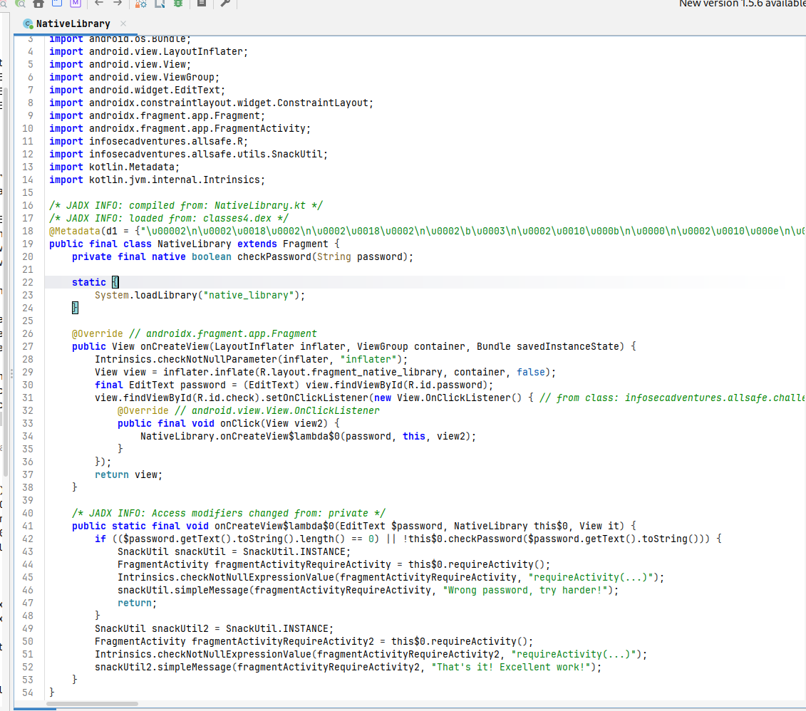
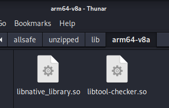
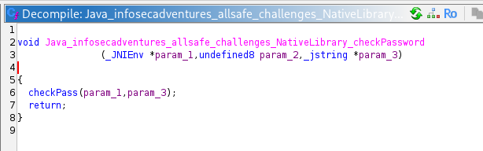
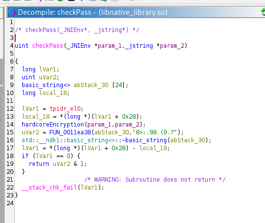
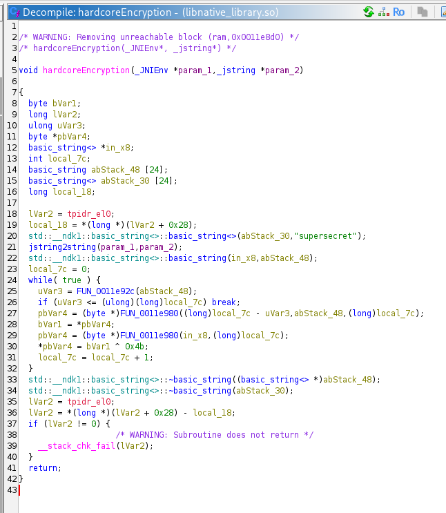
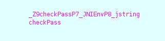
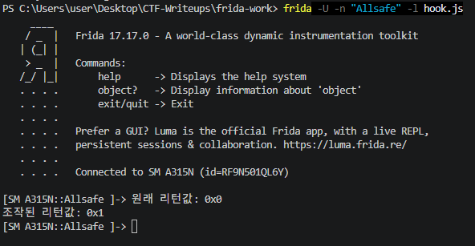
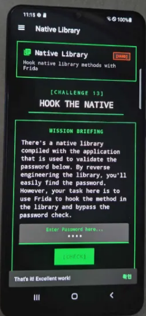

# [Allsafe] Native Library - Reversing

## 1. 문제 개요

* **문제 링크:** [Allsafe - Native Library (v.1.6 Release)](https://github.com/t0thkr1s/allsafe-android/releases/tag/v.1.6)

* **분야:** Reversing, Mobile

* **목표:** 안드로이드 애플리케이션의 JNI(Java Native Interface)를 통해 호출되는 네이티브 라이브러리(`.so`) 내부의 패스워드 검증 로직 정적 분석. 이후 Frida를 활용해 검증 함수의 리턴값을 런타임에 직접 조작하여, 실제 패스워드 없이 인증 로직 자체를 우회.

## 2. 취약점 분석
제공된 APK(`allsafe.apk`)를 JADX로 디컴파일하여 분석한 결과, `NativeLibrary` 클래스에서 `checkPassword`라는 네이티브 메서드를 호출하여 패스워드를 검증하는 구조 파악. 앱 내부에 포함된 `libnative_library.so` 파일을 Ghidra로 분석 시, 사용자의 입력값을 특정 상수(`0x4b`)와 XOR 연산한 후 하드코딩된 암호문(`"8>;.98.(9.?"`)과 비교하는 로직 확인. 최종 검증 결과가 네이티브 함수의 boolean 리턴값 하나에 의존하는 구조로, 해당 값을 런타임에 조작할 경우 실제 패스워드 없이도 인증 우회가 가능한 취약한 구조.

```java
// [NativeLibrary.kt] 네이티브 라이브러리 로드 및 검증 메서드 선언
// ... (중략) ...
public final class NativeLibrary extends Fragment {
    private final native boolean checkPassword(String password);

    static {
        System.loadLibrary("native_library");
    }
// ... (중략) ...
    public static final void onCreateView$lambda$0(EditText $password, NativeLibrary this$0, View it) {
        if (($password.getText().toString().length() == 0) || !this$0.checkPassword($password.getText().toString())) {
            // ... (중략) ...
            snackUtil.simpleMessage(fragmentActivityRequireActivity, "Wrong password, try harder!");
            return;
        }
// ... (중략) ...
```

```c
// [libnative_library.so] checkPass 함수 내부 비교 로직
// ... (중략) ...
uint checkPass(_JNIEnv *param_1,_jstring *param_2)
{
// ... (중략) ...
  // 하드코딩된 타겟 암호문 문자열 확인
  uVar2 = FUN_0011ea38(abStack_30,"8>;.98.(9.?");
  std::__ndk1::basic_string<>::~basic_string(abStack_30);
  lVar1 = *(long *)(lVar1 + 0x28) - local_18;
  if (lVar1 == 0) {
    return uVar2 & 1;
  }
// ... (중략) ...
```

```c
// [libnative_library.so] hardcoreEncryption 함수 XOR 연산 로직
// ... (중략) ...
void hardcoreEncryption(_JNIEnv *param_1,_jstring *param_2)
{
// ... (중략) ...
  local_7c = 0;
  while( true ) {
    uVar3 = FUN_0011e92c(abStack_48);
    if (uVar3 <= (ulong)(long)local_7c) break;
    pbVar4 = (byte *)FUN_0011e980((long)local_7c - uVar3,abStack_48,(long)local_7c);
    bVar1 = *pbVar4;
    pbVar4 = (byte *)FUN_0011e980(in_x8,(long)local_7c);
    
    // 입력값 문자에 대한 0x4b XOR 연산 수행
    *pbVar4 = bVar1 ^ 0x4b;
    local_7c = local_7c + 1;
  }
// ... (중략) ...
```

* **분석 결론:** 패스워드 검증 로직이 네이티브 라이브러리로 분리되어 있으나, 최종 검증 결과가 `checkPass` 함수의 단순 boolean 리턴값(`uVar2 & 1`)에 전적으로 의존하는 구조. 클라이언트 사이드에서 반환되는 이 값 자체를 신뢰하는 구조이기 때문에, 실제 암호화 로직을 분석하지 않고도 리턴값을 런타임에 조작하는 것만으로 검증 우회가 가능한 취약한 구조.

## 3. 공격 수행

1. JADX-GUI를 사용하여 타겟 앱을 디컴파일한 후, 사용자의 패스워드 입력을 검증하는 `NativeLibrary` 클래스 내 `checkPassword` 네이티브 메서드 식별.



2. APK 파일을 `unzip -d`로 압축 해제한 후, `lib/arm64-v8a/` 디렉터리에 위치한 `libnative_library.so` 파일을 직접 확인 및 추출.



3. 추출한 `.so` 파일을 Ghidra로 로드하여 정적 분석 진행. JNI 네이밍 규칙에 따라 생성된 `Java_infosecadventures_allsafe_challenges_NativeLibrary_checkPassword` 함수를 찾아 내부의 `checkPass` 함수 호출 구조 파악.



4. `checkPass` 함수 내부에서 최종 비교에 사용되는 하드코딩된 문자열 `"8>;.98.(9.?"` 식별. 연산 과정을 추적하기 위해 `hardcoreEncryption` 함수 확인.



5. `hardcoreEncryption` 함수의 디컴파일 로직에서 단일 바이트 XOR(`^ 0x4b`) 연산 확인. 다만 이후에도 심볼 없는 하위 함수들이 다수 존재하여, 이를 일일이 정적으로 추적하는 대신 동적 분석(Frida 후킹)으로 전환하기로 결정.




6. `checkPass` 함수가 `hardcoreEncryption`의 XOR 연산 결과와 하드코딩된 문자열을 비교한 뒤, 그 결과를 `uVar2 & 1` 형태로 리턴하는 구조 확인. 문제 설명(Mission Briefing)에서도 "Frida를 이용해 메서드를 후킹하고 패스워드 체크를 우회하라"고 명시하고 있어, 패스워드를 역산하는 대신 이 리턴값 자체를 조작하는 방향으로 공격 결정. 어셈블리 뷰를 통해 후킹 대상 맹글링(Mangling) 심볼명 `_Z9checkPassP7_JNIEnvP8_jstring` 추출.



7. 추출한 심볼명을 바탕으로 `checkPass` 함수 종료 시점(onLeave)에 원본 리턴값을 로그로 출력한 뒤, `retval.replace(1)`을 통해 리턴값을 무조건 참(1)으로 강제 조작하는 Frida 후킹 스크립트(`hook.js`) 작성.

```js
var checkPassAddr = DebugSymbol.fromName("_Z9checkPassP7_JNIEnvP8_jstring").address;

Interceptor.attach(checkPassAddr, {
    onLeave: function (retval) {
        console.log("원래 리턴값: " + retval);
        retval.replace(1);
        console.log("조작된 리턴값: " + retval);
    }
});
```

8. 안드로이드 단말기에 앱을 실행한 상태에서 Frida 연결 및 스크립트 인젝션(`frida -U -n "Allsafe" -l hook.js`). 앱 내에서 실제와 무관한 임의의 패스워드(`1234`) 입력 후 검증 버튼 클릭. 원본 리턴값이 0(거짓)임에도 후킹을 통해 1(참)로 조작되어 반환됨을 콘솔에서 확인.



9. 임의의 패스워드 입력 상태에서 [CHECK] 버튼 클릭 시, 실제 패스워드를 전혀 알지 못한 채로 "That's it! Excellent work!" 메시지와 함께 인증 우회 성공.



## 4. 획득 결과
본 챌린지는 별도의 flag{} 형식 문자열을 제공하지 않으며, Frida를 통한 검증 로직 우회 성공 시 출력되는 아래 성공 메시지로 완료 여부 판정. 실제 패스워드(`supersecret`)는 알아내지 않고도 우회 가능함을 확인.

* **성공 메시지:** `That's it! Excellent work!`

## 5. 대응 방안
본 문제는 패스워드 검증 결과를 클라이언트 내부 네이티브 함수의 단순 boolean 리턴값에 의존하고 있어, 런타임 메모리 후킹만으로 검증 로직 전체를 무력화할 수 있는 구조적 취약점을 가짐. 또한 검증에 사용되는 비교 문자열과 암호화 상수(XOR Key)가 평문 형태로 노출되어 있어 정적 분석에도 취약함. 개발자 관점에서의 안전한 시큐어 코딩 및 보호 기법 적용이 필요.

* **네이티브 라이브러리 난독화 및 안티 디버깅 적용:** O-LLVM(Obfuscator-LLVM) 등을 사용하여 C/C++ 소스 코드 컴파일 단계에서 제어 흐름 평탄화(Control Flow Flattening), 명령어 치환 등을 통해 정적 분석 난이도 상향. 추가적으로 `ptrace` 안티 디버깅이나 Frida 서버 프로세스 탐지 로직을 구현하여 동적 메모리 후킹 차단.

* **하드코딩된 중요 정보 제거 및 복합 암호화 적용:** 소스 코드 내부에 검증을 위한 원본 데이터나 단순한 단일 바이트 XOR 상수를 평문으로 남기지 않아야 함. AES, RSA 등 검증된 표준 암호화 알고리즘을 사용하고, 키 분배 및 보관은 안드로이드 Keystore 시스템 등 안전한 저장소를 활용할 것.

* **중요 로직의 서버 사이드 이전:** 클라이언트 내부(Java 또는 Native 영역)에서 패스워드나 인증 상태를 직접 검증하는 구조는 지양해야 함. 사용자 입력값 자체를 안전하게 해싱하여 백엔드 서버로 전송하고, 실제 비교 검증 로직은 서버 API 단에서 처리하도록 아키텍처 재설계.

## 6. 블루팀 관점 요약
해당 문제는 로컬 단말기에 설치된 네이티브 라이브러리 내에서 독립적으로 문자열 검증 및 연산이 이루어지므로, 네트워크 트래픽 관제(WAF, IDS/IPS) 장비를 통한 위협 탐지가 불가능함. 따라서 엔드포인트 환경(EDR/MDM)에서 추출된 바이너리 파일을 정적으로 분석하여 특정 시그니처를 식별하는 위협 헌팅(Threat Hunting) 시나리오가 요구됨. 분석 과정에서 도출된 앱 고유의 JNI 네이밍 규칙, 특정 상수 및 암호문, 노출된 평문 메시지 등을 조합하여 유사한 취약 라이브러리를 탐지할 수 있음.

### 6.1. YARA 탐지 룰 (IoC)
단말에서 수집된 `.so` 바이너리 및 의심되는 APK 파일 내부에서, 문제에 사용된 고유한 함수 명명 규칙, 하드코딩된 암호문 패턴, 성공/실패 시 노출되는 문자열을 기반으로 탐지하는 YARA 룰 제안.

```yara
rule Detect_Allsafe_Native_Library {
    strings:
        // 타겟 라이브러리 명칭
        $lib_name = "native_library" ascii
        
        // JNI를 통해 연결되는 고유 네이티브 함수명
        $jni_func = "Java_infosecadventures_allsafe_challenges_NativeLibrary_checkPassword" ascii
        
        // 정적 분석 과정에서 식별된 맹글링(Mangling)된 내부 함수명
        $mangled_check = "_Z9checkPassP7_JNIEnvP8_jstring" ascii
        $mangled_enc = "_Z18hardcoreEncryptionP7_JNIEnvP8_jstring" ascii
        
        // 라이브러리 내부에 하드코딩된 최종 검증 타겟 암호문
        $target_enc = "8>;.98.(9.?" ascii
        
        // 앱 상에서 출력되는 성공/실패 평문 메시지
        $msg_fail = "Wrong password, try harder!" ascii wide
        $msg_success = "That's it! Excellent work!" ascii wide

    condition:
        4 of them
}
```