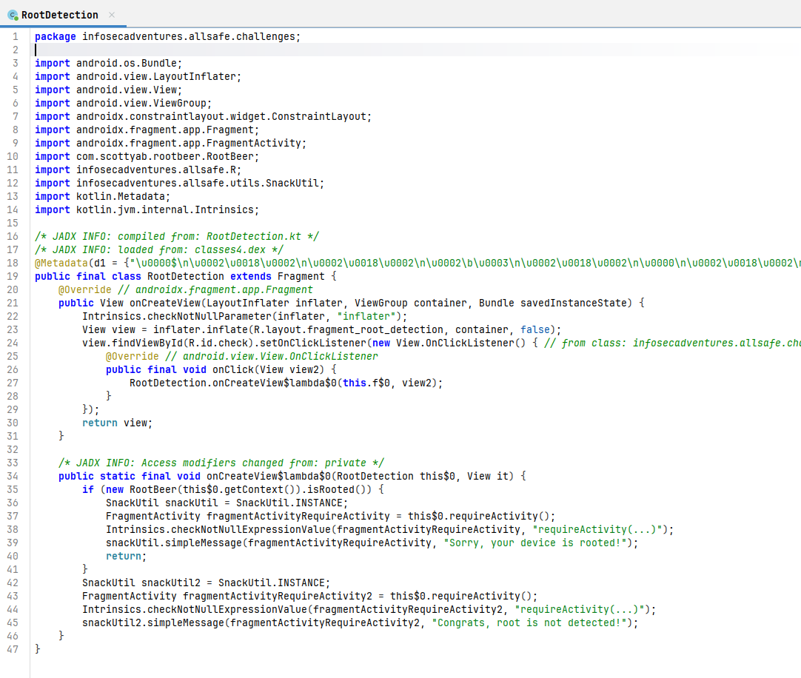
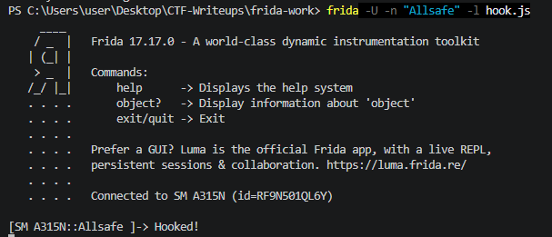
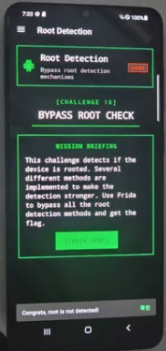

# [Allsafe] Root Detection - Reversing

## 1. 문제 개요

* **문제 링크:** [Allsafe - Root Detection (v.1.6 Release)](https://github.com/t0thkr1s/allsafe-android/releases/tag/v.1.6)

* **분야:** Reversing, Mobile

* **목표:** 안드로이드 애플리케이션의 루팅 탐지(Root Detection) 로직을 정적 분석으로 파악하고, Frida를 활용한 런타임 메모리 후킹을 통해 검증 로직 우회.

## 2. 취약점 분석

제공된 APK(`allsafe.apk`)를 JADX로 디컴파일하여 분석한 결과, `RootDetection` 클래스 내부에서 `com.scottyab.rootbeer.RootBeer` 오픈소스 라이브러리를 임포트하여 루팅 여부를 검사하는 구조 파악. `RootBeer(this$0.getContext()).isRooted()` 메서드의 반환값(Boolean)에 따라 단순 분기 처리되며, 앱 자체적인 교차 검증 로직이 부재하여 런타임에 리턴값을 조작하는 것만으로 손쉬운 탐지 우회가 가능한 취약점 존재.

```java
// ... (중략) ...
public static final void onCreateView$lambda$0(RootDetection this$0, View it) {
    if (new RootBeer(this$0.getContext()).isRooted()) {
        SnackUtil snackUtil = SnackUtil.INSTANCE;
        // ... (중략) ...
        snackUtil.simpleMessage(fragmentActivityRequireActivity, "Sorry, your device is rooted!");
        return;
    }
    SnackUtil snackUtil2 = SnackUtil.INSTANCE;
    // ... (중략) ...
    snackUtil2.simpleMessage(fragmentActivityRequireActivity2, "Congrats, root is not detected!");
}
// ... (중략) ...
```

* **분석 결론:** 루팅 검증이 클라이언트 내부에 포함된 특정 외부 라이브러리(`RootBeer`)의 단일 메서드 리턴값에 전적으로 의존하는 구조. 난독화나 안티 후킹 기법이 적용되어 있지 않아, 해당 `isRooted()` 메서드 실행 시 무조건 `false`를 반환하도록 Frida로 후킹하여 인증 로직 무력화 가능.

## 3. 공격 수행

1. JADX-GUI를 사용하여 앱을 디컴파일한 후, 버튼 클릭 이벤트(`onClick`) 시 호출되는 루팅 검증 클래스(`RootDetection`) 및 주요 메서드(`RootBeer.isRooted()`) 식별.



2. 식별된 `RootBeer` 클래스와 `isRooted` 메서드를 타겟으로, 반환값을 강제로 `false`로 조작하는 Frida 후킹 스크립트(`hook.js`) 작성.

```javascript
Java.perform(function () {
    var RootBeer = Java.use("com.scottyab.rootbeer.RootBeer");
    RootBeer.isRooted.overload().implementation = function () {
        console.log("Hooked!");
        return false;
    };
});
```

3. PC와 루팅된 안드로이드 단말기를 연결하고, 터미널에서 Frida 명령어(`frida -U -n "Allsafe" -l hook.js`)를 통해 대상 앱에 스크립트 인젝션 진행.



4. 앱 내부에서 루팅 검사 버튼을 클릭. 원본 리턴값인 `true`(루팅됨) 대신, 후킹 스크립트에 의해 강제로 `false`가 반환되어 검증 우회 성공. 터미널에 "Hooked!" 로그 출력 확인.



## 4. 획득 결과
본 챌린지는 별도의 flag{} 형식 문자열을 제공하지 않으며, 탐지 로직 우회 시 출력되는 아래 성공 메시지로 완료 여부 판정.

루팅된 기기임에도 불구하고 탐지 로직이 무력화되어 성공 메시지 출력.

* **성공 메시지:** `Congrats, root is not detected!`

## 5. 대응 방안

* **서버 사이드 검증 도입:** 클라이언트 내부의 단순 Boolean 리턴값에 의존하는 로직은 메모리 변조에 취약. 주요 서비스 호출 시 기기 무결성(Attestation) 정보를 서버로 전송하여 서버 API 단에서 안전하게 검증 수행 필요.

* **루팅 탐지 로직 다중화 구현:** 오픈소스 라이브러리(`RootBeer`) 단일 사용을 지양. JNI/NDK 기반의 네이티브 환경(C/C++)에서 파일 시스템 검사(`su` 바이너리), 특정 디렉토리 권한 검사 등 자체적인 다중 교차 검증 로직 구현.

* **코드 난독화 및 안티 후킹 적용:** ProGuard, R8 등을 통한 주요 클래스명 및 메서드명 난독화. Frida와 같은 동적 분석 툴이 주로 사용하는 특정 포트 검사, ptrace 안티 디버깅, 프로세스 maps 메모리 내 후킹 모듈 탐지 로직 추가.

## 6. 블루팀 관점 요약

네트워크 통신이 발생하지 않는 클라이언트 내부 단일 검증 로직이므로 기존 WAF/IDS 등 네트워크 기반 보안 장비로는 위협 탐지 불가.
모바일 엔드포인트(MDM)나 EDR 솔루션을 통해 앱 프로세스 메모리 영역의 비정상적 라이브러리 로드(Frida agent 등) 및 후킹 행위 모니터링 필요.
정적 분석 관점에서는 해당 앱에 하드코딩된 패키지 경로 문자열 및 에러/성공 메시지 패턴을 추출하여 유사 우회 앱 또는 분석 대상 파일을 식별하기 위한 YARA 룰 구성 가능.

### 6.1. YARA 탐지 룰 (IoC)
분석 과정에서 도출된 고유 클래스 경로 및 하드코딩된 노출 메시지를 기반으로 탐지하는 YARA 룰 제안.

```yara
rule Detect_Allsafe_Root_Detection {
    strings:
        // 타겟 오픈소스 라이브러리 클래스 경로
        $lib_rootbeer = "com.scottyab.rootbeer.RootBeer" ascii
        
        // 앱 내 하드코딩된 탐지 결과 문자열
        $msg_fail = "Sorry, your device is rooted!" ascii wide
        $msg_success = "Congrats, root is not detected!" ascii wide

    condition:
        all of them
}
```