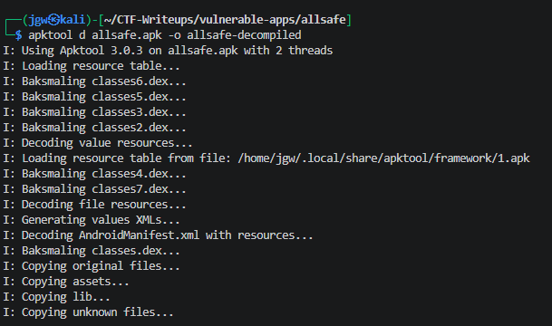
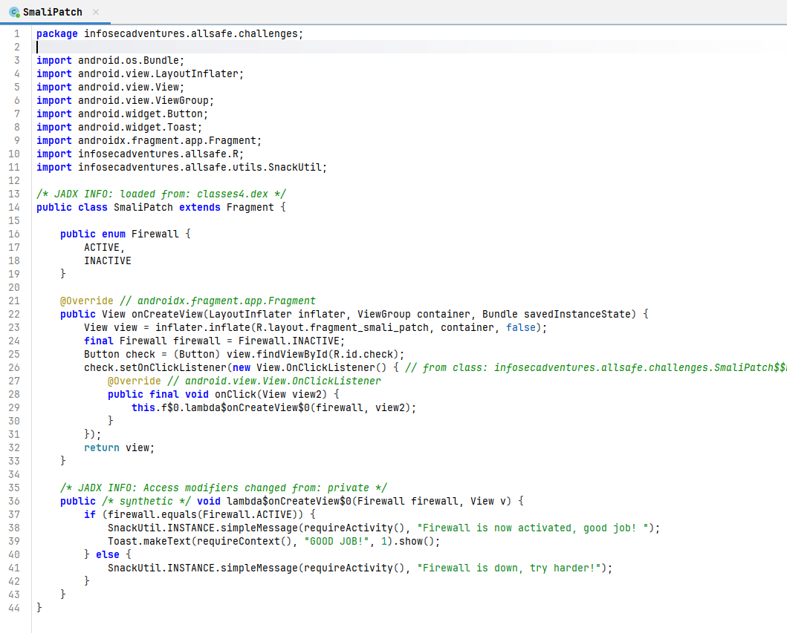
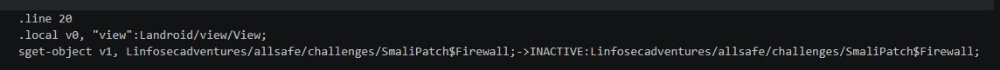
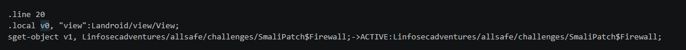
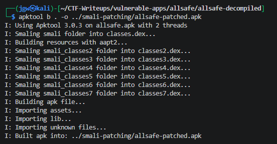
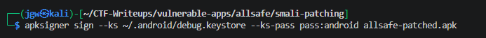
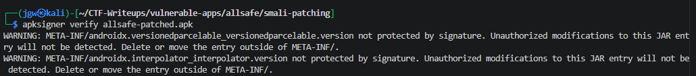
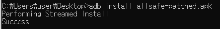
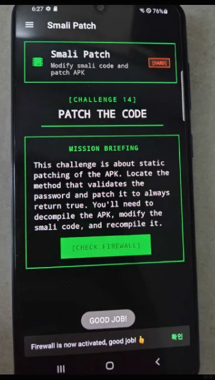

# [Allsafe] Smali Patching - Reversing

## 1. 문제 개요

* **문제 링크:** [Allsafe - Smali Patching (v.1.6 Release)](https://github.com/t0thkr1s/allsafe-android/releases/tag/v.1.6)

* **분야:** Reversing, Mobile

* **목표:** 안드로이드 앱 파일(APK)을 디컴파일하여 자바 소스 코드 및 Smali 코드를 정적 분석. 클라이언트 내부에 하드코딩된 방화벽(Firewall) 상태 검증 객체를 조작(`INACTIVE` -> `ACTIVE`)한 뒤 리패키징(재빌드 및 서명)하여 로컬 인증 로직 우회.

## 2. 취약점 분석
제공된 APK(`allsafe.apk`)를 디컴파일하여 JADX로 분석한 결과, `SmaliPatch` 클래스 내부에서 `Firewall`이라는 열거형(Enum) 상태를 기반으로 인증 성공 여부를 결정하는 로직 확인. 검증에 사용되는 상태 값이 서버 연동 없이 클라이언트 내부 소스 코드에 `INACTIVE`로 초기화 및 하드코딩되어 있어, Smali 패치를 통한 정적 변조에 취약한 구조 파악.

```java
// [SmaliPatch$Firewall] 방화벽 상태 Enum 선언
// ... (중략) ...
public enum Firewall {
    ACTIVE,
    INACTIVE
}
// ... (중략) ...
```

```java
// [SmaliPatch] onCreateView 내 하드코딩된 방화벽 초기 상태
// ... (중략) ...
public View onCreateView(LayoutInflater inflater, ViewGroup container, Bundle savedInstanceState) {
    View view = inflater.inflate(R.layout.fragment_smali_patch, container, false);
    final Firewall firewall = Firewall.INACTIVE;
    Button check = (Button) view.findViewById(R.id.check);
// ... (중략) ...
```

```java
// [SmaliPatch] 버튼 클릭 시 상태 검증 로직
// ... (중략) ...
public /* synthetic */ void lambda$onCreateView$0(Firewall firewall, View v) {
    if (firewall.equals(Firewall.ACTIVE)) {
        SnackUtil.INSTANCE.simpleMessage(requireActivity(), "Firewall is now activated, good job!");
        Toast.makeText(requireContext(), "GOOD JOB!", 1).show();
    } else {
        SnackUtil.INSTANCE.simpleMessage(requireActivity(), "Firewall is down, try harder!");
    }
}
// ... (중략) ...
```

* **분석 결론:** 방화벽 활성화 여부를 결정하는 `firewall` 변수가 코드 내부에 `INACTIVE`로 명시되어 있음. 사용자 입력 검증이나 백엔드 서버와의 세션 통신 없이 클라이언트 로컬 메모리의 변수에 전적으로 의존함. 따라서 디컴파일 후 해당 객체를 할당하는 Smali 코드 명령어 라인을 `ACTIVE`로 수정하고 재빌드하는 오프라인 리패키징 공격만으로 쉽게 검증 로직 우회 가능.

## 3. 공격 수행

1. `apktool`을 사용하여 타겟 안드로이드 앱(`allsafe.apk`) 리버스 엔지니어링 및 디컴파일 진행.



2. JADX-GUI 디컴파일러를 통해 Java 소스 코드를 분석하여 타겟 클래스(`SmaliPatch`) 내부의 검증 로직 식별.



3. 디컴파일된 파일 중 해당 로직이 위치한 Smali 파일(`SmaliPatch.smali`) 탐색. 코드 내에서 `Firewall.INACTIVE` 객체를 레지스터에 불러오는 원본 라인 확인.



4. Smali 코드 상에서 객체 참조 상태를 `INACTIVE`에서 `ACTIVE`로 변경하여 정적 패치 적용.



5. 코드 변조가 완료된 디렉터리를 `apktool`을 이용하여 다시 APK 파일(`allsafe-patched.apk`)로 재빌드. 초기 재빌드 시도에서는 apktool 2.7.0 버전의 리소스 재조립 과정 중 발생하는 알려진 버그(`$avd_...` 형식의 벡터 드로어블 리소스명 처리 오류)로 인해 빌드가 반복 실패함. apktool 3.0.3으로 업그레이드하여 해당 문제 해결 후 재빌드 정상 진행.



6. `apksigner`를 사용하여 리패키징된 APK 파일에 안드로이드 디버그 키스토어(`debug.keystore`)로 서명 작업 수행.



7. 서명된 변조 APK의 무결성 검증 명령어(`verify`)를 실행하여 정상적으로 재서명이 적용되었는지 확인. 서드파티 라이브러리의 버전 메타데이터 파일(`META-INF/*.version`)이 서명 보호 범위 밖이라는 경고가 다수 출력되나, 이는 앱 실행 로직과 무관한 정상적인 경고이며 검증 자체는 오류 없이 완료됨.



8. `adb` 도구를 이용하여 서명 완료된 패치 앱을 안드로이드 단말기에 설치.



9. 기기에서 앱을 실행하고 체크 버튼을 클릭하여, 변조된 `ACTIVE` 상태가 올바르게 인식되며 우회 성공 메시지가 출력되는 것 최종 확인. 해당 액티비티는 `FLAG_SECURE` 플래그가 적용되어 있어 `adb screencap`(0바이트 반환) 및 `screenrecord`(UI 영역 전체 미노출, 단 시스템 레이어에서 렌더링되는 Toast만 노출) 모두 캡처 차단됨을 확인. 소프트웨어 캡처가 불가능함에 따라 물리 카메라 촬영으로 최종 성공 화면 증빙.



## 4. 획득 결과
본 챌린지는 별도의 flag{} 형식 문자열을 제공하지 않으며, 방화벽 상태 검증 우회에 성공할 경우 출력되는 아래 성공 메시지로 완료 여부 판정.

* **성공 메시지:** `Firewall is now activated, good job!`

## 5. 대응 방안
본 문제는 안드로이드 클라이언트 앱 내부에 중요 상태 변수와 인가 검증 로직이 평문으로 하드코딩되어 있어 디컴파일을 통한 코드 변조(Smali Patching)에 매우 취약함. 무단 리패키징 방지 및 비즈니스 로직 보호를 위한 보안 설계가 필요.

* **중요 상태 및 로직 검증의 서버 사이드 이전:** 클라이언트 소스 코드 내부에 하드코딩된 변수(`INACTIVE`, `ACTIVE`)만으로 중요 접근 제어 분기를 결정하지 않아야 함. 보안상 민감한 상태 인가 및 검증 로직은 안전한 백엔드(Backend) 서버 API와의 통신을 통해 처리하고, 클라이언트는 반환된 결과에 따른 UI 렌더링 역할만 수행하도록 구조 설계.

* **앱 무결성 검증 및 서명 해시 체크 적용:** 앱 실행 초기 단계에서 자체적인 패키지 서명(Signature Hash) 검증 로직을 구현하여 원본 릴리스 키가 아닌 임의의 디버그 키스토어로 리패키징된 변조 APK의 실행을 차단.

* **핵심 로직 난독화 및 안티 템퍼링(Anti-Tampering):** ProGuard, R8 등을 적용하여 핵심 보안 분기에 관여하는 클래스명(`SmaliPatch`, `Firewall`)과 메서드명을 난독화하여 정적 리버싱 분석 난이도 상향. 추가적으로 상용 앱 보호 솔루션이나 안티 템퍼링 모듈을 도입하여 실행 중 메모리 변조 행위 탐지.

* **화면 캡처 방지 정책 유지:** 해당 액티비티에 적용된 `FLAG_SECURE`는 분석 과정에서 스크린샷/화면 녹화를 통한 정보 유출을 효과적으로 차단하는 것으로 확인됨. 다만 시스템 레벨 Toast는 이 제한을 우회하므로, 민감 정보 노출 시에는 Toast 대신 앱 내부 UI 컴포넌트(Dialog, Snackbar 등)로 대체하는 것이 보다 안전.

## 6. 블루팀 관점 요약
해당 안드로이드 앱은 통신 기반의 페이로드 교환 없이 로컬 단말기 내부에서 독립적으로 상태 검증을 수행함. 따라서 웹 방화벽(WAF)이나 IDS/IPS 등의 네트워크 인프라 관제 장비로는 비정상 패치 행위 식별이 불가능함. EDR/MDM 기반의 모바일 엔드포인트 보안 솔루션에서 설치된 앱의 인증서 무결성 오류를 모니터링하고, 특정 패키지 내 주요 하드코딩 텍스트 시그니처를 식별하는 정적 기반 위협 헌팅(Threat Hunting) 수행.

### 6.1. YARA 탐지 룰 (IoC)
단말에 설치된 바이너리 내부의 고유 패키지 경로, 검증에 사용되는 중요 클래스명 및 공격 성공/실패 시 노출되는 특징적인 평문 문자열 패턴을 조합하여, 유사한 취약점 로직을 가진 리패키징/변조 의심 앱을 분류하기 위한 YARA 룰 제안.

```yara
rule Detect_Smali_Patching {
    strings:
        // 앱 고유 패키지 경로 및 중요 클래스명
        $pkg = "infosecadventures.allsafe.challenges" ascii
        $cls1 = "SmaliPatch" ascii
        $cls2 = "Firewall" ascii

        // 코드 내부에 노출된 검증 성공/실패 평문 메시지
        $msg_success = "Firewall is now activated" ascii wide
        $msg_fail = "Firewall is down, try harder!" ascii wide

        // 주요 인가 상태 변수 문자열
        $state1 = "INACTIVE" ascii
        $state2 = "ACTIVE" ascii

    condition:
        all of ($pkg, $cls1, $cls2)
        and any of ($msg_success, $msg_fail)
        and any of ($state*)
}
```