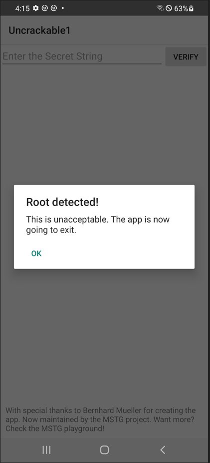
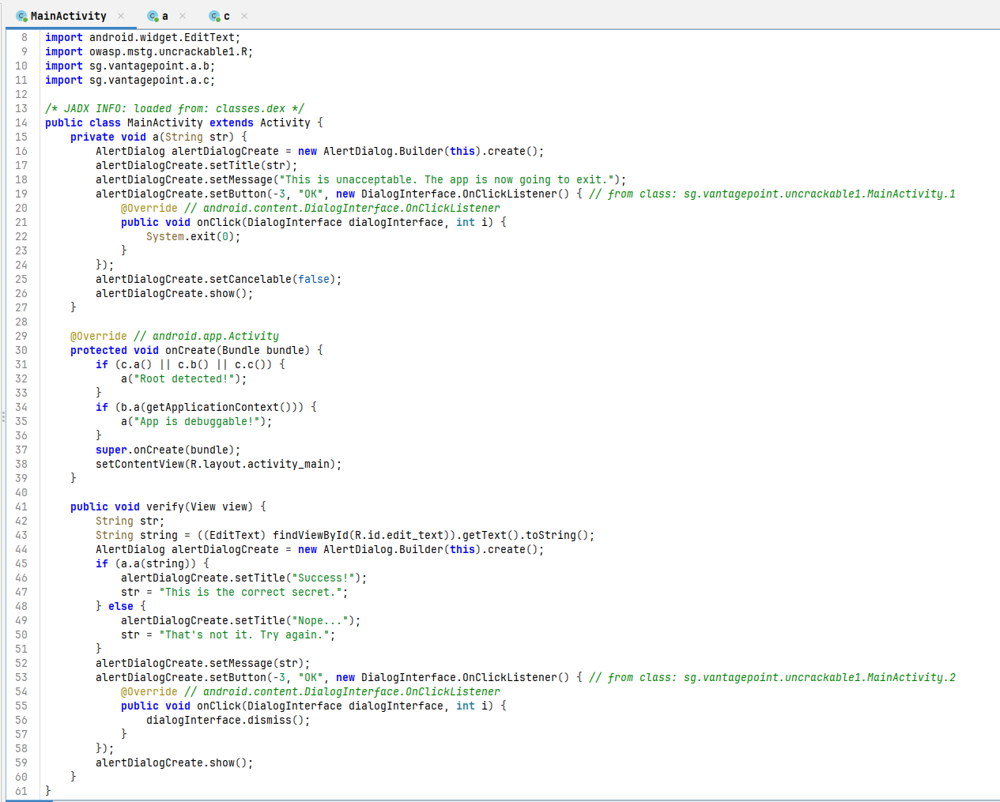
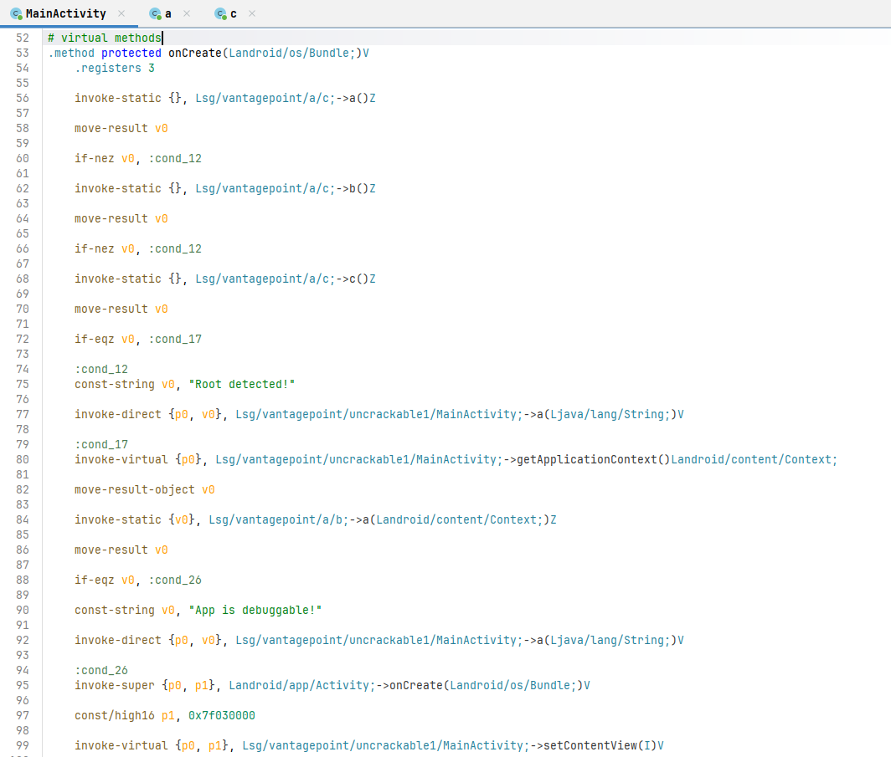
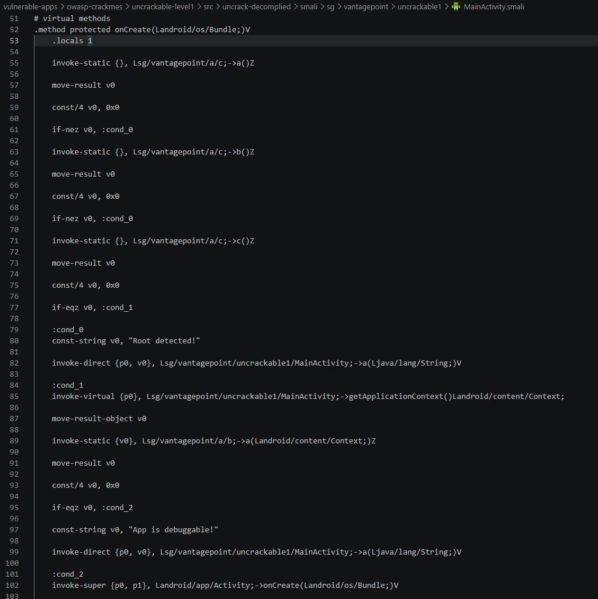
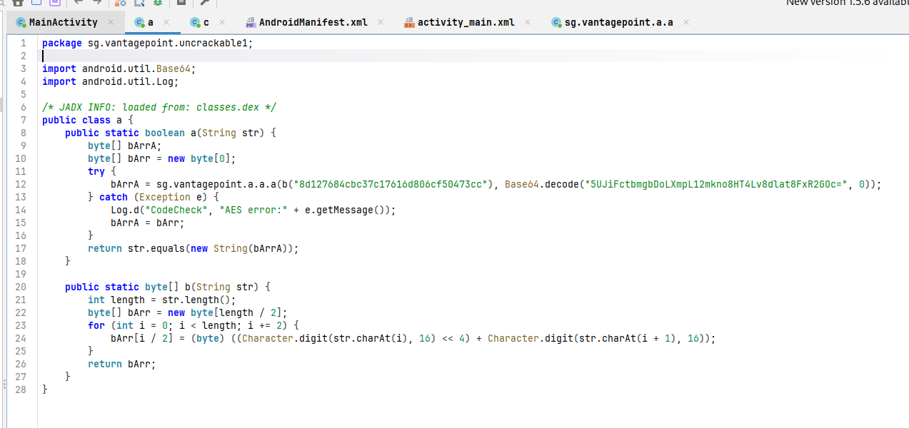
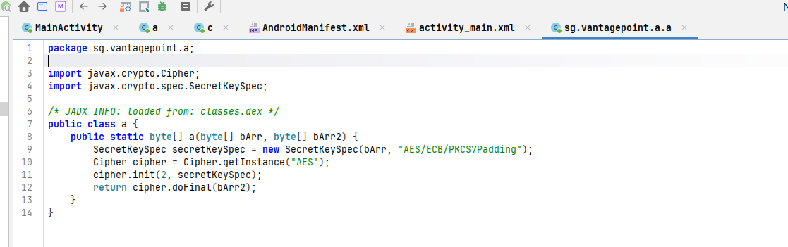
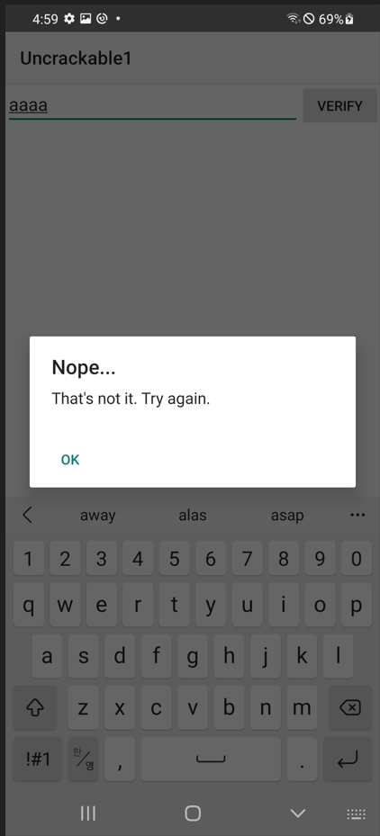
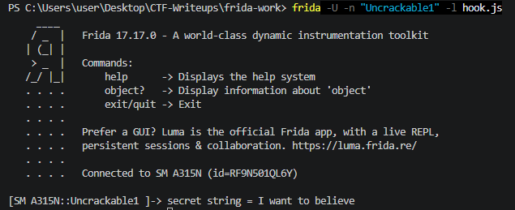
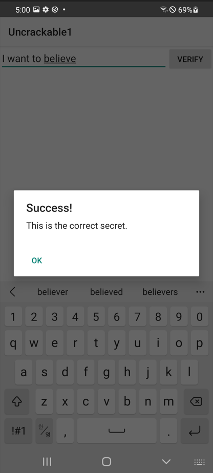

# [OWASP MASTG Crackmes] UnCrackable Level 1 - Reversing

## 1. 문제 개요

* **문제 링크:** [OWASP MASTG Crackmes - UnCrackable Level 1](https://github.com/OWASP/mastg/tree/master/Crackmes/Android/Level_01)

* **분야:** Reversing, Mobile

* **목표:** Root/Debug 탐지 로직을 smali 정적 패칭으로 무력화하여 앱 강제 종료를 우회, AES로 암호화되어 하드코딩된 정답 문자열을 Frida 동적 후킹으로 도출하여 최종 검증 성공

## 2. 취약점 분석
제공된 APK(`UnCrackable-Level1`)를 JADX로 디컴파일한 결과, 앱 진입 자체를 막는 방어선(root/debug 탐지)과 정답 비교 로직(AES 복호화)이 서로 다른 계층에 분리되어 존재하는 이중 구조로 확인. `MainActivity.onCreate()`는 앱 실행 즉시 root/debug 여부를 판단해 강제 종료 다이얼로그를 띄우며, 실제 정답 검증은 `verify()` 클릭 시 별도 wrapper 클래스로 위임.

```java
// [MainActivity.java] Root/Debug 탐지 및 강제 종료 로직
protected void onCreate(Bundle bundle) {
    if (c.a() || c.b() || c.c()) {
        a("Root detected!");
    }
    if (b.a(getApplicationContext())) {
        a("App is debuggable!");
    }
    super.onCreate(bundle);
    setContentView(R.layout.activity_main);
}
```

`verify()` 호출 시 실행되는 wrapper 클래스(`sg.vantagepoint.uncrackable1.a`)에서 AES 키와 암호문이 하드코딩된 문자열 형태로 그대로 노출.

```java
// [sg/vantagepoint/uncrackable1/a.java] 시크릿 비교 wrapper - AES 키/암호문 하드코딩
public class a {
    public static boolean a(String str) {
        byte[] bArrA;
        byte[] bArr = new byte[0];
        try {
            bArrA = sg.vantagepoint.a.a.a(b("8d127684cbc37c17616d806cf50473cc"),
                    Base64.decode("5UJiFctbmgbDoLXmpL12mkno8HT4Lv8dlat8FxR2GOc=", 0));
        } catch (Exception e) {
            // ... (중략) 예외 발생 시 빈 배열로 대체 ...
            bArrA = bArr;
        }
        return str.equals(new String(bArrA));
    }
}
```

실제 AES 복호화는 별도 패키지의 동일 클래스명(`sg.vantagepoint.a.a`)에서 수행되며, 알고리즘/모드/패딩 방식이 코드에 그대로 명시.

```java
// [sg/vantagepoint/a/a.java] AES/ECB/PKCS7Padding 복호화 실행부
public class a {
    public static byte[] a(byte[] bArr, byte[] bArr2) {
        SecretKeySpec secretKeySpec = new SecretKeySpec(bArr, "AES/ECB/PKCS7Padding");
        Cipher cipher = Cipher.getInstance("AES");
        cipher.init(2, secretKeySpec);
        return cipher.doFinal(bArr2);
    }
}
```

* **분석 결론:** 앱 진입 방어(root/debug 탐지)는 boolean 반환값 하나로만 판단하는 단순 분기 구조라 smali 패칭으로 즉시 무력화 가능. 정답 검증 역시 하드코딩된 AES 키(`8d127684cbc37c17616d806cf50473cc`)와 Base64 암호문(`5UJiFctbmgbDoLXmpL12mkno8HT4Lv8dlat8FxR2GOc=`)을 `AES/ECB/PKCS7Padding`으로 복호화하는 구조이며, 함수 리턴값을 직접 가로채는 Frida 동적 후킹으로 정답 도출 가능.

## 3. 공격 수행

### 3.1. Root/Debug 탐지 우회 (smali 정적 패칭)

1. 원본 APK를 rooted 테스트 단말(Galaxy A31)에 설치, root 탐지 로직에 의해 즉시 차단 확인.



2. JADX-GUI로 `MainActivity` 전체 코드를 확인, root/debug 탐지 분기(`c.a/b/c`, `b.a`)와 `verify(View)`의 호출 체인 특정.



3. 동일 테스트 단말(Galaxy A31)로 진행한 UnCrackable Level 3에서 삼성 Knox 환경의 SELinux 정책 충돌로 Frida `spawn` 모드 자체가 반복 실패했던 것을 이미 확인한 바 있어, 본 문제에서는 spawn 재시도 없이 곧바로 smali 정적 패칭으로 진행.

4. `MainActivity.smali`의 `onCreate()` 내 root/debug 분기 조건 원본 확인.



5. apktool로 APK 디컴파일 후 각 분기 조건 직전에 `const/4 v0, 0x0`을 삽입, 판단 레지스터 값을 강제로 `false`(0)로 고정.

```bash
apktool d UnCrackable-Level1.apk -o uncrack-decomplied
# (smali 패치)
cd uncrack-decomplied
apktool b . -o ../uncrackable1_patched.apk
cd ../
apksigner sign --ks ~/.android/debug.keystore --ks-pass pass:android uncrackable1_patched.apk
apksigner verify uncrackable1_patched.apk
```



6. 패치된 APK 재설치, root/debug 다이얼로그 없이 정상 화면 진입 확인.

### 3.2. 시크릿 문자열 동적 추출 (Frida Hooking)

7. `verify()`가 호출하는 wrapper 클래스(`sg.vantagepoint.uncrackable1.a`)와 실제 AES 복호화를 수행하는 클래스(`sg.vantagepoint.a.a`)가 동일한 클래스명(`a`)으로 서로 다른 패키지에 존재함을 확인, 후킹 대상을 후자로 특정.





8. `sg.vantagepoint.a.a.a(byte[], byte[])`의 리턴값을 가로채는 Frida 스크립트 작성. Root 탐지가 이미 패치로 무력화되어 있어 `spawn` 대신 `attach` 모드로 실행 가능.

```javascript
// [hook.js] AES 복호화 함수 후킹 - 리턴값(bArrA)을 String으로 변환하여 로깅
Java.perform(function () {
    var a = Java.use("sg.vantagepoint.a.a");

    a.a.overload('[B', '[B').implementation = function (bArr, bArr2) {
        var result = this.a(bArr, bArr2);

        var StringClass = Java.use("java.lang.String");
        var decrypted = StringClass.$new(result);

        console.log("secret string = " + decrypted);

        return result;
    };
});
```

9. `frida -U -n "Uncrackable1" -l hook.js`로 실행 중인 프로세스에 attach.

10. 앱 화면에서 임의의 문자열(`aaaa`) 입력 후 verify 클릭, `Nope...` 오답 다이얼로그가 뜨는 것과 동시에 `sg.vantagepoint.a.a.a()`가 실제 호출되어 후킹 스크립트가 진짜 정답을 콘솔에 로깅.





### 3.3. 최종 검증

11. 추출한 정답 문자열을 patched APK의 EditText에 직접 입력, `Success!` 확인.



## 4. 획득 결과
Knox 환경에서 Frida `spawn` 모드가 동작하지 않음이 이미 확인된 상태였기에, smali 정적 패칭으로 root/debug 탐지를 먼저 우회한 뒤 attach 모드 후킹으로 시크릿을 동적 추출하여 최종 검증 성공.

* **정답 문자열 (FLAG):** `I want to believe`

* **검증 근거:** 패치된 APK에 해당 문자열 입력 시 root/debug 다이얼로그 없이 `Success! This is the correct secret.` 확인

## 5. 대응 방안
클라이언트에 노출된 앱 바이너리는 그 자체로 신뢰할 수 없는 실행 환경이므로, 검증에 사용되는 키·상수값을 코드 내부에 그대로 두는 설계는 정적/동적 분석 어느 경로로든 우회 가능.

* **하드코딩된 대칭키 제거:** AES 키와 암호문이 앱 리소스/코드 내부에 고정 상수로 존재하면 디컴파일만으로 즉시 노출되므로, 시크릿 검증은 서버 사이드로 이전하거나 최소한 키 유도를 디바이스 고유값 기반 런타임 파생 방식으로 전환.

* **boolean 반환 기반 검증 구조 탈피:** `str.equals(...)`의 결과를 그대로 조건문에 사용하는 패턴은 리턴값 후킹으로 손쉽게 우회되므로, 검증 결과를 이후 로직(예: 후속 API 호출 인증 토큰 생성)에 직접 사용해 우회 시 앱 기능 자체가 파괴되도록 설계.

* **Root/Debug 탐지 단일 분기 구조 개선:** `if-nez`/`if-eqz` 단순 분기 지점으로만 앱 종료를 트리거하는 구조는 smali 레벨 패칭 몇 줄로 전부 무력화되므로, 탐지 결과를 암호화 키 유도 등 실질 로직에 연동해 단일 지점 패치만으로는 우회 불가하도록 다중화.

* **동적 계측 방어 강화:** Frida 등 계측 프레임워크 탐지(포트 스캔, 메모리 맵 검사, JNI 함수 후킹 탐지)를 앱 자체에 내장하여 attach 시도 자체를 차단.

## 6. 블루팀 관점 요약
본 앱은 네트워크 통신 없이 로컬에서 모든 검증이 종료되는 구조로, 트래픽 기반 관제 장비로는 공격 시도 자체를 관측할 수 없는 근본적 탐지 한계 존재. 호스트 기반 관점에서는 정적/동적 분석 과정에서 도출된 하드코딩 문자열, 클래스명, 재서명 흔적을 통한 위협 헌팅이 유일한 탐지 경로.

* **정적 분석 기반 단서:** 하드코딩된 AES 키(`8d127684cbc37c17616d806cf50473cc`), Base64 암호문(`5UJiFctbmgbDoLXmpL12mkno8HT4Lv8dlat8FxR2GOc=`), 암호화 방식 문자열(`AES/ECB/PKCS7Padding`), 클래스명(`sg.vantagepoint.a.a`, `sg.vantagepoint.a.b`, `sg.vantagepoint.a.c`) 등을 기반으로 유사 변형 샘플 탐지 가능.

* **재서명 흔적 기반 위협 헌팅:** 정상 배포 서명이 아닌 디버그 키(`CN=Android Debug`)로 서명된 APK가 정식 패키지명(`owasp.mstg.uncrackable1`)으로 설치되는 경우, MDM/EDR에서 서명 인증서 이상 탐지 룰로 식별 가능.

* **동적 계측 도구 탐지:** `frida-server` 프로세스명, 비표준 포트(27042) 리스닝 등을 통해 루팅 기기 내 동적 계측 시도 흔적 확보 가능.

* **분석 자동화 아이디어:** 본 샘플처럼 하드코딩된 hex 키와 Base64 암호문이 소스 문자열로 그대로 노출되는 UnCrackable 계열 변형에 대해, Frida 후킹 스크립트를 자동 생성(클래스명/메서드 시그니처를 디컴파일 결과에서 파싱해 후킹 대상 자동 특정)하여 대량 샘플에 대한 시크릿 자동 추출 파이프라인 구성 가능.

### 6.1. YARA 탐지 룰 (IoC)
분석 과정에서 도출된 패키지명, 방어 로직 관련 클래스명, 하드코딩된 AES 키·암호문·알고리즘 문자열, 탐지 시 노출되는 메시지를 기반으로 탐지하는 YARA 룰 제안.

```yara
rule Detect_OWASP_UnCrackable1_Sample {
    strings:
        // 타겟 패키지
        $pkg_name = "owasp.mstg.uncrackable1" ascii

        // Root/Debug 탐지 및 시크릿 검증 관련 클래스
        $class_wrapper = "sg/vantagepoint/uncrackable1/a" ascii
        $class_aes = "sg/vantagepoint/a/a" ascii
        $class_debug = "sg/vantagepoint/a/b" ascii
        $class_root = "sg/vantagepoint/a/c" ascii

        // 하드코딩된 AES 키 및 암호문, 암호화 방식
        $aes_key = "8d127684cbc37c17616d806cf50473cc" ascii
        $aes_ciphertext = "5UJiFctbmgbDoLXmpL12mkno8HT4Lv8dlat8FxR2GOc=" ascii
        $aes_mode = "AES/ECB/PKCS7Padding" ascii

        // 탐지 시 노출되는 메시지
        $msg_root = "Root detected!" ascii
        $msg_debug = "App is debuggable!" ascii
        $msg_exit = "This is unacceptable. The app is now going to exit." ascii

    condition:
        $pkg_name and (
            $aes_key or
            $aes_ciphertext or
            $aes_mode or
            any of ($class_*) or
            any of ($msg_*)
        )
}
```