# [OWASP MASTG Crackmes] UnCrackable Level 3 - Reversing

## 1. 문제 개요

* **문제 링크:** [OWASP MASTG Crackmes - UnCrackable Level 3](https://github.com/OWASP/mastg/tree/master/Crackmes/Android/Level_03)

* **분야:** Reversing, Mobile

* **목표:** JNI 네이티브 라이브러리(`libfoo.so`) 내 XOR 비교 검증 로직을 분석하여 정답 문자열 도출, Root/Tampering/Anti-Debug 탐지 로직을 smali 정적 패칭으로 무력화하여 최종 검증 성공

## 2. 취약점 분석
제공된 APK(`UnCrackable-Level3`)를 JADX로 디컴파일한 결과, 정답 검증 로직 자체는 Java 계층에 존재하지 않고 native(`libfoo.so`) 계층에 전적으로 위임되어 있으며, Java 계층은 root/tampering/anti-debug 탐지 후 조건부로 진입을 차단하는 다중 방어선 구조로 확인.

```java
// [MainActivity.java] onCreate() 내 root/tampering 탐지 및 anti-debug 스레드
protected void onCreate(Bundle bundle) {
    verifyLibs();
    init(xorkey.getBytes());
    // ... (중략) Debug.isDebuggerConnected()를 반복 확인하는 백그라운드 스레드 ...
    if (RootDetection.checkRoot1() || RootDetection.checkRoot2() || RootDetection.checkRoot3()
            || IntegrityCheck.isDebuggable(getApplicationContext()) || tampered != 0) {
        showDialog("Rooting or tampering detected.");
    }
    this.check = new CodeCheck();
    // ... (중략) ...
}
```

```java
// [CodeCheck.java] 정답 검증 로직의 native 위임 구조
public class CodeCheck {
    private native boolean bar(byte[] bArr);

    public boolean check_code(String str) {
        return bar(str.getBytes());
    }
}
```

```c
// [libfoo.so] Java_sg_vantagepoint_uncrackable3_CodeCheck_bar - XOR 비교 검증 로직
void Java_sg_vantagepoint_uncrackable3_CodeCheck_bar(...) {
    // ... (중략) init()이 정상 실행되었는지 카운터로 확인 (Frida 등으로 init() 흐름이
    //     스킵되면 이 카운터가 요구값에 도달하지 못해 아래 비교 로직 자체가 실행되지 않는
    //     안티 후킹 장치) ...
    if (DAT_00115054 == 2) {
        FUN_001010e0(local_68);
        // ... (중략) 입력 문자열 길이(0x18) 검증 ...
        do {
            if (input[i] != (xorkey[i] ^ local_68[i]))
                goto fail;
            i = i + 1;
        } while (i < 0x18);
        // ... (중략) ...
    }
}
```

```c
// [libfoo.so] FUN_001010e0 - local_68에 실제 대입되는 상수
// 함수 앞부분은 난수 생성 패턴을 반복하며 링크드리스트를 채우지만, 그 결과값이
// 이후 어디에도 사용되지 않는 안티 리버싱용 쓰레기 코드로 판단, 분석에서 제외
if (_1_sub_doit__opaque_list1_1 != (uint *)0x0) {
    param_1[1] = 0x15131d5a1903000d;
    *param_1   = 0x1549170f1311081d;
    param_1[2] = 0x14130817005a0e08;
}
```

* **분석 결론:** `bar()`는 사용자 입력값을 `xorkey`(`init()`에서 Java 계층으로부터 전달받아 전역 변수에 저장된 24바이트 문자열)와 `FUN_001010e0()`가 채우는 24바이트 상수(`local_68`)를 바이트 단위 XOR한 결과와 비교하는 구조로 확인. 함수 최후단에 하드코딩된 세 개의 64비트 상수만이 실질적 검증 재료이며, 정답은 `xorkey XOR local_68` 연산으로 역산 가능. `verify(View)` 메서드가 `android:onClick` 속성을 통해 XML 레이아웃과 연결되는 구조 확인.

## 3. 공격 수행

### 3.1. 정적분석: JNI 함수 및 XOR 로직 파악

1. JADX-GUI로 APK 디컴파일 후 `MainActivity` 클래스의 `verifyLibs()`, `init()`, `onCreate()` 내 root/tampering 검사 로직 및 `System.loadLibrary("foo")` 확인.

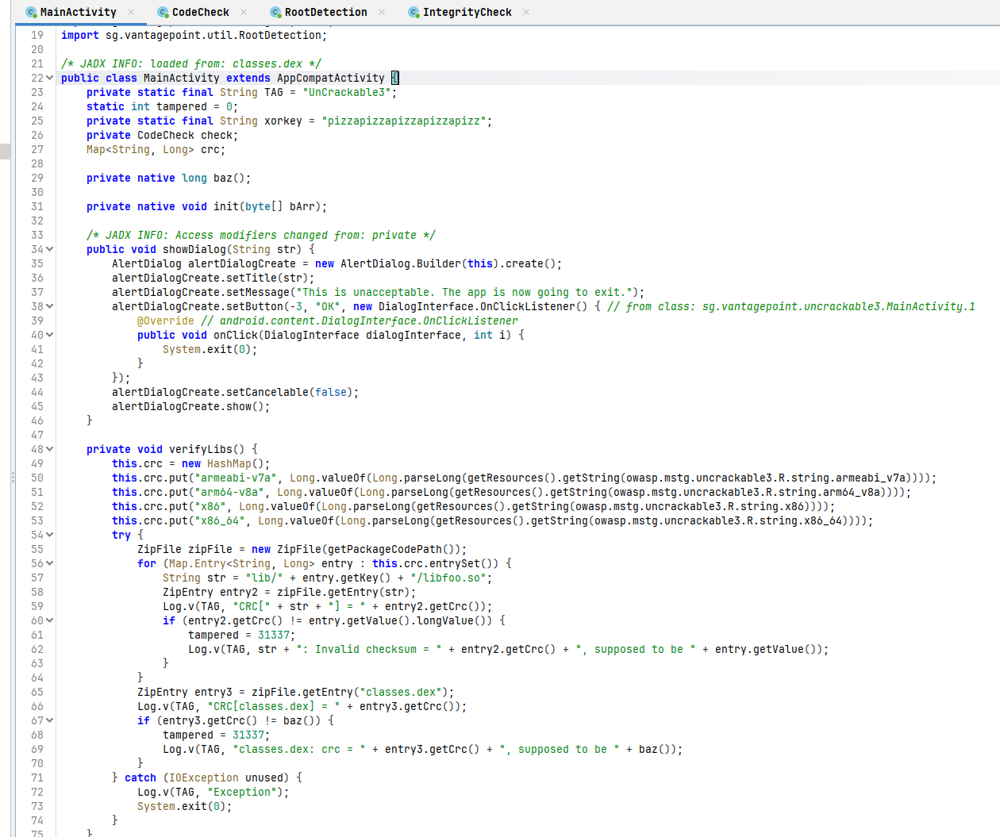

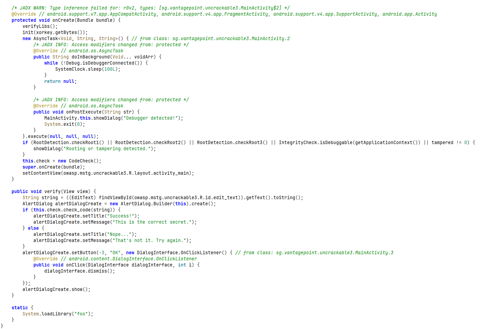

2. `res/layout/activity_main.xml`에서 `verify` 버튼의 `android:onClick="verify"` 속성 확인, xref 없이 존재하는 `verify(View)` 메서드의 호출 경로 특정.

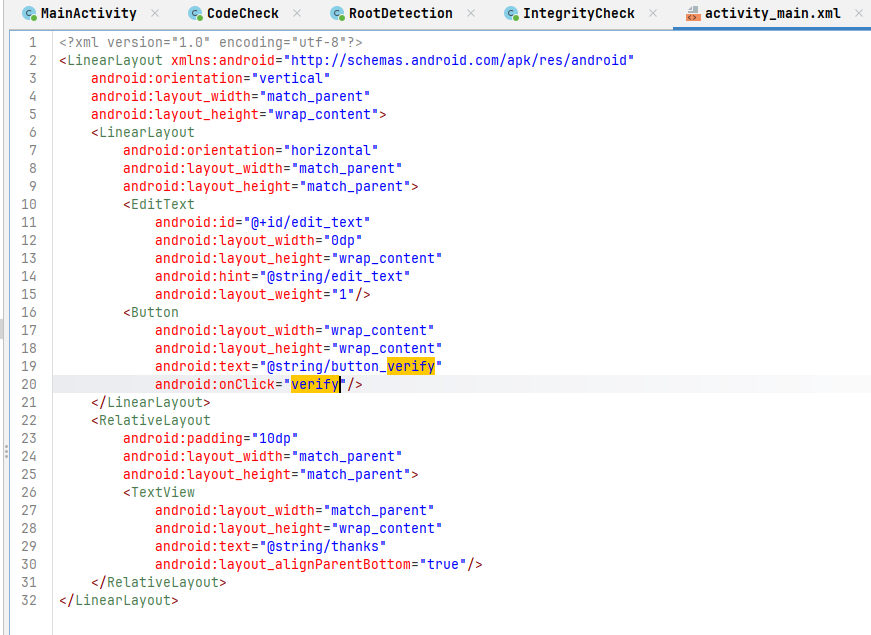

3. `CodeCheck.java`에서 `check_code()`가 정답 비교 없이 `bar()` native 함수로 그대로 위임하는 구조 확인.

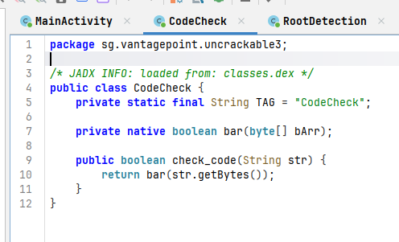

4. Ghidra로 `lib/arm64-v8a/libfoo.so` 로드, `baz()`, `init()`, `bar()` 세 개 export 함수 디컴파일.

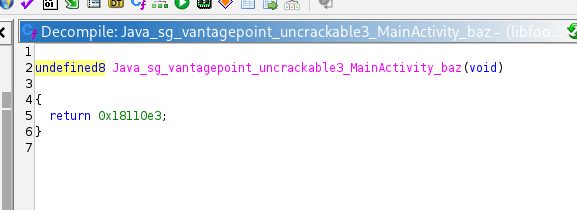

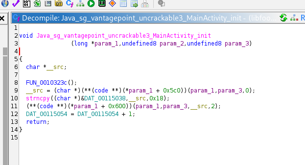

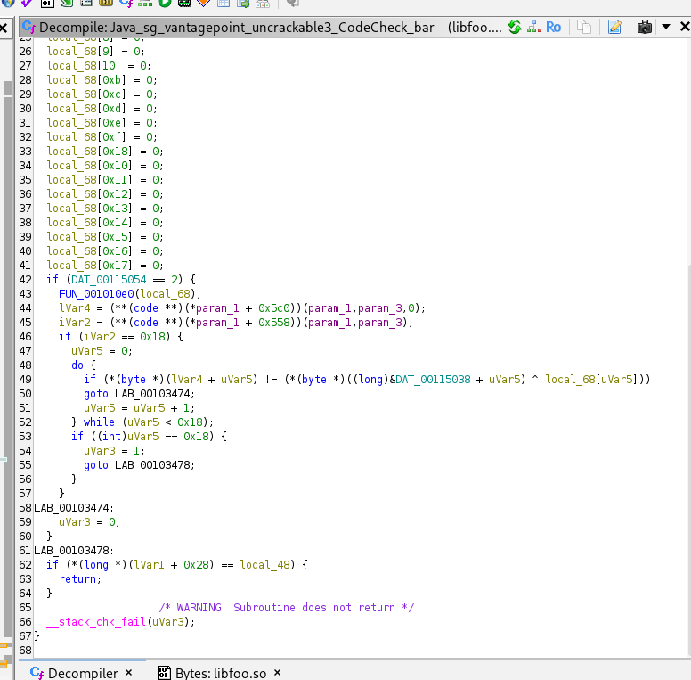

5. `bar()` 내부에서 호출되는 `FUN_001010e0()`의 최후단 코드에서 `local_68`에 대입되는 세 개의 64비트 상수(정답 도출용 실질 재료) 확인.

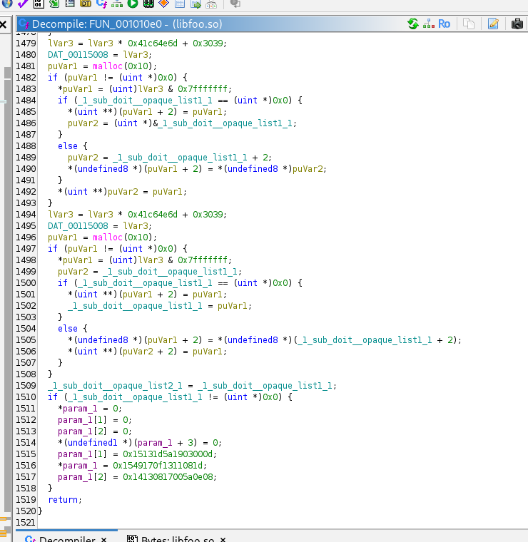

6. Python으로 `xorkey`와 `local_68`(리틀엔디안 바이트 재배열)을 XOR하는 스크립트 작성 및 실행.

```python
import struct

key = "pizzapizzapizzapizzapizz"
xor_key = key.encode('ascii')

local_68 = (
    struct.pack('<Q', 0x1549170f1311081d) +
    struct.pack('<Q', 0x15131d5a1903000d) +
    struct.pack('<Q', 0x14130817005a0e08)
)

flag = bytes([xor_key[i] ^ local_68[i] for i in range(len(xor_key))])
print(flag)
```

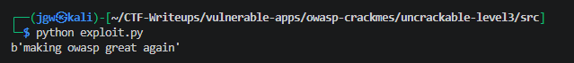

### 3.2. 동적 검증 시도: Frida 후킹 (실패)

7. 원본 APK를 rooted 테스트 단말(Galaxy A31)에 설치, root 탐지 로직에 의해 즉시 차단되는 것을 확인.

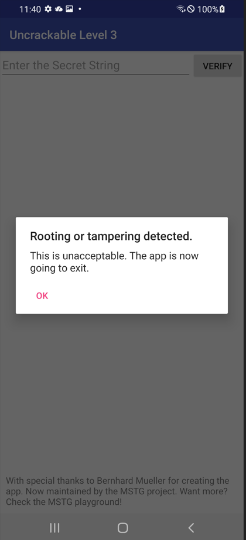

8. `RootDetection`, `IntegrityCheck`, `Debug.isDebuggerConnected` 세 지점을 무력화하는 Frida 스크립트 작성, `spawn` 모드로 후킹 시도.

```javascript
// [hook.js] Root/Anti-Debug 탐지 3개 지점 후킹 스크립트
Java.perform(function () {
    var RootDetection = Java.use("sg.vantagepoint.util.RootDetection");
    RootDetection.checkRoot1.overload().implementation = function () { return false; };
    RootDetection.checkRoot2.overload().implementation = function () { return false; };
    RootDetection.checkRoot3.overload().implementation = function () { return false; };

    var IntegrityCheck = Java.use("sg.vantagepoint.util.IntegrityCheck");
    IntegrityCheck.isDebuggable.overload("android.content.Context").implementation = function (ctx) { return false; };

    var Debug = Java.use("android.os.Debug");
    Debug.isDebuggerConnected.overload().implementation = function () { return false; };
});
```

9. `frida -U -f <package> -l hook.js` 실행 시 삼성 Knox 환경의 SELinux 정책(`selinux_android_setcontext`) 및 ART 계층 충돌로 spawn 반복 실패 확인. `magiskpolicy`를 통한 SELinux 정책 예외 추가로도 근본 해결 불가, 기기 환경 한계로 판단하여 동적 후킹 방식 포기.

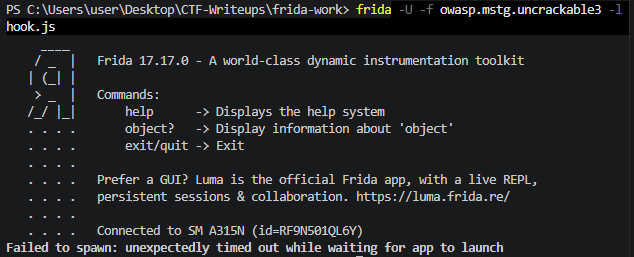

### 3.3. 우회 전환: smali 정적 패칭

10. Frida 대신 apktool을 이용한 정적 바이너리 패칭으로 방향 전환. APK 디컴파일 후 `MainActivity.smali`의 `onCreate()` 내 root/tampering 분기 조건 5개 지점(`checkRoot1/2/3`, `isDebuggable`, `tampered`) 특정.

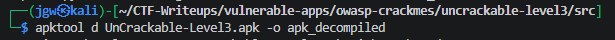

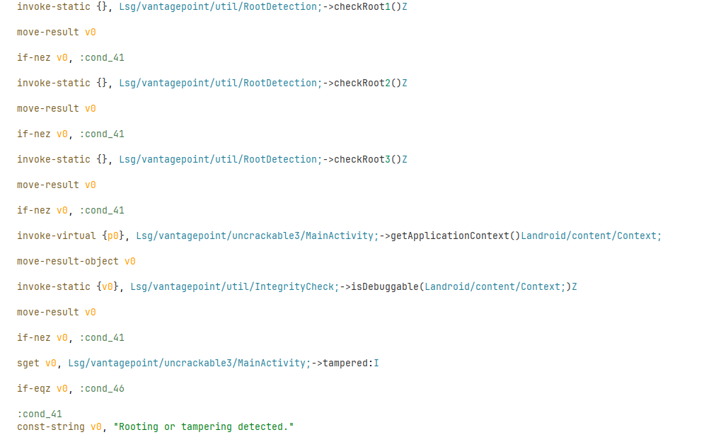

11. 각 조건문 직전에 `const/4 v0, 0x0`을 삽입, 판단에 쓰이는 레지스터 값을 강제로 `false`(0)로 고정하여 실제 체크 함수의 부수효과(로그 등)는 유지한 채 분기 로직만 무력화.

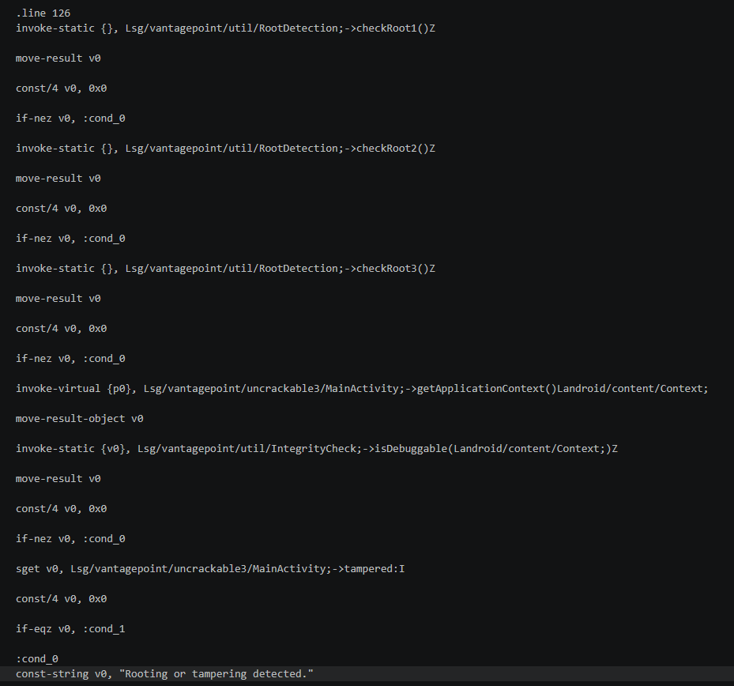

12. `apktool b`로 재조립, `uber-apk-signer`로 재서명 후 재조립 과정에서 발생하는 CRC 불일치가 `tampered` 강제 고정 패치로 무력화됨을 확인.

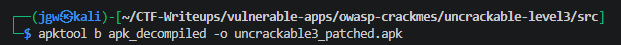

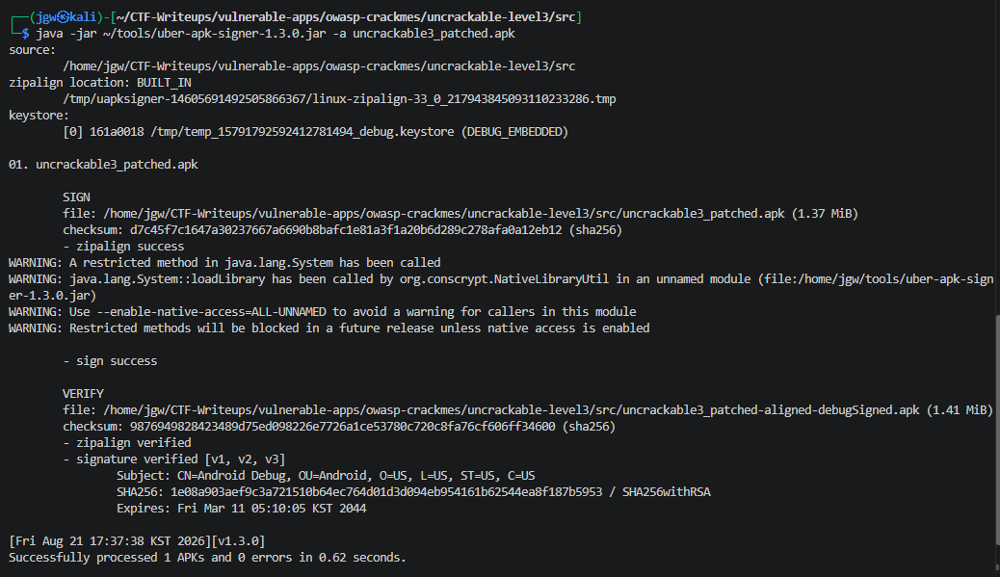

13. 패치된 APK를 재설치, 정답 문자열 입력 후 root 다이얼로그 없이 `Success!` 확인.

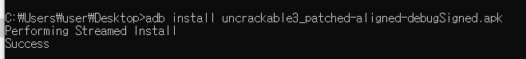

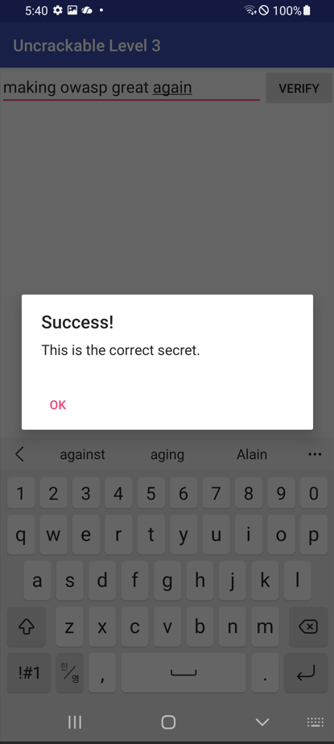

## 4. 획득 결과
Frida 동적 후킹이 기기 환경(Knox RKP/SELinux) 이슈로 차단되었으나, smali 정적 패칭으로 우회 방식을 전환하여 최종 검증 성공.

* **정답 문자열 (FLAG):** `making owasp great again`

* **검증 근거:** 패치된 APK에 해당 문자열 입력 시 root/tampering 다이얼로그 없이 `Success! This is the correct secret.` 확인

## 5. 대응 방안
Java 계층의 검증 우회는 물론, 정적 바이너리 패칭 및 재서명 공격까지 함께 고려한 다층 방어 설계 필요.

* **런타임 무결성 자체검증(Self-check) 강화:** 단일 `tampered` 플래그로 CRC 불일치를 기록하는 방식은 해당 플래그 자체를 패치로 무력화 가능하므로, 서명 검증(APK 서명 인증서 해시 확인) 및 다중 지점 교차검증을 결합.

* **분기 조건 대신 흐름 자체를 데이터에 의존:** `if-nez`류 단순 boolean 분기는 smali 레벨에서 손쉽게 무력화되므로, 검증 결과값을 이후 암복호화 키 유도 등 실질 로직에 직접 사용하여 우회 시 기능 자체가 파괴되도록 설계.

* **핵심 검증 로직의 네이티브 이전 및 난독화:** 정답 비교 로직은 이미 native에 있으나, root/anti-debug 판단까지 native로 이전하고 문자열·상수를 난독화하여 smali 패칭만으로는 완전 우회 불가하도록 방어선 이원화.

* **다중 안티 리버싱 기법 결합:** anti-debug 폴링 스레드 하나만으로는 우회가 용이하므로, ptrace 기반 자가 디버깅, 체크섬 다중화, 코드 가상화(VM 기반 난독화) 등을 결합하여 정적 패칭의 공수 자체를 증가.

## 6. 블루팀 관점 요약
본 앱은 네트워크 통신 없이 완전히 로컬에서 검증 로직이 종료되는 구조로, 트래픽 기반 관제 장비로는 공격 시도 자체를 관측할 수 없는 근본적 탐지 한계 존재. 호스트 기반 관점에서는 정적/동적 분석 과정에서 도출된 문자열, 클래스명, 재서명 흔적을 통한 위협 헌팅이 유일한 탐지 경로.

* **정적 분석 기반 단서:** 하드코딩된 XOR 키(`pizzapizzapizzapizzapizz`), 클래스명(`RootDetection`, `IntegrityCheck`, `CodeCheck`), 노출 메시지(`Rooting or tampering detected.`) 등을 기반으로 유사 변형 샘플 탐지 가능.

* **재서명 흔적 기반 위협 헌팅:** 정상 배포 서명이 아닌 디버그 키(`CN=Android Debug`)로 서명된 APK가 정식 패키지명으로 설치되는 경우, MDM/EDR에서 서명 인증서 이상 탐지 룰로 식별 가능.

* **동적 계측 도구 탐지:** `frida-server` 프로세스명, 비표준 포트(27042) 리스닝, `magiskpolicy --live` 실행 이력 등을 통해 루팅 기기 내 동적 계측 시도 흔적 확보 가능.

* **분석 자동화 아이디어:** 본 샘플처럼 `init()`이 XOR 키를 전역 변수에 저장하고 별도 함수가 상수 배열을 채우는 UnCrackable 계열 변형에 대해, Ghidra 헤드리스 스크립트로 두 지점을 자동 추출·XOR하는 디크립터 자동화 가능.

### 6.1. YARA 탐지 룰 (IoC)
분석 과정에서 도출된 패키지명, 네이티브 라이브러리명, 하드코딩된 XOR 키, 방어 로직 관련 클래스명 및 탐지 시 노출되는 메시지를 기반으로 탐지하는 YARA 룰 제안.

```yara
rule Detect_OWASP_UnCrackable3_Sample {
    strings:
        // 타겟 패키지 및 네이티브 라이브러리
        $pkg_name = "owasp.mstg.uncrackable3" ascii
        $lib_name = "libfoo.so" ascii
        $tag_name = "UnCrackable3" ascii

        // 정답 검증에 사용되는 하드코딩된 XOR 키
        $xor_key = "pizzapizzapizzapizzapizz" ascii

        // Root/Tampering 탐지 관련 클래스
        $class_root = "sg/vantagepoint/util/RootDetection" ascii
        $class_integrity = "sg/vantagepoint/util/IntegrityCheck" ascii

        // 탐지 시 노출되는 메시지
        $msg_tamper = "Rooting or tampering detected." ascii
        $msg_exit = "This is unacceptable. The app is now going to exit." ascii

    condition:
        $pkg_name and $lib_name and (
            $xor_key or
            $tag_name or
            $class_root or
            $class_integrity or
            any of ($msg_*)
        )
}
```